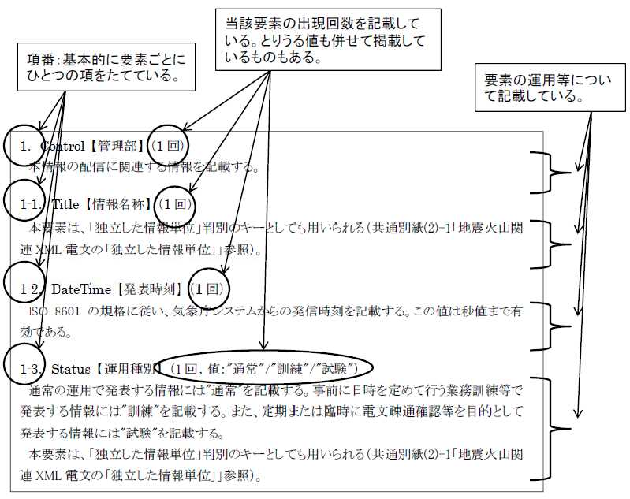

**(PDF版から変更していること)**
- 目次にリンクが追加されています。
- ()がついたヘッディングが追加されています。これは目次の補完用です。
- コードにリンクがついています。このリンクで要素の説明に飛ぶことができます。(制作中)

# **地震火山関連XML電文解説資料**
令和３年７月  
気象庁地震火山部

# はじめに
　この「地震火山関連XML電文解説資料」（以下「本解説資料」という。）は、平成27年８月に運用を開始した噴火速報の情報文を含んだ地震火山関連の気象庁防災情報XMLフォーマット（以下「気象庁XML」という。）による電文について、実際の地震火山関連の警報や情報等の運用に即して詳細に説明したものである。  
　なお、平成29年11月から運用を開始した南海トラフ地震に関連する情報の移行措置用電文については、本解説資料の最後に別冊として添付した「南海トラフ地震に関連する情報関連移行措置用XML電文解説資料」において説明する。    
　気象庁XMLについては、既に、「気象庁防災情報XMLフォーマット」仕様（令和３年７月現在、平成28年３月31日付ver1.2が最新版）や「気象庁防災情報XMLフォーマット運用指針」（令和３年７月現在、平成25年４月12日付ver1.3が最新版）等において、その基本的な仕様や運用も含め公開しているところである。このため、本解説資料は、それら既存公開資料との重複記載は極力せず、詳細な事項や地震火山関連電文に特化した事項について記載しており、上記既存公開資料と合わせて本解説資料を読むことで全体像を把握していただくという利用を想定している。  
　今後の地震火山関連の警報・情報等の運用の変更がある場合等に、本解説資料の内容が変わる可能性がある。  
   
　本解説資料では、表記短縮のため、基本的に、各要素（element）を示す場合には当該要素の名称だけを用い（例えば、Status要素については「Status」、Control/EditorialOffice要素については「Control/EditorialOffice」のように表記する）、属性（attribute）を示す場合には属性の名称の前に「@」を付けたものを用いることとしている（例えば、type属性については「@type」、Areas要素のcodeType属性については「Areas/@codeType」のように表記する）。また、本解説資料で用いる用語については、以下に示すもののほか、気象庁XMLに関連する各種資料で用いられる用語の例に依る。

## 用語
### 津波に関連する情報
津波警報・注意報・予報、津波情報、沖合の津波観測に関する情報をまとめてこのように呼ぶ。
### 地震・津波に関連する情報
津波に関連する情報、緊急地震速報（警報）、緊急地震速報（地震動予報）、緊急地震速報（予報）、緊急地震速報の配信テスト電文、震度速報、震源に関する情報、震源・震度に関する情報、地震の活動状況等に関する情報、地震回数に関する情報、顕著な地震の震源要素更新のお知らせをまとめてこのように呼ぶ。
### 南海トラフ地震に関連する情報
南海トラフ地震臨時情報、南海トラフ地震関連解説情報をまとめてこのように呼ぶ。
### 火山に関連する情報
噴火警報・予報、火山の状況に関する解説情報、噴火に関する火山観測報、火山現象に関する海上警報・海上予報、降灰予報、噴火速報をまとめてこのように呼ぶ。


# 目次
**[I．共通](#i共通)**  
- [（i）管理部](#ii管理部)
- [（ii）ヘッダ部](#iiiヘッダ部)
- [（iii）共通別紙](#iiii共通別紙)
    - [ア．地震火山関連XML電文の「独立した情報単位」の運用](#地震火山関連xml電文の独立した情報単位の運用)
    - [イ．地震・津波に関連する情報におけるEventID要素の運用](#地震津波に関連する情報におけるeventid要素の運用)
    - [ウ．地震火山関連XMLの取消電文の運用](#地震火山関連xmlの取消電文の運用)
    - [エ．南海トラフ地震に関連する情報における EventID 要素及びSerial要素の運用](#南海トラフ地震に関連する情報におけるeventid要素及びserial要素の運用)
  
**[II．内容部](#ii内容部)**
- [（i）地震・津波](#i地震津波ア津波警報等)
    - [ア．津波警報等](#i地震津波ア津波警報等)
        - [（ア）津波警報・注意報・予報](#iiiアア津波警報注意報予報)
        - [（イ）津波情報](#iiiアイ津波情報)
        - [（ウ）沖合の津波観測に関する情報](#iiiアウ沖合の津波観測に関する情報)
    - [イ．緊急地震速報](#i地震津波イ緊急地震速報)
        - [（ア）緊急地震速報(警報)、緊急地震速報（地震動予報）、緊急地震速報(予報)、リアルタイム震度電文](#iiiイア緊急地震速報警報緊急地震速報地震動予報緊急地震速報予報リアルタイム震度電文)
        - [（イ）緊急地震速報の配信テスト電文](#iiiイイ緊急地震速報の配信テスト電文)
    - [ウ．地震情報等](#i地震津波ウ地震情報等)
        - [（ア）震度速報](#iiiウア震度速報)
        - [（イ）地震情報(震源に関する情報)](#iiiウイ地震情報震源に関する情報)
        - [（ウ）地震情報(震源・震度に関する情報)](#iiiウウ地震情報震源震度に関する情報)
        - [（エ）地震情報(地震の活動状況等に関する情報)](#iiiウエ地震情報地震の活動状況等に関する情報)
        - [（オ）地震情報(地震回数に関する情報)](#iiiウオ地震情報地震回数に関する情報)
        - [（カ）地震情報(顕著な地震の震源要素更新のお知らせ)](#iiiウカ地震情報顕著な地震の震源要素更新のお知らせ)
        - [（キ）長周期地震動に関する観測情報](#iiiウキ長周期地震動に関する観測情報)
    - [エ．南海トラフ地震に関連する情報](#iiiエ南海トラフ地震に関連する情報)
    - [オ．地震・津波に関するお知らせ](#iiiオ地震津波に関するお知らせ)
- [（ii）火山](#ii火山)
    - [ア．噴火警報・予報、火山の状況に関する解説情報、火山現象に関する海上警報・海上予報](#iiiiア噴火警報予報火山の状況に関する解説情報火山現象に関する海上警報海上予報)
    - [イ．噴火に関する火山観測報](#iiiiイ噴火に関する火山観測報)
    - [ウ．火山に関するお知らせ](#iiiiウ火山に関するお知らせ)
    - [エ．降灰予報](#iiiiエ降灰予報定時降灰予報速報降灰予報詳細)
    - [オ．噴火速報](#iiiiオ噴火速報)
- [【別冊】南海トラフ地震に関連する情報関連移行措置用XML電文解説資料](#別冊南海トラフ地震に関連する情報関連移行措置用-xml-電文解説資料)

# 本解説資料の様式


# I．共通
## I．（i）管理部
### Control【管理部】（1回）
　本情報の配信に関連する情報を記載する。
#### 1．Title【情報名称】（1回）
　本要素は、「独立した情報単位」判別のキーとしても用いられる（[（iii）共通別紙ア．「地震火山関連XML電文の「独立した情報単位」の運用」](#地震火山関連xml電文の独立した情報単位の運用)参照）。
#### 2．DateTime【発表時刻】（1回）
　ISO 8601 の規格に従い、気象庁システムからの発信時刻を記載する。この値は秒値まで有効である。
#### 3．Status【運用種別】（1回，値：“通常”/“訓練”/“試験”）
　通常の運用で発表する情報には“通常”を記載する。  
　事前に日時を定めて行う業務訓練等で発表する情報には“訓練”を記載する。  
定期または臨時に電文疎通確認等を目的として発表する緊急地震速報の配信テスト電文には“試験”を記載する。  
本要素は、「独立した情報単位」判別のキーとしても用いられる（[（iii）共通別紙ア．「地震火山関連XML電文の「独立した情報単位」の運用」](#地震火山関連xml電文の独立した情報単位の運用)参照）。
#### 4．EditorialOffice【編集官署名】（1回）
　本要素は、「独立した情報単位」判別のキーとしても用いられるが、地震・津波に関連する情報、南海トラフ地震に関連する情報及び地震・津波に関するお知らせについては、システム障害発生等により一連の情報であっても編集官署が切り替わる場合があることに留意が必要である。地震・津波に関連する情報等のこうした取扱については、[（iii）共通別紙ア．「地震火山関連XML電文の「独立した情報単位」の運用」](#地震火山関連xml電文の独立した情報単位の運用)を参照すること。
#### 5．PublishingOffice【発表官署名】（1回）
　発表官署名を記載する。

## I．（ii）ヘッダ部
### Head【ヘッダ部】（1回）
本情報の見出しを記載する。
#### 1．Title【標題】（1回）
　情報の標題を記載する。  
　震源・震度に関する情報において、近地地震の場合には“震源・震度情報”、遠地地震の場合には“遠地地震に関する情報”と記載する。  
　津波警報・注意報・予報については、発表する情報に含まれる津波予報等の種類の総和表現を記載する。なお、津波警報・注意報を全解除し、全ての津波予報区等で津波予報（若干の海面変動）又は津波なしとなる場合は、事例に示すとおり“津波予報”と記載する。  
　各地の満潮時刻と津波到達予想時刻を発表する津波情報については“各地の満潮時刻・津波到達予想時刻に関する情報”を、津波の観測値を発表する津波情報については“津波観測に関する情報”を記載する。両者をひとつの津波情報電文で発表する場合は、本要素の中に二つの標題を半角スペースで区切って併記する。  
　南海トラフ地震に関連する情報においては、[情報名称（Control/Title）](#1title情報名称1回)が”南海トラフ地震臨時情報”の場合は、”南海トラフ地震臨時情報”に続けて[情報種別番号名（Body/EarthquakeInfo/InfoSerial/Name）](#1-2-1name情報種別番号名1回)の内容を付記する（例：”南海トラフ地震臨時情報（巨大地震警戒）”）。また、[情報名称（Control/Title）](#1title情報名称1回)が”南海トラフ地震関連解説情報”の場合は、”南海トラフ地震関連解説情報”と標記し、[情報番号（Head/Serial）](#1title情報名称1回)に値が記載されている場合に限り、一連の情報番号を付記する（例：”南海トラフ地震関連解説情報（第○号）”）。  
　火山に関連する情報においては、火山名と情報の種別を記載する。  
**事例１（津波注意報と津波予報を発表する場合）**
<pre>
&lt;<a href="#1title標題1回">Title</a>&gt;津波注意報・津波予報&lt;/<a href="#1title標題1回">Title</a>&gt;
</pre>
**事例２（津波注意報を全解除し、津波予報（若干の海面変動）が残る場合）**
<pre>
&lt;<a href="#1title標題1回">Title</a>&gt;津波予報&lt;/<a href="#1title標題1回">Title</a>&gt;
</pre>
**事例３（津波注意報を全解除し、全ての津波予報区で津波なしとなる場合）**
<pre>
&lt;<a href="#1title標題1回">Title</a>&gt;津波予報&lt;/<a href="#1title標題1回">Title</a>&gt;
</pre>
**事例４（大津波警報、津波警報、津波注意報、津波予報を発表する場合）**
<pre>
&lt;<a href="#1title標題1回">Title</a>&gt;大津波警報・津波警報・津波注意報・津波予報&lt;/<a href="#1title標題1回">Title</a>&gt;
</pre>
#### 2．ReportDateTime【発表時刻】（1回）
　発表官署が本情報を発表した時刻を記載する。
　緊急地震速報（警報）、緊急地震速報（地震動予報）、緊急地震速報（予報）、及び緊急地震速報の配信テスト電文については秒値まで、その他の地震・津波・南海トラフ地震・火山に関連する情報については、分値まで有効である。
#### 3．TargetDateTime【基点時刻】（1回）
　情報の内容が発現・発効する基点時刻を記載する。  
　震度速報については地震波の検知時刻を、地震情報（顕著な地震の震源要素更新のお知らせ）については震源要素を切り替えた時刻を、津波の観測値を発表する津波情報、沖合の津波観測に関する情報については津波の観測状況を確定した時刻を記載する。火山現象に関する海上警報については火山活動の観測時刻、噴火に関する火山観測報、噴火速報については報じる現象の発現時刻、降灰予報については情報の対象となる時間帯の基点時刻を記載する。その他の地震・津波・火山に関連する情報については、ヘッダ部の[発表時刻（Head/ReportDateTime）](#1-2-1name情報種別番号名1回)の値を記載する。  
　なお、緊急地震速報（警報）、緊急地震速報（地震動予報）、緊急地震速報（予報）、及び緊急地震速報の配信テスト電文については秒値まで、その他の地震・津波・南海トラフ地震・火山に関連する情報については、分値まで有効である。ただし、噴火に関する火山観測報、噴火速報については、基本的に分値まで有効であるが、[TargetDTDubious](#4-targetdtdubious基点時刻のあいまいさ0回1回-値頃年頃月頃日頃時頃分頃秒頃) が出現する場合は、それで示すあいまいさに応じた単位までが有効、発現時刻が不明の場合には xsi:nil=“true”属性値により空要素となる。  
**事例（噴火に関する火山観測報において、本要素が空要素として出現する場合）**
<pre>
&lt;<a href="#3targetdatetime基点時刻1回">TargetDateTime</a> xsi:nil=”true” /&gt;
</pre>
#### 4. TargetDTDubious【基点時刻のあいまいさ】（0回/1回, 値：“頃”/“年頃”/“月頃”/“日頃”/“時頃”/“分頃”/“秒頃”）
　噴火に関する火山観測報、噴火速報で用いる場合があり、報じる現象の発現時刻にあいまいさがある場合に記載する。  
　例えば“日頃”のときは年月日までが有効となる。具体的な精度の有効な範囲は、内容部のEventDateTime及びEventDateTimeUTCの@significantに記載する。
#### 5．ValidDateTime【失効時刻】（0回/1回）
　津波警報・注意報・予報の電文及び降灰予報の電文において情報の失効時刻を記載する。    
　津波警報・注意報・予報の電文については、津波予報（若干の海面変動）のみ発表の場合や、津波警報・注意報解除後に津波予報（若干の海面変動）のみが残る場合に、その失効時刻を記載する。  
　降灰予報については、それぞれの情報における失効時刻を記載し、降灰予報（定時）は基点時刻から 18 時間後、降灰予報（速報）は基点時刻から 1 時間後、降灰予報（詳細）は基点時刻から概ね6時間後となる。
#### 6．EventID【識別情報】（1回）
　地震・津波に関連する情報については、ある特定の地震を識別するための地震識別番号（14 桁の数字）を記載する。津波に関連する情報では、当該警報等に寄与している地震の地震識別番号を記載するため、１つの電文に複数の地震識別番号が出現する場合もある。詳細については、[（iii）共通別紙イ．「地震・津波に関連する情報のEventID要素の運用」](#地震津波に関連する情報におけるeventid要素の運用)を参照。  
　南海トラフ地震に関連する情報については、任意の識別番号（14 桁の数字）を記載する。詳細については、[（iii）共通別紙エ．「南海トラフ地震に関連する情報における EventID 要素及びSerial要素の運用」](#南海トラフ地震に関連する情報におけるeventid要素及びserial要素の運用)を参照。  
　火山に関連する情報については、３桁の火山番号を記載する。ただし、噴火に関する火山観測報及び噴火速報については、[ReportDateTime](#2reportdatetime発表時刻1回)と火山番号を“\_”で連結して記載する。  
　地震・津波に関するお知らせや火山に関するお知らせについては、情報発表日時分（14 桁の数字）を記載する。

#### 7．InfoType【情報形態】（1回）
　情報を発表する場合は“発表”を、「独立した情報単位」において直前の時点で発表されている [Control/DateTime](#2datetime発表時刻1回) の最も新しい電文を訂正する場合は“訂正”を、「独立した情報単位」全体を取り消す場合は“取消”を記載する。取消電文の運用については、[（iii）共通別紙ウ．「取消電文の運用」](#地震火山関連xmlの取消電文の運用)を参照。

#### 8．Serial【情報番号】（1回）
　続報を発表し、内容を更新する情報については、情報番号を記載する。続報を発表する度に情報番号を更新するが、取消報の場合は、番号は更新しない。訂正報の場合は訂正する直近の情報の情報番号を記載する。  
　南海トラフ地震に関連する情報については、続報を発表する情報で情報番号を記載する。詳細については、[（iii）共通別紙エ．「南海トラフ地震に関連する情報における EventID 要素及びSerial要素の運用」](#南海トラフ地震に関連する情報におけるeventid要素及びserial要素の運用)を参照。

※なお、同一種別の情報における最新情報の検索にあたっては、本要素ではなく管理部の[発表時刻（Control/DateTime）](#2datetime発表時刻1回)を参照すること。
#### 9．InfoKind【スキーマの運用種別情報】（1回）
#### 10．InfoKindVersion【スキーマの運用種別情報のバージョン番号】（1回）
#### 11．Headline【見出し要素】（1回）
　子要素に[Text](#11-1text見出し文1回)及び[Information](#11-2information見出し防災気象情報事項0回以上)をもつ。
##### 11-1．Text【見出し文】（1回）
　見出し文を自由文形式で記載する。

##### 11-2．Information【見出し防災気象情報事項】（0回以上）
　地震火山関連 XML 電文では、情報によって本要素の運用が異なる。このため、以下のとおり個別に解説する。
- 津波に関連する情報については、[11-2(1)](#11-21information見出し防災気象情報事項0回1回)にて解説する。
- 緊急地震速報については、[11-2(2)](#11-22information見出し防災気象情報事項0回3回)にて解説する。
- 地震情報等については、[11-2(3)](#11-23information見出し防災気象情報事項0回以上)にて解説する。
- 南海トラフ地震に関連する情報では、本要素は出現しない。
- 地震・津波に関するお知らせでは、本要素は出現しない。
- 火山に関連する情報については、[11-2(4)](#11-24information見出し防災気象情報事項0回以上)にて解説する。
- 火山に関するお知らせでは、本要素は出現しない。

　なお、[情報形態（Head/InfoType）](#7infotype情報形態1回)が“取消”の場合、情報名称に関わらず本要素は出現しない（[（iii）共通別紙ウ．「取消電文の運用」](#地震火山関連xmlの取消電文の運用)を参照）。

**津波に関連する情報におけるHead/Headline/Informationの解説**
##### 11-2(1)．Information【見出し防災気象情報事項】（0回/1回）
　本要素は津波警報・注意報・予報、沖合の津波観測に関する情報のみに出現し、津波情報には出現しない。  
　津波警報・注意報・予報においては、津波予報（若干の海面変動）のみ発表する場合、津波警報・注意報を全解除する場合、津波警報発表後に切り替わり津波注意報のみとなる場合、又は[情報形態（Head/InfoType）](#7infotype情報形態1回)が“取消”の場合を除き、本要素が出現する。  
　沖合の津波観測に関する情報においては、大津波警報・津波警報に相当する観測値が含まれない場合、又は[情報形態（Head/InfoType）](#7infotype情報形態1回)が“取消”の場合を除き、本要素が出現する。  
　本要素が出現する場合、津波警報・注意報・予報においては、@type が“津波予報領域表現”となり、子要素としてItemをもち、沖合の津波観測に関する情報においては、@typeが“沖合の津波観測に関する情報”となり、子要素として[Item](#11-21-1item個々の防災気象情報要素1回2回)をもつ。

###### 11-2(1)-1．Item【個々の防災気象情報要素】（1回/2回）
**○津波警報・注意報・予報の場合**  
　津波警報等の発表状況に応じて本要素の出現回数が決まる（下表参照）。なお、発表している全ての警報・注意報・予報の種類の個数だけ本要素が出現するわけではないことに留意が必要である（例：津波警報を発表している津波予報区等がある場合は、津波注意報を発表している津波予報区等があっても、津波注意報のための本要素は出現しない）。  
　子要素として、[Kind](#11-21-1-1kind防災気象情報要素1回)と[Areas](#11-21-1-2areas対象地域地点1回)をもつ。

| 大津波警報 | 津波警報 | 津波注意報 | Item 要素の出現回数 | Kind/Name 要素の内容 |
| ----- | ----- | ----- | ----- | ----- |
| ○ | ○ | ○ | 2 | "大津波警報"<br>"津波警報" |
| ○ | ○ | × | 2 | "大津波警報"<br>"津波警報" |
| ○ | × | ○ | 1 | "大津波警報" |
| ○ | × | × | 1 | "大津波警報" |
| × | ○ | ○ | 1 | "津波警報" |
| × | ○ | × | 1 | "津波警報" |
| × | × | ○ | 1 | "津波注意報" |

（注）表中の○は発表あり、×は発表なしをあらわす。  
**○沖合の津波観測に関する情報の場合**  
　1回のみ出現する。子要素として、[Kind](#11-21-1-1kind防災気象情報要素1回)と[Areas](#11-21-1-2areas対象地域地点1回)をもつ。
###### 11-2(1)-1-1．Kind【防災気象情報要素】（1回）
**○津波警報・注意報・予報の場合**  
　津波警報等の種類を記載する。子要素に[Name](#11-21-1-1-1name防災気象情報要素名1回)と[Code](#11-21-1-1-2code防災気象情報要素コード0回1回)をもつ。  
**○沖合の津波観測に関する情報の場合**  
　子要素に[Name](#11-21-1-1-1name防災気象情報要素名1回)をもつ。  

###### 11-2(1)-1-1-1．Name【防災気象情報要素名】（1回）
**○津波警報・注意報・予報の場合**  
　津波警報等の名称を記載する。  
**○沖合の津波観測に関する情報の場合**  
　本要素の値は“沖合の津波観測に関する情報”となる。  

###### 11-2(1)-1-1-2．Code【防災気象情報要素コード】（0回/1回）
**○津波警報・注意報・予報の場合**  
　上記 Name の内容に対応するコード（“警報等情報要素／津波警報・注意報・予報”）を記載する。  
**○沖合の津波観測に関する情報の場合**  
　本要素は出現しない。  
###### 11-2(1)-1-2．Areas【対象地域・地点】（1回）
**○津波警報・注意報・予報の場合**  
　津波警報等の対象となる津波予報区、津波予報区結合表現、又は領域表現を記載する。  
　子要素に[Area](#11-21-1-2-1area対象地域地点1回以上)をもつ。  
**○沖合の津波観測に関する情報の場合**  
　大津波警報・津波警報に相当する高い津波が観測された沖合の潮位観測点を記載する。  
　子要素に[Area](#11-21-1-2-1area対象地域地点1回以上)をもつ。  

###### 11-2(1)-1-2-1．Area【対象地域・地点】（1回以上）
**○津波警報・注意報・予報の場合**  
　[Kind](#11-21-1-1kind防災気象情報要素1回) の内容に対応する津波警報等の対象となる、津波予報区、津波予報区結合表現、又は領域表現の数と同数出現する。  
　子要素に[Name](#11-21-1-2-1-1name対象地域地点名称1回)と[Code](#11-21-1-2-1-2code対象地域地点コード1回)をもつ。  
**○沖合の津波観測に関する情報の場合**  
　大津波警報・津波警報に相当する高い津波が観測された沖合の潮位観測点又は観測点名称を簡略化した表現（複数の観測点で同じ表現となる場合は 1回だけ記載する。）の数と同数出現する。  
　子要素に[Name](#11-21-1-2-1-1name対象地域地点名称1回)と[Code](#11-21-1-2-1-2code対象地域地点コード1回)をもつ。

###### 11-2(1)-1-2-1-1．Name【対象地域・地点名称】（1回）
**○津波警報・注意報・予報の場合**  
　津波予報区、津波予報区結合表現、又は領域表現を記載する。  
**○沖合の津波観測に関する情報の場合**  
　沖合の潮位観測点又は観測点名称を簡略化した表現（複数の観測点で同じ表現となる場合は1回だけ記載する。）を記載する。  

###### 11-2(1)-1-2-1-2．Code【対象地域・地点コード】（1回）
**○津波警報・注意報・予報の場合**  
　上記[Name](#11-21-1-2-1-1name対象地域地点名称1回)の内容に対応するコード（“津波予報区”）を記載する。  
**○沖合の津波観測に関する情報の場合**  
　上記 [Name](#11-21-1-2-1-1name対象地域地点名称1回) の内容に対応するコード（“潮位観測点”）を記載する。“潮位観測点”コード表には、各観測点を示すコードと、観測点名称を簡略化した表現（複数の観測点を代表する地点として抜粋して用いられる観測点名）を示すコードが含まれており、簡略化した観測点名称に対しては、その名称に対応するコードを記載する。この簡略化した観測点名称は、[「ヘッダ部」（Head）](#iiiヘッダ部)に記載する場合のみ使用し、[「内容部」（Body）](#ii内容部)では使用しない。この[ヘッダ部](#iiiヘッダ部)に出現する簡略化した観測点名称は、電文の内容を簡潔に伝えることを目的としたものであり、実際にどの観測点で観測したかを知るためには、内容部を参照することを想定している。

**津波警報・注意報・予報におけるInformationの構造**
<pre>
<a href="#11-21information見出し防災気象情報事項0回1回">Information</a> @type=”津波予報領域表現”
    └─<a href="#11-21-1item個々の防災気象情報要素1回2回">Item</a>（ 1 回/2回）
        ├─<a href="#11-21-1-1kind防災気象情報要素1回">Kind</a>（ 1 回）
        │   ├─<a href="#11-21-1-1-1name防災気象情報要素名1回">Name</a>（ 1 回）
        │   └─<a href="#11-21-1-1-2code防災気象情報要素コード0回1回">Code</a>（ 1 回）
        └─<a href="#11-21-1-2areas対象地域地点1回">Areas</a> @codeType="津波予報区"（ 1 回）
            └─<a href="#11-21-1-2-1area対象地域地点1回以上">Area</a>（ 1 回以上）
                ├─<a href="#11-21-1-2-1-1name対象地域地点名称1回">Name</a>（ 1 回）
                └─<a href="#11-21-1-2-1-2code対象地域地点コード1回">Code</a>（ 1 回）
</pre>

**津波警報・注意報・予報におけるInformationの出現例**
<pre>
&lt;<a href="#11-21information見出し防災気象情報事項0回1回">Information</a> type="津波予報領域表現"&gt;
 &lt;<a href="#11-21-1item個々の防災気象情報要素1回2回">Item</a>&gt;
  &lt;<a href="#11-21-1-1kind防災気象情報要素1回">Kind</a>&gt;
   &lt;<a href="#11-21-1-1-1name防災気象情報要素名1回">Name</a>&gt;津波注意報&lt;/<a href="#11-21-1-1-1name防災気象情報要素名1回">Name</a>&gt;
   &lt;<a href="#11-21-1-1-2code防災気象情報要素コード0回1回">Code</a>&gt;62&lt;/<a href="#11-21-1-1-2code防災気象情報要素コード0回1回">Code</a>&gt;
  &lt;/<a href="#11-21-1-1kind防災気象情報要素1回">Kind</a>&gt;
  &lt;<a href="#11-21-1-2areas対象地域地点1回">Areas</a> codeType="津波予報区"&gt;
   &lt;<a href="#11-21-1-2-1area対象地域地点1回以上">Area</a>&gt;
    &lt;<a href="#11-21-1-2-1-1name対象地域地点名称1回">Name</a>&gt;伊豆諸島&lt;/<a href="#11-21-1-2-1-1name対象地域地点名称1回">Name</a>&gt;
    &lt;<a href="#11-21-1-2-1-2code対象地域地点コード1回">Code</a>&gt;320&lt;/<a href="#11-21-1-2-1-2code対象地域地点コード1回">Code</a>&gt;
   &lt;/<a href="#11-21-1-2-1area対象地域地点1回以上">Area</a>&gt;
   &lt;<a href="#11-21-1-2-1area対象地域地点1回以上">Area</a>&gt;
    &lt;<a href="#11-21-1-2-1-1name対象地域地点名称1回">Name</a>&gt;静岡県&lt;/<a href="#11-21-1-2-1-1name対象地域地点名称1回">Name</a>&gt;
    &lt;<a href="#11-21-1-2-1-2code対象地域地点コード1回">Code</a>&gt;380&lt;/<a href="#11-21-1-2-1-2code対象地域地点コード1回">Code</a>&gt;
   &lt;/<a href="#11-21-1-2-1area対象地域地点1回以上">Area</a>&gt;
  &lt;/<a href="#11-21-1-2areas対象地域地点1回">Areas</a>&gt;
 &lt;/<a href="#11-21-1item個々の防災気象情報要素1回2回">Item</a>&gt;
&lt;/<a href="#11-21information見出し防災気象情報事項0回1回">Information</a>&gt;
</pre>

**沖合の津波観測に関する情報におけるInformationの構造**
<pre>
<a href="#11-21information見出し防災気象情報事項0回1回">Information</a> @type="沖合の津波観測に関する情報"
    └─<a href="#11-21-1item個々の防災気象情報要素1回2回">Item</a>（ 1 回）
        ├─<a href="#11-21-1-1kind防災気象情報要素1回">Kind</a>（ 1 回）
        │   └─<a href="#11-21-1-1-1name防災気象情報要素名1回">Name</a>（ 1 回）
        └─<a href="#11-21-1-2areas対象地域地点1回">Areas</a> @codeType="潮位観測点"（ 1 回）
            └─<a href="#11-21-1-2-1area対象地域地点1回以上">Area</a>（ 1 回以上）
                ├─<a href="#11-21-1-2-1-1name対象地域地点名称1回">Name</a>（ 1 回）
                └─<a href="#11-21-1-2-1-2code対象地域地点コード1回">Code</a>（ 1 回）
</pre>

**沖合の津波観測に関する情報におけるInformationの出現例**
<pre>
&lt;<a href="#11-21information見出し防災気象情報事項0回1回">Information</a> type="沖合の津波観測に関する情報"&gt;
 &lt;<a href="#11-21-1item個々の防災気象情報要素1回2回">Item</a>&gt;
  &lt;<a href="#11-21-1-1kind防災気象情報要素1回">Kind</a>&gt;
   &lt;<a href="#11-21-1-1-1name防災気象情報要素名1回">Name</a>&gt;沖合の津波観測に関する情報&lt;/<a href="#11-21-1-1-1name防災気象情報要素名1回">Name</a>&gt;
  &lt;/<a href="#11-21-1-1kind防災気象情報要素1回">Kind</a>&gt;
  &lt;<a href="#11-21-1-2areas対象地域地点1回">Areas</a> codeType="潮位観測点"&gt;
   &lt;<a href="#11-21-1-2-1area対象地域地点1回以上">Area</a>&gt;
    &lt;<a href="#11-21-1-2-1-1name対象地域地点名称1回">Name</a>&gt;岩手釜石沖&lt;/<a href="#11-21-1-2-1-1name対象地域地点名称1回">Name</a>&gt;
    &lt;<a href="#11-21-1-2-1-2code対象地域地点コード1回">Code</a>&gt;21090&lt;/<a href="#11-21-1-2-1-2code対象地域地点コード1回">Code</a>&gt;
   &lt;/<a href="#11-21-1-2-1area対象地域地点1回以上">Area</a>&gt;
   &lt;<a href="#11-21-1-2-1area対象地域地点1回以上">Area</a>&gt;
    &lt;<a href="#11-21-1-2-1-1name対象地域地点名称1回">Name</a>&gt;岩手宮古沖&lt;/<a href="#11-21-1-2-1-1name対象地域地点名称1回">Name</a>&gt;
    &lt;<a href="#11-21-1-2-1-2code対象地域地点コード1回">Code</a>&gt;21091&lt;/<a href="#11-21-1-2-1-2code対象地域地点コード1回">Code</a>&gt;
   &lt;/<a href="#11-21-1-2-1area対象地域地点1回以上">Area</a>&gt;
  &lt;/<a href="#11-21-1-2areas対象地域地点1回">Areas</a>&gt;
 &lt;/<a href="#11-21-1item個々の防災気象情報要素1回2回">Item</a>&gt;
&lt;/<a href="#11-21information見出し防災気象情報事項0回1回">Information</a>&gt;
</pre>

**緊急地震速報におけるHead/Headline/Informationの解説**

##### 11-2(2)．Information【見出し防災気象情報事項】（0回/3回）
　本要素は緊急地震速報（警報）及び緊急地震速報（地震動予報）のみに出現し、緊急地震速報(予報)及び緊急地震速報の配信テスト電文には出現しない。また、[情報形態（Head/InfoType）](#7infotype情報形態1回)が“取消”の場合も出現しない。  
　緊急地震速報(警報)及び緊急地震速報（地震動予報）で本要素が出現する場合には、@type が“緊急地震速報(地方予報区)”、 “緊急地震速報(府県予報区)”、及び“緊急地震速報(細分区域)”である本要素が各々１回ずつ出現する。各々の Information 要素は子要素として[Item](#11-22-1item個々の防災気象情報要素1回2回)をもつ。  

###### 11-2(2)-1．Item【個々の防災気象情報要素】（1回/2回）
　緊急地震速報(警報)の発表状況を記載する。子要素として、[Kind](#11-22-1-1kind防災気象情報要素1回)、[LastKind](#11-22-1-2lastkind直前の防災気象情報要素1回)及び[Areas](#11-22-1-3areas対象地域地点1回)をもつ。警報では本要素は原則として１回のみの出現だが、新たに警報対象となる区域がある場合には、当該警報の電文において本要素は２回出現する（下表参照）。

<table>
<tr>
<th></th>
<th>区域※の変化</th>
<th>Item の出現回数</th>
<th>Kind/Name の内容</th>
<th>LastKind/Name の内容</th>
</tr>
<tr>
<td>最初の警報</td>
<td>-</td>
<td>1</td>
<td>"緊急地震速報（警報）"</td>
<td>"なし"</td>
</tr>
<tr>
<td rowspan="3">続報の警報</td>
<td>変化がない場合</td>
<td>1</td>
<td>"緊急地震速報（警報）"</td>
<td>"緊急地震速報（警報）"</td>
</tr>
<tr>
<td rowspan="2">増える場合</td>
<td rowspan="2">2</td>
<td>"緊急地震速報（警報）"</td>
<td>"なし"</td>
</tr>
<tr>
<td>"緊急地震速報（警報）"</td>
<td>"緊急地震速報（警報）"</td>
</tr>
</table>

※当該[Item](#11-22-1item個々の防災気象情報要素1回2回)の親要素[Information](#11-22information見出し防災気象情報事項0回3回)の@typeで示す警報対象区域

###### 11-2(2)-1-1．Kind【防災気象情報要素】（1回）
　子要素に[Name](#11-22-1-1-1name防災気象情報要素名1回)と[Code](#11-22-1-1-2code防災気象情報要素コード1回)をもつ。

###### 11-2(2)-1-1-1．Name【防災気象情報要素名】（1回）
　防災気象情報名を記載する。現行の運用では、とりうる値としては“緊急地震速報(警報)”のみである（[11-2(2)-1](#11-22-1item個々の防災気象情報要素1回2回)の表参照）。

###### 11-2(2)-1-1-2．Code【防災気象情報要素コード】（1回）
　上記[Name](#11-22-1-1-1name防災気象情報要素名1回)の内容に対応するコード（“警報等情報要素／緊急地震速報”）を記載する。

###### 11-2(2)-1-2．LastKind【直前の防災気象情報要素】（1回）
　子要素に[Name](#11-22-1-2-1name防災気象情報要素名1回)と[Code](#11-22-1-2-2code防災気象情報要素コード1回)をもつ。

###### 11-2(2)-1-2-1．Name【防災気象情報要素名】（1回）
　防災気象情報名を記載する。現行の運用では、とりうる値としては“緊急地震速報(警報)”又は“なし”である（[11-2(2)-1](#11-22-1item個々の防災気象情報要素1回2回)の表参照）。

###### 11-2(2)-1-2-2．Code【防災気象情報要素コード】（1回）
　上記[Name](#11-22-1-2-1name防災気象情報要素名1回)の内容に対応するコード（“警報等情報要素／緊急地震速報”）を記載する。

###### 11-2(2)-1-3．Areas【対象地域・地点】（1回）
　[Kind](#11-22-1-1kind防災気象情報要素1回) 及び [LastKind](#11-22-1-2lastkind直前の防災気象情報要素1回) の防災気象情報名の組み合わせに該当する区域を記載する。[Information](#11-22information見出し防災気象情報事項0回3回)/@type の値に応じて本要素の@codeType が“緊急地震速報／地方予報区”、“緊急地震速報／府県予報区”、又は“地震情報／細分区域”に設定される。  
　子要素に[Area](#11-22-1-3-1area対象地域地点1回以上)をもつ。

###### 11-2(2)-1-3-1．Area【対象地域・地点】（1回以上）
　子要素に[Name](#11-22-1-3-1-1name対象地域地点名称1回)と[Code](#11-22-1-3-1-2code対象地域地点コード1回)をもつ。

###### 11-2(2)-1-3-1-1．Name【対象地域・地点名称】（1回）
　[Areas](#11-22-1-3areas対象地域地点1回)/@codeType の値に応じて地方予報区、府県予報区又は細分区域のいずれかを記載する。

###### 11-2(2)-1-3-1-2．Code【対象地域・地点コード】（1回）
　上記 [Name](#11-22-1-3-1-1name対象地域地点名称1回) の内容に対応するコードを記載する。参照するコードは [Areas](#11-22-1-3areas対象地域地点1回)/@codeType に記載されている。

**緊急地震速報(警報)における Information の構造（Information/@type=“緊急地震速報(地方予報区)”の場合のみを示す。@typeが異なる値を持つInformationについても、構造は同じである。）**
<pre>
<a href="#11-22information見出し防災気象情報事項0回3回">Information</a> @type="緊急地震速報(地方予報区)"
    └─<a href="#11-22-1item個々の防災気象情報要素1回2回">Item</a>（ 1 回/2回）
        ├─<a href="#11-22-1-1kind防災気象情報要素1回">Kind</a>（ 1 回）
        │   ├─<a href="#11-22-1-1-1name防災気象情報要素名1回">Name</a>（ 1 回）
        │   └─<a href="#11-22-1-1-2code防災気象情報要素コード1回">Code</a>（ 1 回）
        ├─<a href="#11-22-1-2lastkind直前の防災気象情報要素1回">LastKind</a>（ 1 回）
        │   ├─<a href="#11-22-1-2-1name防災気象情報要素名1回">Name</a>（ 1 回）
        │   └─<a href="#11-22-1-2-2code防災気象情報要素コード1回">Code</a>（ 1 回）
        └─<a href="#11-22-1-3areas対象地域地点1回">Areas</a> @codeType="緊急地震速報／地方予報区"（ 1 回）
            └─<a href="#11-22-1-3-1area対象地域地点1回以上">Area</a>（ 1 回以上）
                ├─<a href="#11-22-1-3-1-1name対象地域地点名称1回">Name</a>（ 1 回）
                └─<a href="#11-22-1-3-1-2code対象地域地点コード1回">Code</a>（ 1 回）
</pre>

**緊急地震速報(警報)におけるInformationの出現例  
事例： （最初の緊急地震速報（警報）の事例）**
<pre>
&lt;<a href="#11-22information見出し防災気象情報事項0回3回">Information</a> type="緊急地震速報（地方予報区）"&gt;
 &lt;<a href="#11-22-1item個々の防災気象情報要素1回2回">Item</a>&gt;
  &lt;<a href="#11-22-1-1kind防災気象情報要素1回">Kind</a>&gt;
   &lt;<a href="#11-22-1-1-1name防災気象情報要素名1回">Name</a>&gt;緊急地震速報（警報）&lt;/<a href="#11-22-1-1-1name防災気象情報要素名1回">Name</a>&gt;
   &lt;<a href="#11-22-1-1-2code防災気象情報要素コード1回">Code</a>&gt;31&lt;/<a href="#11-22-1-1-2code防災気象情報要素コード1回">Code</a>&gt;
  &lt;/<a href="#11-22-1-1kind防災気象情報要素1回">Kind</a>&gt;
  &lt;<a href="#11-22-1-2lastkind直前の防災気象情報要素1回">LastKind</a>&gt;
   &lt;<a href="#11-22-1-2-1name防災気象情報要素名1回">Name</a>&gt;なし&lt;/<a href="#11-22-1-2-1name防災気象情報要素名1回">Name</a>&gt;
   &lt;<a href="#11-22-1-2-2code防災気象情報要素コード1回">Code</a>&gt;00&lt;/<a href="#11-22-1-2-2code防災気象情報要素コード1回">Code</a>&gt;
  &lt;/<a href="#11-22-1-2lastkind直前の防災気象情報要素1回">LastKind</a>&gt;
  &lt;<a href="#11-22-1-3areas対象地域地点1回">Areas</a> codeType="緊急地震速報／地方予報区"&gt;
   &lt;<a href="#11-22-1-3-1area対象地域地点1回以上">Area</a>&gt;
    &lt;<a href="#11-22-1-3-1-1name対象地域地点名称1回">Name</a>&gt;東海&lt;/<a href="#11-22-1-3-1-1name対象地域地点名称1回">Name</a>&gt;
    &lt;<a href="#11-22-1-3-1-2code対象地域地点コード1回">Code</a>&gt;9936&lt;/<a href="#11-22-1-3-1-2code対象地域地点コード1回">Code</a>&gt;
   &lt;/<a href="#11-22-1-3-1area対象地域地点1回以上">Area</a>&gt;
   &lt;<a href="#11-22-1-3-1area対象地域地点1回以上">Area</a>&gt;
    &lt;<a href="#11-22-1-3-1-1name対象地域地点名称1回">Name</a>&gt;甲信&lt;/<a href="#11-22-1-3-1-1name対象地域地点名称1回">Name</a>&gt;
    &lt;<a href="#11-22-1-3-1-2code対象地域地点コード1回">Code</a>&gt;9935&lt;/<a href="#11-22-1-3-1-2code対象地域地点コード1回">Code</a>&gt;
   &lt;/<a href="#11-22-1-3-1area対象地域地点1回以上">Area</a>&gt;
  &lt;/<a href="#11-22-1-3areas対象地域地点1回">Areas</a>&gt;
 &lt;/<a href="#11-22-1item個々の防災気象情報要素1回2回">Item</a>&gt;
&lt;/<a href="#11-22information見出し防災気象情報事項0回3回">Information</a>&gt;
&lt;<a href="#11-22information見出し防災気象情報事項0回3回">Information</a> type="緊急地震速報（府県予報区）"&gt;
 &lt;<a href="#11-22-1item個々の防災気象情報要素1回2回">Item</a>&gt;
  &lt;<a href="#11-22-1-1kind防災気象情報要素1回">Kind</a>&gt;
   &lt;<a href="#11-22-1-1-1name防災気象情報要素名1回">Name</a>&gt;緊急地震速報（警報）&lt;/<a href="#11-22-1-1-1name防災気象情報要素名1回">Name</a>&gt;
   &lt;<a href="#11-22-1-1-2code防災気象情報要素コード1回">Code</a>&gt;31&lt;/<a href="#11-22-1-1-2code防災気象情報要素コード1回">Code</a>&gt;
  &lt;/<a href="#11-22-1-1kind防災気象情報要素1回">Kind</a>&gt;
  &lt;<a href="#11-22-1-2lastkind直前の防災気象情報要素1回">LastKind</a>&gt;
   &lt;<a href="#11-22-1-2-1name防災気象情報要素名1回">Name</a>&gt;なし&lt;/<a href="#11-22-1-2-1name防災気象情報要素名1回">Name</a>&gt;
   &lt;<a href="#11-22-1-2-2code防災気象情報要素コード1回">Code</a>&gt;00&lt;/<a href="#11-22-1-2-2code防災気象情報要素コード1回">Code</a>&gt;
  &lt;/<a href="#11-22-1-2lastkind直前の防災気象情報要素1回">LastKind</a>&gt;
  &lt;<a href="#11-22-1-3areas対象地域地点1回">Areas</a> codeType="緊急地震速報／府県予報区"&gt;
   &lt;<a href="#11-22-1-3-1area対象地域地点1回以上">Area</a>&gt;
    &lt;<a href="#11-22-1-3-1-1name対象地域地点名称1回">Name</a>&gt;静岡&lt;/<a href="#11-22-1-3-1-1name対象地域地点名称1回">Name</a>&gt;
    &lt;<a href="#11-22-1-3-1-2code対象地域地点コード1回">Code</a>&gt;9220&lt;/<a href="#11-22-1-3-1-2code対象地域地点コード1回">Code</a>&gt;
   &lt;/<a href="#11-22-1-3-1area対象地域地点1回以上">Area</a>&gt;
   &lt;<a href="#11-22-1-3-1area対象地域地点1回以上">Area</a>&gt;
    &lt;<a href="#11-22-1-3-1-1name対象地域地点名称1回">Name</a>&gt;山梨&lt;/<a href="#11-22-1-3-1-1name対象地域地点名称1回">Name</a>&gt;
    &lt;<a href="#11-22-1-3-1-2code対象地域地点コード1回">Code</a>&gt;9190&lt;/<a href="#11-22-1-3-1-2code対象地域地点コード1回">Code</a>&gt;
   &lt;/<a href="#11-22-1-3-1area対象地域地点1回以上">Area</a>&gt;
  &lt;/<a href="#11-22-1-3areas対象地域地点1回">Areas</a>&gt;
 &lt;/<a href="#11-22-1item個々の防災気象情報要素1回2回">Item</a>&gt;
&lt;/<a href="#11-22information見出し防災気象情報事項0回3回">Information</a>&gt;
&lt;<a href="#11-22information見出し防災気象情報事項0回3回">Information</a> type="緊急地震速報（細分区域）"&gt;
 &lt;<a href="#11-22-1item個々の防災気象情報要素1回2回">Item</a>&gt;
  &lt;<a href="#11-22-1-1kind防災気象情報要素1回">Kind</a>&gt;
   &lt;<a href="#11-22-1-1-1name防災気象情報要素名1回">Name</a>&gt;緊急地震速報（警報）&lt;/<a href="#11-22-1-1-1name防災気象情報要素名1回">Name</a>&gt;
   &lt;<a href="#11-22-1-1-2code防災気象情報要素コード1回">Code</a>&gt;31&lt;/<a href="#11-22-1-1-2code防災気象情報要素コード1回">Code</a>&gt;
  &lt;/<a href="#11-22-1-1kind防災気象情報要素1回">Kind</a>&gt;
  &lt;<a href="#11-22-1-2lastkind直前の防災気象情報要素1回">LastKind</a>&gt;
   &lt;<a href="#11-22-1-2-1name防災気象情報要素名1回">Name</a>&gt;なし&lt;/<a href="#11-22-1-2-1name防災気象情報要素名1回">Name</a>&gt;
   &lt;<a href="#11-22-1-2-2code防災気象情報要素コード1回">Code</a>&gt;00&lt;/<a href="#11-22-1-2-2code防災気象情報要素コード1回">Code</a>&gt;
  &lt;/<a href="#11-22-1-2lastkind直前の防災気象情報要素1回">LastKind</a>&gt;
  &lt;<a href="#11-22-1-3areas対象地域地点1回">Areas</a> codeType="地震情報／細分区域"&gt;
   &lt;<a href="#11-22-1-3-1area対象地域地点1回以上">Area</a>&gt;
    &lt;<a href="#11-22-1-3-1-1name対象地域地点名称1回">Name</a>&gt;静岡県東部&lt;/<a href="#11-22-1-3-1-1name対象地域地点名称1回">Name</a>&gt;
    &lt;<a href="#11-22-1-3-1-2code対象地域地点コード1回">Code</a>&gt;441&lt;/<a href="#11-22-1-3-1-2code対象地域地点コード1回">Code</a>&gt;
   &lt;/<a href="#11-22-1-3-1area対象地域地点1回以上">Area</a>&gt;
   &lt;<a href="#11-22-1-3-1area対象地域地点1回以上">Area</a>&gt;
    &lt;<a href="#11-22-1-3-1-1name対象地域地点名称1回"><a href="#11-22-1-3-1-1name対象地域地点名称1回">Name</a></a>&gt;山梨県中・西部&lt;/<a href="#11-22-1-3-1-1name対象地域地点名称1回"><a href="#11-22-1-3-1-1name対象地域地点名称1回">Name</a></a>&gt;
    &lt;<a href="#11-22-1-3-1-2code対象地域地点コード1回">Code</a>&gt;411&lt;/<a href="#11-22-1-3-1-2code対象地域地点コード1回">Code</a>&gt;
   &lt;/<a href="#11-22-1-3-1area対象地域地点1回以上">Area</a>&gt;
   &lt;<a href="#11-22-1-3-1area対象地域地点1回以上">Area</a>&gt;
    &lt;<a href="#11-22-1-3-1-1name対象地域地点名称1回">Name</a>&gt;山梨県東部・富士五湖&lt;/<a href="#11-22-1-3-1-1name対象地域地点名称1回">Name</a>&gt;
    &lt;<a href="#11-22-1-3-1-2code対象地域地点コード1回">Code</a>&gt;412&lt;/<a href="#11-22-1-3-1-2code対象地域地点コード1回">Code</a>&gt;
   &lt;/<a href="#11-22-1-3-1area対象地域地点1回以上">Area</a>&gt;
   &lt;<a href="#11-22-1-3-1area対象地域地点1回以上">Area</a>&gt;
    &lt;<a href="#11-22-1-3-1-1name対象地域地点名称1回">Name</a>&gt;静岡県伊豆&lt;/<a href="#11-22-1-3-1-1name対象地域地点名称1回">Name</a>&gt;
    &lt;<a href="#11-22-1-3-1-2code対象地域地点コード1回">Code</a>&gt;440&lt;/<a href="#11-22-1-3-1-2code対象地域地点コード1回">Code</a>&gt;
   &lt;/<a href="#11-22-1-3-1area対象地域地点1回以上">Area</a>&gt;
   &lt;<a href="#11-22-1-3-1area対象地域地点1回以上">Area</a>&gt;
    &lt;<a href="#11-22-1-3-1-1name対象地域地点名称1回">Name</a>&gt;静岡県中部&lt;/<a href="#11-22-1-3-1-1name対象地域地点名称1回">Name</a>&gt;
    &lt;<a href="#11-22-1-3-1-2code対象地域地点コード1回">Code</a>&gt;442&lt;/<a href="#11-22-1-3-1-2code対象地域地点コード1回">Code</a>&gt;
   &lt;/<a href="#11-22-1-3-1area対象地域地点1回以上">Area</a>&gt;
   &lt;<a href="#11-22-1-3-1area対象地域地点1回以上">Area</a>&gt;
    &lt;<a href="#11-22-1-3-1-1name対象地域地点名称1回">Name</a>&gt;静岡県西部&lt;/<a href="#11-22-1-3-1-1name対象地域地点名称1回">Name</a>&gt;
    &lt;<a href="#11-22-1-3-1-2code対象地域地点コード1回">Code</a>&gt;443&lt;/<a href="#11-22-1-3-1-2code対象地域地点コード1回">Code</a>&gt;
   &lt;/<a href="#11-22-1-3-1area対象地域地点1回以上">Area</a>&gt;
  &lt;/<a href="#11-22-1-3areas対象地域地点1回">Areas</a>&gt;
 &lt;/<a href="#11-22-1item個々の防災気象情報要素1回2回">Item</a>&gt;
&lt;/<a href="#11-22information見出し防災気象情報事項0回3回">Information</a>&gt;
</pre>

**地震情報等におけるHead/Headline/Informationの解説**
##### 11-2(3)．Information【見出し防災気象情報事項】（0回以上）
　震度速報では、@type が“震度速報”である本要素が１回出現する。[情報形態（Head/InfoType）](#7infotype情報形態1回)が“取消”の場合は出現しない。  
　地震情報(震源・震度に関する情報)では、@type が“震源・震度に関する情報（細分区域）”、“震源・震度に関する情報（市町村等）”である本要素が各々１回ずつ出現する。なお、以下の場合は本要素は出現しない。
- 観測された震度が全て２以下だった場合
- 震度が観測されなかった場合（遠地地震の場合など）
- [情報形態（Head/InfoType）](#7infotype情報形態1回)が“取消”の場合

　長周期地震動に関する観測情報では、@type が“長周期地震動に関する観測情報（細分区域）”である本要素が１回出現する。なお、以下の場合は本要素は出現しない。
- [情報形態（Head/InfoType）](#7infotype情報形態1回)が“取消”の場合

　地震情報(震源に関する情報)、地震情報(地震の活動状況等に関する情報)、地震情報(地震回数に関する情報)、及び地震情報(顕著な地震の震源要素更新のお知らせ)には、本要素は出現しない。

###### 11-2(3)-1．Item【個々の防災気象情報要素】（1回以上）
　本要素は、[Information](#11-23information見出し防災気象情報事項0回以上)/@typeの値や観測された最大震度により出現回数が決まる。  
　[Information](#11-23information見出し防災気象情報事項0回以上)/@type が“震度速報”又は“震源・震度に関する情報(細分区域)”の場合は、観測された震度のうち、震度３以上の震度階級の数だけ本要素が出現する。  
　[Information](#11-23information見出し防災気象情報事項0回以上)/@type が“震源・震度に関する情報(市町村等)”の場合、当面は下表に示す震度階級の要素が出現する。また、基準となる震度以上と考えられるが情報発表時点で震度が入電していない市町村がある場合は、その旨を記載するための要素が追加される。当面は震度５弱を基準とし、震度５弱以上と考えられるが震度が入電していない市町村を、“震度５弱以上未入電”の要素に記載する。  
　子要素として、[Kind](#11-23-1-1kind防災気象情報要素1回)及び[Areas](#11-23-1-2areas対象地域地点1回)をもつ。  
| 観測された最大震度 | Itemに記載する震度階級 |
| ---- | ---- |
| 震度６弱以上 | 観測された震度のうち、震度５弱以上の階級のもの |
| 震度５強又は震度５弱 | 観測された震度のうち、震度４以上の階級のもの |
| 震度４又は震度３ | 観測された震度のうち、震度３以上の階級のもの |

###### 11-2(3)-1-1．Kind【防災気象情報要素】（1回）
　子要素に[Name](#11-23-1-1-1name防災気象情報要素名1-回とりうる値震度７震度６強震度６弱震度５強震度５弱震度４震度３震度５弱以上未入電長周期地震動階級４長周期地震動階級３長周期地震動階級２長周期地震動階級１)をもつ。

###### 11-2(3)-1-1-1．Name【防災気象情報要素名】（1 回，とりうる値：“震度７”、“震度６強”、“震度６弱”、“震度５強”、“震度５弱”、“震度４”、“震度３”、“震度５弱以上未入電”、“長周期地震動階級４”、“長周期地震動階級３”、“長周期地震動階級２”、“長周期地震動階級１”）
　観測された震度、長周期地震動階級等を記載する。    
　[Information](#11-23information見出し防災気象情報事項0回以上)/@type が“震源・震度に関する情報(市町村等)”の場合は、11-2(3)-1 の表に示す震度等が記載の対象となる。

###### 11-2(3)-1-2．Areas【対象地域・地点】（1回）
　区域を記載する。Information/@type の値に応じて、@codeType が“地震情報／細分区域”又は“気象・地震・火山情報／市町村等”に設定される。  
　子要素に[Area](#11-23-1-2-1area対象地域地点1回以上)をもつ。

###### 11-2(3)-1-2-1．Area【対象地域・地点】（1回以上）
　子要素に[Name](#11-23-1-2-1-1name対象地域地点名称1回)と[Code](#11-23-1-2-1-2code対象地域地点コード1回)をもつ。

###### 11-2(3)-1-2-1-1．Name【対象地域・地点名称】（1回）
　[Areas](#11-23-1-2areas対象地域地点1回)/@codeTypeの値に応じて、Kindに記載されている震度、長周期地震動階級を観測した細分区域又は市町村等のいずれかを記載する（市町村等を記載する場合であって、[Kind](#11-23-1-1kind防災気象情報要素1回) の内容が“震度５弱以上未入電”の場合は、震度５弱以上未入電と推定される市町村等を記載する）。

###### 11-2(3)-1-2-1-2．Code【対象地域・地点コード】（1回）
　上記Nameの内容に対応するコードを記載する。参照するコードは[Areas](#11-23-1-2areas対象地域地点1回)/@codetypeに記載されている。

**Information @type=“震度速報”の構造（@type=“震源・震度に関する情報(細分区域)”又は“震源・震度に関する情報(市町村等)”である場合も構造は同じ）**
<pre>
<a href="#11-23information見出し防災気象情報事項0回以上">Information</a> @type="震度速報"
    └─<a href="#11-23-1item個々の防災気象情報要素1回以上">Item</a>（ 1 回以上）
        ├─<a href="#11-23-1-1kind防災気象情報要素1回">Kind</a>（ 1 回）
        │   └─<a href="#11-23-1-1-1name防災気象情報要素名1-回とりうる値震度７-震度６強震度６弱-震度５強-震度５弱-震度４-震度３-震度５弱以上未入電">Name</a>（ 1 回）
        └─<a href="#11-23-1-2areas対象地域地点1回">Areas</a> @codeType="地震情報／細分区域"（ 1 回）
            └─<a href="#11-23-1-2-1area対象地域地点1回以上">Area</a>（ 1 回以上）
                ├─<a href="#11-23-1-2-1-1name対象地域地点名称1回">Name</a>（ 1 回）
                └─<a href="#11-23-1-2-1-2code対象地域地点コード1回">Code</a>（ 1 回）
</pre>

**震度速報におけるInformationの出現例**
<pre>
&lt;<a href="#11-23information見出し防災気象情報事項0回以上">Information</a> type="震度速報"&gt;
 &lt;<a href="#11-23-1item個々の防災気象情報要素1回以上">Item</a>&gt;
  &lt;<a href="#11-23-1-1kind防災気象情報要素1回">Kind</a>&gt;
   &lt;<a href="#11-23-1-1-1name防災気象情報要素名1-回とりうる値震度７-震度６強震度６弱-震度５強-震度５弱-震度４-震度３-震度５弱以上未入電">Name</a>&gt;震度４&lt;/<a href="#11-23-1-1-1name防災気象情報要素名1-回とりうる値震度７-震度６強震度６弱-震度５強-震度５弱-震度４-震度３-震度５弱以上未入電">Name</a>&gt;
  &lt;/<a href="#11-23-1-1kind防災気象情報要素1回">Kind</a>&gt;
  &lt;<a href="#11-23-1-2areas対象地域地点1回">Areas</a> codeType="地震情報／細分区域"&gt;
   &lt;<a href="#11-23-1-2-1area対象地域地点1回以上">Area</a>&gt;
    &lt;<a href="#11-23-1-2-1-1name対象地域地点名称1回">Name</a>&gt;静岡県中部&lt;/<a href="#11-23-1-2-1-1name対象地域地点名称1回">Name</a>&gt;
    &lt;<a href="#11-23-1-2-1-2code対象地域地点コード1回">Code</a>&gt;442&lt;/<a href="#11-23-1-2-1-2code対象地域地点コード1回">Code</a>&gt;
   &lt;/<a href="#11-23-1-2-1area対象地域地点1回以上">Area</a>&gt;
   &lt;<a href="#11-23-1-2-1area対象地域地点1回以上">Area</a>&gt;
    &lt;<a href="#11-23-1-2-1-1name対象地域地点名称1回">Name</a>&gt;静岡県西部&lt;/<a href="#11-23-1-2-1-1name対象地域地点名称1回">Name</a>&gt;
    &lt;<a href="#11-23-1-2-1-2code対象地域地点コード1回">Code</a>&gt;443&lt;/<a href="#11-23-1-2-1-2code対象地域地点コード1回">Code</a>&gt;
   &lt;/<a href="#11-23-1-2-1area対象地域地点1回以上">Area</a>&gt;
  &lt;/<a href="#11-23-1-2areas対象地域地点1回">Areas</a>&gt;
 &lt;/<a href="#11-23-1item個々の防災気象情報要素1回以上">Item</a>&gt;
 &lt;<a href="#11-23-1item個々の防災気象情報要素1回以上">Item</a>&gt;
  &lt;<a href="#11-23-1-1kind防災気象情報要素1回">Kind</a>&gt;
   &lt;<a href="#11-23-1-1-1name防災気象情報要素名1-回とりうる値震度７-震度６強震度６弱-震度５強-震度５弱-震度４-震度３-震度５弱以上未入電">Name</a>&gt;震度３&lt;/<a href="#11-23-1-1-1name防災気象情報要素名1-回とりうる値震度７-震度６強震度６弱-震度５強-震度５弱-震度４-震度３-震度５弱以上未入電">Name</a>&gt;
  &lt;/<a href="#11-23-1-1kind防災気象情報要素1回">Kind</a>&gt;
  &lt;<a href="#11-23-1-2areas対象地域地点1回">Areas</a> codeType="地震情報／細分区域"&gt;
   &lt;<a href="#11-23-1-2-1area対象地域地点1回以上">Area</a>&gt;
    &lt;<a href="#11-23-1-2-1-1name対象地域地点名称1回">Name</a>&gt;静岡県伊豆&lt;/<a href="#11-23-1-2-1-1name対象地域地点名称1回">Name</a>&gt;
    &lt;<a href="#11-23-1-2-1-2code対象地域地点コード1回">Code</a>&gt;440&lt;/<a href="#11-23-1-2-1-2code対象地域地点コード1回">Code</a>&gt;
   &lt;/<a href="#11-23-1-2-1area対象地域地点1回以上">Area</a>&gt;
   &lt;<a href="#11-23-1-2-1area対象地域地点1回以上">Area</a>&gt;
    &lt;<a href="#11-23-1-2-1-1name対象地域地点名称1回">Name</a>&gt;静岡県東部&lt;/<a href="#11-23-1-2-1-1name対象地域地点名称1回">Name</a>&gt;
    &lt;<a href="#11-23-1-2-1-2code対象地域地点コード1回">Code</a>&gt;441&lt;/<a href="#11-23-1-2-1-2code対象地域地点コード1回">Code</a>&gt;
   &lt;/<a href="#11-23-1-2-1area対象地域地点1回以上">Area</a>&gt;
  &lt;/<a href="#11-23-1-2areas対象地域地点1回">Areas</a>&gt;
 &lt;/<a href="#11-23-1item個々の防災気象情報要素1回以上">Item</a>&gt;
&lt;/<a href="#11-23information見出し防災気象情報事項0回以上">Information</a>&gt;
</pre>

**震源・震度に関する情報におけるInformationの出現例**
<pre>
&lt;<a href="#11-23information見出し防災気象情報事項0回以上">Information</a> type="震源・震度に関する情報(細分区域)"&gt;
 &lt;<a href="#11-23-1item個々の防災気象情報要素1回以上">Item</a>&gt;
  &lt;<a href="#11-23-1-1kind防災気象情報要素1回">Kind</a>&gt;
   &lt;<a href="#11-23-1-1-1name防災気象情報要素名1-回とりうる値震度７-震度６強震度６弱-震度５強-震度５弱-震度４-震度３-震度５弱以上未入電">Name</a>&gt;震度４&lt;/<a href="#11-23-1-1-1name防災気象情報要素名1-回とりうる値震度７-震度６強震度６弱-震度５強-震度５弱-震度４-震度３-震度５弱以上未入電">Name</a>&gt;
  &lt;/<a href="#11-23-1-1kind防災気象情報要素1回">Kind</a>&gt;
  &lt;<a href="#11-23-1-2areas対象地域地点1回">Areas</a> codeType="地震情報／細分区域"&gt;
   &lt;<a href="#11-23-1-2-1area対象地域地点1回以上">Area</a>&gt;
    &lt;<a href="#11-23-1-2-1-1name対象地域地点名称1回">Name</a>&gt;静岡県中部&lt;/<a href="#11-23-1-2-1-1name対象地域地点名称1回">Name</a>&gt;
    &lt;<a href="#11-23-1-2-1-2code対象地域地点コード1回">Code</a>&gt;442&lt;/<a href="#11-23-1-2-1-2code対象地域地点コード1回">Code</a>&gt;
   &lt;/<a href="#11-23-1-2-1area対象地域地点1回以上">Area</a>&gt;
   &lt;<a href="#11-23-1-2-1area対象地域地点1回以上">Area</a>&gt;
    &lt;<a href="#11-23-1-2-1-1name対象地域地点名称1回">Name</a>&gt;静岡県西部&lt;/<a href="#11-23-1-2-1-1name対象地域地点名称1回">Name</a>&gt;
    &lt;<a href="#11-23-1-2-1-2code対象地域地点コード1回">Code</a>&gt;443&lt;/<a href="#11-23-1-2-1-2code対象地域地点コード1回">Code</a>&gt;
   &lt;/<a href="#11-23-1-2-1area対象地域地点1回以上">Area</a>&gt;
  &lt;/<a href="#11-23-1-2areas対象地域地点1回">Areas</a>&gt;
 &lt;/<a href="#11-23-1item個々の防災気象情報要素1回以上">Item</a>&gt;
 &lt;<a href="#11-23-1item個々の防災気象情報要素1回以上">Item</a>&gt;
  &lt;<a href="#11-23-1-1kind防災気象情報要素1回">Kind</a>&gt;
   &lt;<a href="#11-23-1-1-1name防災気象情報要素名1-回とりうる値震度７-震度６強震度６弱-震度５強-震度５弱-震度４-震度３-震度５弱以上未入電">Name</a>&gt;震度３&lt;/<a href="#11-23-1-1-1name防災気象情報要素名1-回とりうる値震度７-震度６強震度６弱-震度５強-震度５弱-震度４-震度３-震度５弱以上未入電">Name</a>&gt;
  &lt;/<a href="#11-23-1-1kind防災気象情報要素1回">Kind</a>&gt;
  &lt;<a href="#11-23-1-2areas対象地域地点1回">Areas</a> codeType="地震情報／細分区域"&gt;
   &lt;<a href="#11-23-1-2-1area対象地域地点1回以上">Area</a>&gt;
    &lt;<a href="#11-23-1-2-1-1name対象地域地点名称1回">Name</a>&gt;静岡県伊豆&lt;/<a href="#11-23-1-2-1-1name対象地域地点名称1回">Name</a>&gt;
    &lt;<a href="#11-23-1-2-1-2code対象地域地点コード1回">Code</a>&gt;440&lt;/<a href="#11-23-1-2-1-2code対象地域地点コード1回">Code</a>&gt;
   &lt;/<a href="#11-23-1-2-1area対象地域地点1回以上">Area</a>&gt;
   &lt;<a href="#11-23-1-2-1area対象地域地点1回以上">Area</a>&gt;
    &lt;<a href="#11-23-1-2-1-1name対象地域地点名称1回">Name</a>&gt;静岡県東部&lt;/<a href="#11-23-1-2-1-1name対象地域地点名称1回">Name</a>&gt;
    &lt;<a href="#11-23-1-2-1-2code対象地域地点コード1回">Code</a>&gt;441&lt;/<a href="#11-23-1-2-1-2code対象地域地点コード1回">Code</a>&gt;
   &lt;/<a href="#11-23-1-2-1area対象地域地点1回以上">Area</a>&gt;
  &lt;/<a href="#11-23-1-2areas対象地域地点1回">Areas</a>&gt;
 &lt;/<a href="#11-23-1item個々の防災気象情報要素1回以上">Item</a>&gt;
&lt;/<a href="#11-23information見出し防災気象情報事項0回以上">Information</a>&gt;
&lt;<a href="#11-23information見出し防災気象情報事項0回以上">Information</a> type="震源・震度に関する情報(市町村等)"&gt;
 &lt;<a href="#11-23-1item個々の防災気象情報要素1回以上">Item</a>&gt;
  &lt;<a href="#11-23-1-1kind防災気象情報要素1回">Kind</a>&gt;
   &lt;<a href="#11-23-1-1-1name防災気象情報要素名1-回とりうる値震度７-震度６強震度６弱-震度５強-震度５弱-震度４-震度３-震度５弱以上未入電">Name</a>&gt;震度４&lt;/<a href="#11-23-1-1-1name防災気象情報要素名1-回とりうる値震度７-震度６強震度６弱-震度５強-震度５弱-震度４-震度３-震度５弱以上未入電">Name</a>&gt;
  &lt;/<a href="#11-23-1-1kind防災気象情報要素1回">Kind</a>&gt;
  &lt;<a href="#11-23-1-2areas対象地域地点1回">Areas</a> codeType="気象・地震・火山情報／市町村等"&gt;
   &lt;<a href="#11-23-1-2-1area対象地域地点1回以上">Area</a>&gt;
    &lt;<a href="#11-23-1-2-1-1name対象地域地点名称1回">Name</a>&gt;●●市&lt;/<a href="#11-23-1-2-1-1name対象地域地点名称1回">Name</a>&gt;
    &lt;<a href="#11-23-1-2-1-2code対象地域地点コード1回">Code</a>&gt;0000000&lt;/<a href="#11-23-1-2-1-2code対象地域地点コード1回">Code</a>&gt;
   &lt;/<a href="#11-23-1-2-1area対象地域地点1回以上">Area</a>&gt;
   &lt;<a href="#11-23-1-2-1area対象地域地点1回以上">Area</a>&gt;
    &lt;<a href="#11-23-1-2-1-1name対象地域地点名称1回">Name</a>&gt;▲▲町&lt;/<a href="#11-23-1-2-1-1name対象地域地点名称1回">Name</a>&gt;
    &lt;<a href="#11-23-1-2-1-2code対象地域地点コード1回">Code</a>&gt;1111111&lt;/<a href="#11-23-1-2-1-2code対象地域地点コード1回">Code</a>&gt;
   &lt;/<a href="#11-23-1-2-1area対象地域地点1回以上">Area</a>&gt;
  &lt;/<a href="#11-23-1-2areas対象地域地点1回">Areas</a>&gt;
 &lt;/<a href="#11-23-1item個々の防災気象情報要素1回以上">Item</a>&gt;
 &lt;<a href="#11-23-1item個々の防災気象情報要素1回以上">Item</a>&gt;
  &lt;<a href="#11-23-1-1kind防災気象情報要素1回">Kind</a>&gt;
   &lt;<a href="#11-23-1-1-1name防災気象情報要素名1-回とりうる値震度７-震度６強震度６弱-震度５強-震度５弱-震度４-震度３-震度５弱以上未入電">Name</a>&gt;震度３&lt;/<a href="#11-23-1-1-1name防災気象情報要素名1-回とりうる値震度７-震度６強震度６弱-震度５強-震度５弱-震度４-震度３-震度５弱以上未入電">Name</a>&gt;
  &lt;/<a href="#11-23-1-1kind防災気象情報要素1回">Kind</a>&gt;
  &lt;<a href="#11-23-1-2areas対象地域地点1回">Areas</a> codeType="気象・地震・火山情報／市町村等"&gt;
   &lt;<a href="#11-23-1-2-1area対象地域地点1回以上">Area</a>&gt;
    &lt;<a href="#11-23-1-2-1-1name対象地域地点名称1回">Name</a>&gt;■■区&lt;/<a href="#11-23-1-2-1-1name対象地域地点名称1回">Name</a>&gt;
    &lt;<a href="#11-23-1-2-1-2code対象地域地点コード1回">Code</a>&gt;2222222&lt;/<a href="#11-23-1-2-1-2code対象地域地点コード1回">Code</a>&gt;
   &lt;/<a href="#11-23-1-2-1area対象地域地点1回以上">Area</a>&gt;
   &lt;<a href="#11-23-1-2-1area対象地域地点1回以上">Area</a>&gt;
    &lt;<a href="#11-23-1-2-1-1name対象地域地点名称1回">Name</a>&gt;××市&lt;/<a href="#11-23-1-2-1-1name対象地域地点名称1回">Name</a>&gt;
    &lt;<a href="#11-23-1-2-1-2code対象地域地点コード1回">Code</a>&gt;3333333&lt;/<a href="#11-23-1-2-1-2code対象地域地点コード1回">Code</a>&gt;
   &lt;/<a href="#11-23-1-2-1area対象地域地点1回以上">Area</a>&gt;
  &lt;/<a href="#11-23-1-2areas対象地域地点1回">Areas</a>&gt;
 &lt;/<a href="#11-23-1item個々の防災気象情報要素1回以上">Item</a>&gt;
&lt;/<a href="#11-23information見出し防災気象情報事項0回以上">Information</a>&gt;
</pre>

**長周期地震動に関する観測情報における Information の出現例**
```
<Information type="長周期地震動に関する観測情報（細分区域）">
 <Item>
  <Kind>
   <Name>長周期地震動階級２</Name>
  </Kind>
  <Areas codeType="地震情報／細分区域">
   <Area>
    <Name>宮城県北部</Name>
    <Code>220</Code>
   </Area>
  </Areas>
 </Item>
 <Item>
  <Kind>
   <Name>長周期地震動階級１</Name>
  </Kind>
  <Areas codeType="地震情報／細分区域">
   <Area>
    <Name>青森県津軽北部</Name>
    <Code>200</Code>
   </Area>
   <Area>
    <Name>青森県三八上北</Name>
    <Code>202</Code>
   </Area>
   <Area>
    <Name>岩手県内陸北部</Name>
    <Code>212</Code>
   </Area>
   <Area>
    <Name>岩手県内陸南部</Name>
    <Code>213</Code>
   </Area>
  </Areas>
 </Item>
</Information>
```

**火山に関連する情報におけるHead/Headline/Informationの解説**

##### 11-2(4)．Information【見出し防災気象情報事項】（0回以上）
　噴火警報・予報及び火山現象に関する海上警報においては、@typeが“噴火警報・予報(対象火山)”、 “噴火警報・予報(対象市町村等)”（海上警報では“噴火警報・予報(対象海上予報区)”）及び“噴火警報・予報（対象市町村の防災対応等）”である本要素が各々１回ずつ出現する。  
　火山の状況に関する解説情報においては、@type が“火山の状況に関する解説情報(対象火山)”である本要素が１回出現する。  
　噴火に関する火山観測報においては、@type が“噴火に関する火山観測報”である本要素が１回出現する。  
　降灰予報においては、@type が“降灰予報(対象火山)”、 “降灰予報(対象市町村等)”である本要素が各々１回ずつ出現する。  
　噴火速報においては、@typeが“噴火速報”である本要素が１回出現する。

　[情報形態（Head/InfoType）](#7infotype情報形態1回)が“取消”の場合は、いずれの情報においても、本要素は出現しない。

###### 11-2(4)-1．Item【個々の防災気象情報要素】（1回以上）
　[Information](#11-24information見出し防災気象情報事項0回以上)/@type=“火山の状況に関する解説情報(対象火山)”、 “噴火警報・予報(対象市町村等) ”、“降灰予報（対象市町村等）”、“火山現象に関する海上警報・海上予報(対象海上予報区) ” 又は“噴火警報・予報(対象市町村の防災対応等)”の場合は本要素が1回以上出現するが、[Information](#11-24information見出し防災気象情報事項0回以上)がそれ以外の属性値をとる場合は1回だけ出現する。  
　子要素として、[Kind](#11-24-1-1kind防災気象情報要素1回)、[LastKind](#11-24-1-2lastkind直前の防災気象情報要素0回1回)及び[Areas](#11-24-1-3areas対象地域地点1回)をもつ（[Information](#11-24information見出し防災気象情報事項0回以上)/@type=“噴火に関する火山観測報”、“降灰予報（対象火山）”、又は“降灰予報（対象市町村等）”、“噴火速報”である場合は、[LastKind](#11-24-1-2lastkind直前の防災気象情報要素0回1回)は出現しない）。

###### 11-2(4)-1-1．Kind【防災気象情報要素】（1回）
　子要素に[Name](#11-24-1-1-1name防災気象情報要素名1回)、[Code](#11-24-1-1-2code防災気象情報要素コード1回)及び[Condition](#11-24-1-1-3condition状況0回1回)をもつ。[Information](#11-24information見出し防災気象情報事項0回以上)/@type=“噴火に関する火山観測報”、“降灰予報（対象火山）”、又は“降灰予報（対象市町村等）”、 “噴火速報”である場合は、[Condition](#11-24-1-1-3condition状況0回1回)は出現しない。

###### 11-2(4)-1-1-1．Name【防災気象情報要素名】（1回）
　[Information](#11-24information見出し防災気象情報事項0回以上)/@typeの値に応じて本要素の内容を記載する。  
　[Information](#11-24information見出し防災気象情報事項0回以上)/@type の値が“噴火警報・予報(対象火山) ”又は“火山の状況に関する解説情報(対象火山) ”の場合は、噴火警戒レベル導入火山は噴火警戒レベルを、レベル未導入火山と海底火山は警戒事項等（キーワード）を記載する。  
　[Information](#11-24information見出し防災気象情報事項0回以上)/@typeの値が“噴火に関する火山観測報” 、“噴火速報”の場合は、発生した現象を記載する。  
　Information/@typeの値が“降灰予報(対象火山) ”の場合は、情報種別（「降灰予報（定時）」、「降灰予報（速報）」、「降灰予報（詳細）」のいずれか）を記載する。  
　[Information](#11-24information見出し防災気象情報事項0回以上)/@type の値が“噴火警報・予報(対象市町村等) ”又は“火山現象に関する海上警報・海上予報(対象海上予報区) ”の場合、噴火警報・予報又は海上警報・海上予報の種類を記載する。  
　[Information](#11-24information見出し防災気象情報事項0回以上)/@type の値が“降灰予報(対象市町村等)”の場合は、関連する防災気象情報要素名（「降灰」、「多量の降灰」、「やや多量の降灰」、「少量の降灰」、「小さな噴石の落下」のいずれか）を記載する。  
[Information](#11-24information見出し防災気象情報事項0回以上)/@type の値が“噴火警報・予報(対象市町村の防災対応等) ”の場合、警戒事項等（警報の種類及び具体的な防災対応）を記載する。[防災気象情報要素コード（Code）](#11-24-1-1-2code防災気象情報要素コード1回)の 41～43 に対応する噴火警戒レベル導入火山用の名称（Name、“噴火警報：避難等”、“噴火警報：入山規制等”、“火口周辺警報：入山規制等”）については、噴火警戒レベル導入火山で一斉に開始するのではなく、準備の整った火山から平成25年度末より順次運用を開始しているところ。なお、将来的には、上記の [Information](#11-24information見出し防災気象情報事項0回以上) の値が“噴火警報・予報（対象市町村等）”を廃止する予定。

###### 11-2(4)-1-1-2．Code【防災気象情報要素コード】（1回）
上記[Name](#11-24-1-1-1name防災気象情報要素名1回)の内容に対応するコード（“警報等情報要素／噴火警報・予報等”）を記載する。

###### 11-2(4)-1-1-3．Condition【状況】（0回/1回）
　前回発表からの変化を記載する。  
　[Information](#11-24information見出し防災気象情報事項0回以上)/@type の値が“噴火警報・予報(対象火山) ”又は“火山の状況に関する解説情報(対象火山) ”である場合のとりうる値は“引上げ”、 “継続”、 “引下げ”である。  
　[Information](#11-24information見出し防災気象情報事項0回以上)/@type の値が“噴火警報・予報(対象市町村等) ”又は“火山現象に関する海上警報・海上予報(対象海上予報区) ”である場合のとりうる値は下表のとおりである。  
　[Information](#11-24information見出し防災気象情報事項0回以上)/@type の値が“噴火に関する火山観測報”、“降灰予報（対象火山）”、又は“降灰予報（対象市町村等）” 、 “噴火速報”である場合は、本要素は出現しない。 
<table>
<tr><td>“発表”</td><td>噴火予報から火口周辺警報、噴火予報から噴火警報、火口周辺警報から噴火警報、又は噴火警報から火口周辺警報に変更したとき</td></tr>
<tr><td>“切替”</td><td>火口周辺警報発表中の火口周辺警報発表、噴火予報発表中の噴火予報発表など、同種の噴火警報・予報の発表のとき“解除” 噴火警報から噴火予報、又は火口周辺警報から噴火予報に変更したとき</td></tr>
<tr><td>“解除”</td><td>噴火警報から噴火予報、又は火口周辺警報から噴火予報に変更したとき</td></tr>
</table>

[Information](#11-24information見出し防災気象情報事項0回以上)/@type の値が“噴火警報・予報(対象市町村の防災対応等) ”である場合のとりうる値は下表のとおりである。
<table>
<tr><td>“発表”</td><td>“活火山であることに留意”から“噴火警報：避難等”、“活火山であることに留意”から“噴火警報：入山規制等”、“活火山であることに留意”から“火口周辺警報：入山規制等”、“活火山であることに留意”から“噴火警報（周辺海域）：周辺海域警戒”、“活火山であることに留意”から“噴火警報：当該居住地域厳重警戒”、“活火山であることに留意”から“噴火警報：当該山麓厳重警戒”、“活火山であることに留意”から“噴火警報：火口周辺警戒”、又は“活火山であることに留意”から“火口周辺警報：火口周辺警戒”に変更したとき</td></tr>
<tr><td>“引上げ”</td><td>“噴火警報：入山規制等”から“噴火警報：避難等”、“火口周辺警報：入山規制等”から“噴火警報：避難等”、“噴火警報：火口周辺警戒”から“噴火警報：当該居住地域厳重警戒”、“噴火警報：火口周辺警戒”から“噴火警報：当該山麓厳重警戒”“火口周辺警報：火口周辺警戒”から“噴火警報：当該居住地域厳重警戒”、又は“火口周辺警報：火口周辺警戒”から“噴火警報：当該山麓厳重警戒”に変更したとき</td></tr>
<tr><td>“切替”</td><td>“火口周辺警報：入山規制等”から“噴火警報：入山規制等”、“噴火警報：入山規制等”から“火口周辺警報：入山規制等”、“火口周辺警報：火口周辺警戒”から“噴火警報：火口周辺警戒”、又は“噴火警報：火口周辺警戒”から“火口周辺警報：火口周辺警戒”に変更したとき</td></tr>
<tr><td>”継続“</td><td>警戒事項等に変更がないとき</td></tr>
<tr><td>“引下げ”</td><td>“噴火警報：避難等”から“噴火警報：入山規制等”、“噴火警報：避難等”から“火口周辺警報：入山規制等”、“噴火警報：当該居住地域厳重警戒”から“噴火警報：火口周辺警戒”、“噴火警報：当該山麓厳重警戒”から“噴火警報：火口周辺警戒”、“噴火警報：当該居住地域厳重警戒”から“火口周辺警報：火口周辺警戒”、又は“噴火警報：当該山麓厳重警戒”から“火口周辺警報：火口周辺警戒”に変更したとき</td></tr>
<tr><td>“解除”</td><td>“噴火警報：避難等”から“活火山であることに留意”、“噴火警報：入山規制等”から“活火山であることに留意”、“火口周辺警報：入山規制等”から“活火山であることに留意”、“噴火警報（周辺海域）：周辺海域警戒”から“活火山であることに留意”、“噴火警報：当該居住地域厳重警戒”から“活火山であることに留意”、“噴火警報：当該山麓厳重警戒”から“活火山であることに留意”、“噴火警報：火口周辺警戒”から“活火山であることに留意”、又は“火口周辺警報：火口周辺警戒”から“活火山であることに留意”に変更したとき</td></tr>
</table>

###### 11-2(4)-1-2．LastKind【直前の防災気象情報要素】（0回/1回）
　子要素に[Name](#11-24-1-2-1name防災気象情報要素名1回)、[Code](#11-24-1-2-2code防災気象情報要素コード1回)及び[Condition](#11-24-1-2-3condition状況1回)をもつ。  
　[Information](#11-24information見出し防災気象情報事項0回以上)/@type の値が“噴火に関する火山観測報”、“降灰予報（対象火山）”、又は“降灰予報（対象市町村等）” 、 “噴火速報”である場合は、本要素は出現しない。

###### 11-2(4)-1-2-1．Name【防災気象情報要素名】（1回）
　Kindと同様に、[Information](#11-24information見出し防災気象情報事項0回以上)/@typeの値に応じて本要素の内容を記載する。

###### 11-2(4)-1-2-2．Code【防災気象情報要素コード】（1回）
　上記[Name](#11-24-1-2-1name防災気象情報要素名1回)の内容に対応するコード（“警報等情報要素／噴火警報・予報等”）を記載する。

###### 11-2(4)-1-2-3．Condition【状況】（1回）
　本要素は常に空要素となる。

###### 11-2(4)-1-3．Areas【対象地域・地点】（1回）
[Kind](#11-24-1-1kind防災気象情報要素1回) の記載に応じた区域等を記載する。[Information](#11-24information見出し防災気象情報事項0回以上)/@type の値に応じて、本要素の@codeType が設定される。すなわち、[Information](#11-24information見出し防災気象情報事項0回以上)/@type=“噴火警報・予報(対象火山) ”、“火山の状況に関する解説情報(対象火山) ”、“噴火に関する火山観測報”、 又は“降灰予報(対象火山) ” 、 “噴火速報”の場合には@codeType=“火山名”、 [Information](#11-24information見出し防災気象情報事項0回以上)/@type=“噴火警報・予報(対象市町村等) ”、“噴火警報・予報(対象市町村の防災対応等)”、又は“降灰予報（対象市町村等）”の場合には@codeType=“気象・地震・火山情報／市町村等”、[Information](#11-24information見出し防災気象情報事項0回以上)/@type=“火山現象に関する海上警報・海上予報(対象海上予報区) ”の場合には@codeType=“地方海上予報区”に設定される。 子要素に[Area](#11-24-1-3-1area対象地域地点1回以上)をもつ。

###### 11-2(4)-1-3-1．Area【対象地域・地点】（1回以上）
　子要素に[Name](#11-24-1-3-1-1name対象地域地点名称1回)と[Code](#11-24-1-3-1-2code対象地域地点コード1回)をもつ。  
“降灰予報（対象市町村等）”の場合には、複数の防災気象情報要素（[Kind](#11-24-1-1kind防災気象情報要素1回)）に対して、同じ対象地域（[Area](#11-24-1-3-1area対象地域地点1回以上)）が出現することがある。

###### 11-2(4)-1-3-1-1．Name【対象地域・地点名称】（1回）
　[Areas](#11-24-1-3areas対象地域地点1回)/@codeType の値に応じて、発表対象の火山名、市町村等、又は地方海上予報区を記載する。

###### 11-2(4)-1-3-1-2．Code【対象地域・地点コード】（1回）
　上記[Name](#11-24-1-3-1-1name対象地域地点名称1回)の内容に対応するコードを記載する。参照するコードは[Areas](#11-24-1-3areas対象地域地点1回)/@codeTypeに記載されている。

**Information @type=“噴火警報・予報(対象火山) ”の構造（@type=“火山の状況に関する解説情報(対象火山) ”はItemが複数出現する場合があるが、構造は基本的には同じである）**
<pre>
<a href="#11-24information見出し防災気象情報事項0回以上">Information</a> @type="噴火警報・予報(対象火山)"
    └─<a href="#11-24-1item個々の防災気象情報要素1回以上">Item</a>（ 1 回）
        ├─<a href="#11-24-1-1kind防災気象情報要素1回">Kind</a>（ 1 回）
        │   ├─<a href="#11-24-1-1-1name防災気象情報要素名1回">Name</a>（ 1 回）
        │   ├─<a href="#11-24-1-1-2code防災気象情報要素コード1回">Code</a>（ 1 回）
        │   └─<a href="#11-24-1-1-3condition状況0回1回">Condition</a>（ 1 回）
        ├─<a href="#11-24-1-2lastkind直前の防災気象情報要素0回1回">LastKind</a>（ 1 回）
        │   ├─<a href="#11-24-1-2-1name防災気象情報要素名1回">Name</a>（ 1 回）
        │   ├─<a href="#11-24-1-2-2code防災気象情報要素コード1回">Code</a>（ 1 回）
        │   └─<a href="#11-24-1-2-3condition状況1回">Condition</a>（ 1 回）
        └─<a href="#11-24-1-3areas対象地域地点1回">Areas</a> @codeType="火山名"（ 1 回）
            └─<a href="#11-24-1-3-1area対象地域地点1回以上">Area</a>（ 1 回以上）
                ├─<a href="#11-24-1-3-1-1name対象地域地点名称1回">Name</a>（ 1 回）
                └─<a href="#11-24-1-3-1-2code対象地域地点コード1回">Code</a>（ 1 回）
</pre>

**Information @type=“噴火に関する火山観測報”又は“降灰予報（対象火山）”、“噴火速報”の構造**
<pre>
<a href="#11-24information見出し防災気象情報事項0回以上">Information</a> @type="噴火に関する火山観測報"**
    └─<a href="#11-24-1item個々の防災気象情報要素1回以上">Item</a>（ 1 回）
        ├─<a href="#11-24-1-1kind防災気象情報要素1回">Kind</a>（ 1 回）
        │   ├─<a href="#11-24-1-1-1name防災気象情報要素名1回">Name</a>（ 1 回）
        │   └─<a href="#11-24-1-1-2code防災気象情報要素コード1回">Code</a>（ 1 回）
        └─<a href="#11-24-1-3areas対象地域地点1回">Areas</a> @codeType="火山名"（ 1 回）
            └─<a href="#11-24-1-3-1area対象地域地点1回以上">Area</a>（ 1 回）
                ├─<a href="#11-24-1-3-1-1name対象地域地点名称1回">Name</a>（ 1 回）
                └─<a href="#11-24-1-3-1-2code対象地域地点コード1回">Code</a>（ 1 回）
</pre>

**Information @type=“噴火警報・予報(対象市町村等) ”の構造（@type=“火山現象に関する海上警報・海上予報(対象海上予報区) ”及び@type=“噴火警報・予報(対象市町村の防災対応等) ”である場合も同じ構造となる）**
```
Information @type="噴火警報・予報(対象市町村等)"
    └─Item（ 1 回以上）
        ├─Kind（ 1 回）
        │   ├─Name（ 1 回）
        │   ├─Code（ 1 回）
        │   └─Condition（ 1 回）
        ├─LastKind（ 1 回）
        │   ├─Name（ 1 回）
        │   ├─Code（ 1 回）
        │   └─Condition（ 1 回）
        └─Areas @codeType="気象・地震・火山情報／市町村等"（ 1 回）
            └─Area（ 1 回以上）
                ├─Name（ 1 回）
                └─Code（ 1 回）
```
**Information @type=“降灰予報(対象市町村等) ”の構造**
```
Information @type="降灰予報(対象市町村等)"
    └─Item（ 1 回以上）
        ├─Kind（ 1 回）
        │   ├─Name（ 1 回）
        │   └─Code（ 1 回）
        └─Areas @codeType="気象・地震・火山情報／市町村等"（ 1 回）
            └─Area（ 1 回以上）
                ├─Name（ 1 回）
                └─Code（ 1 回）
```
**噴火警報・予報におけるInformationの出現例**
```
<Information type="噴火警報・予報（対象火山）">
 <Item>
  <Kind>
   <Name>レベル２（火口周辺規制）</Name>
   <Code>12</Code>
   <Condition>引上げ</Condition>
  </Kind>
  <LastKind>
   <Name>レベル１（活火山であることに留意）</Name>
   <Code>11</Code>
   <Condition />
  </LastKind>
  <Areas codeType="火山名">
   <Area>
    <Name>有珠山</Name>
    <Code>112</Code>
   </Area>
  </Areas>
 </Item>
</Information>
<Information type="噴火警報・予報（対象市町村等）">
 <Item>
  <Kind>
   <Name>火口周辺警報</Name>
   <Code>02</Code>
   <Condition>発表</Condition>
  </Kind>
  <LastKind>
   <Name>噴火予報</Name>
   <Code>05</Code>
   <Condition />
  </LastKind>
  <Areas codeType="気象・地震・火山情報／市町村等">
   <Area>
    <Name>北海道伊達市</Name>
    <Code>0123300</Code>
   </Area>
   <Area>
    <Name>北海道洞爺湖町</Name>
    <Code>0158400</Code>
   </Area>
   <Area>
    <Name>北海道壮瞥町</Name>
    <Code>0157500</Code>
   </Area>
  </Areas>
 </Item>
</Information>
<Information type="噴火警報・予報（対象市町村の防災対応等）">
 <Item>
  <Kind>
   <Name>火口周辺警報：入山規制等</Name>
   <Code>43</Code>
   <Condition>発表</Condition>
  </Kind>
  <LastKind>
   <Name>活火山であることに留意</Name>
   <Code>45</Code>
   <Condition />
  </LastKind>
  <Areas codeType="気象・地震・火山情報／市町村等">
   <Area>
    <Name>北海道伊達市</Name>
    <Code>0123300</Code>
   </Area>
   <Area>
    <Name>北海道洞爺湖町</Name>
    <Code>0158400</Code>
   </Area>
   <Area>
    <Name>北海道壮瞥町</Name>
    <Code>0157500</Code>
   </Area>
  </Areas>
 </Item>
</Information>
```

**火山の状況に関する解説情報におけるInformationの出現例**
```
<Information type="火山の状況に関する解説情報（対象火山）">
 <Item>
  <Kind>
   <Name>レベル３（入山規制）</Name>
   <Code>13</Code>
   <Condition>継続</Condition>
  </Kind>
  <LastKind>
   <Name>レベル３（入山規制）</Name>
   <Code>13</Code>
   <Condition />
  </LastKind>
  <Areas codeType="火山名">
   <Area>
    <Name>有珠山</Name>
    <Code>112</Code>
   </Area>
  </Areas>
 </Item>
</Information>
```

**火山現象に関する海上警報・海上予報におけるInformationの出現例**
```
<Information type="噴火警報・予報（対象火山）">
 <Item>
  <Kind>
   <Name>周辺海域警戒</Name>
   <Code>36</Code>
   <Condition>引上げ</Condition>
  </Kind>
  <LastKind>
   <Name>活火山であることに留意（海底火山）</Name>
   <Code>35</Code>
   <Condition />
  </LastKind>
  <Areas codeType="火山名">
   <Area>
    <Name>桜島</Name>
    <Code>506</Code>
   </Area>
  </Areas>
 </Item>
</Information>
<Information type="火山現象に関する海上警報・海上予報（対象海上予報区）">
 <Item>
  <Kind>
   <Name>海上警報（噴火警報）</Name>
   <Code>31</Code>
   <Condition>発表</Condition>
  </Kind>
  <LastKind>
   <Name>海上予報（噴火予報）</Name>
   <Code>33</Code>
   <Condition />
  </LastKind>
  <Areas codeType="地方海上予報区">
   <Area>
    <Name>九州南方海上及び日向灘</Name>
    <Code>5200</Code>
   </Area>
  </Areas>
 </Item>
</Information>
```

**噴火に関する火山観測報におけるInformationの出現例**
```
<Information type="噴火に関する火山観測報">
 <Item>
  <Kind>
   <Name>噴火</Name>
   <Code>52</Code>
  </Kind>
  <Areas codeType="火山名">
   <Area>
    <Name>桜島</Name>
    <Code>506</Code>
   </Area>
  </Areas>
 </Item>
```

**噴火警報における警報の種類に基づく対象市町村の記載例（Information/@type=“噴火警報・予報（対象市町村等） ”については省略）**
```
<Information type="噴火警報・予報（対象火山）">
 <Item>
  <Kind>
   <Name>レベル５（避難）</Name>
   <Code>15</Code>
   <Condition>引上げ</Condition>
  </Kind>
  <LastKind>
   <Name>レベル３（入山規制）</Name>
   <Code>13</Code>
   <Condition />
  </LastKind>
  <Areas codeType="火山名">
   <Area>
    <Name>有珠山</Name>
    <Code>112</Code>
   </Area>
  </Areas>
 </Item>
</Information>
<Information type="噴火警報・予報（対象市町村等）">
 <Item>
  <Kind>
   <Name>噴火警報</Name>
   <Code>01</Code>
   <Condition>発表</Condition>
  </Kind>
  <LastKind>
   <Name>火口周辺警報</Name>
   <Code>02</Code>
   <Condition />
  </LastKind>
  <Areas codeType="気象・地震・火山情報／市町村等">
   <Area>
    <Name>北海道伊達市</Name>
    <Code>0123300</Code>
   </Area>
   <Area>
    <Name>北海道洞爺湖町</Name>
    <Code>0158400</Code>
   </Area>
  </Areas>
 </Item>
</Information>
２．対象市町村等
　北海道伊達市、北海道洞爺湖町
```
**噴火警報における警報事項等に基づく対象市町村の記載例（噴火警戒レベル導入火山、Information/@type=“噴火警報・予報（対象市町村等） ”については省略）**
```
<Information type="噴火警報・予報（対象火山）">
 <Item>
  <Kind>
   <Name>レベル５（避難）</Name>
   <Code>15</Code>
   <Condition>引上げ</Condition>
  </Kind>
  <LastKind>
   <Name>レベル３（入山規制）</Name>
   <Code>13</Code>
   <Condition />
  </LastKind>
  <Areas codeType="火山名">
   <Area>
    <Name>有珠山</Name>
    <Code>112</Code>
   </Area>
  </Areas>
 </Item>
</Information>
<Information type="噴火警報・予報（対象市町村の防災対応等）">
 <Item>
  <Kind>
   <Name>噴火警報：避難等</Name>
   <Code>41</Code>
   <Condition>引上げ</Condition>
  </Kind>
  <LastKind>
   <Name>火口周辺警報：入山規制等</Name>
   <Code>43</Code>
   <Condition />
  </LastKind>
  <Areas codeType="気象・地震・火山情報／市町村等">
   <Area>
    <Name>北海道伊達市</Name>
    <Code>0123300</Code>
   </Area>
  </Areas>
 </Item>
 <Item>
  <Kind>
   <Name>噴火警報：入山規制等</Name>
   <Code>42</Code>
   <Condition>切替</Condition>
  </Kind>
  <LastKind>
   <Name>火口周辺警報：入山規制等</Name>
   <Code>43</Code>
   <Condition />
  </LastKind>
  <Areas codeType="気象・地震・火山情報／市町村等">
   <Area>
    <Name>北海道洞爺湖町</Name>
    <Code>0158400</Code>
   </Area>
  </Areas>
 </Item>
 <Item>
  <Kind>
   <Name>活火山であることに留意</Name>
   <Code>45</Code>
   <Condition>解除</Condition>
  </Kind>
  <LastKind>
   <Name>火口周辺警報：入山規制等</Name>
   <Code>43</Code>
   <Condition />
  </LastKind>
  <Areas codeType="気象・地震・火山情報／市町村等">
   <Area>
    <Name>北海道壮瞥町</Name>
    <Code>0157500</Code>
   </Area>
  </Areas>
 </Item>
</Information>
２．対象市町村等
　以下の市町村では、当該居住地域で厳重な警戒をしてください。
　　北海道伊達市
　以下の市町村では、火口周辺で警戒をしてください。
　　北海道洞爺湖町
　以下の市町村では、特段の警戒が必要なくなりました。
　　北海道壮瞥町
```

**噴火警報における警報事項等に基づく対象市町村の記載例（噴火警戒レベル未導入火山、Information/@type=“噴火警報・予報（対象市町村等） ”については省略）**
```
<Information type="噴火警報・予報（対象火山）">
 <Item>
  <Kind>
   <Name>居住地域厳重警戒</Name>
   <Code>25</Code>
   <Condition>引上げ</Condition>
  </Kind>
  <LastKind>
   <Name>入山危険</Name>
   <Code>23</Code>
   <Condition />
  </LastKind>
  <Areas codeType="火山名">
   <Area>
    <Name>倶多楽</Name>
    <Code>111</Code>
   </Area>
  </Areas>
 </Item>
</Information>
<Information type="噴火警報・予報（対象市町村の防災対応等）">
 <Item>
  <Kind>
   <Name>噴火警報：当該居住地域厳重警戒</Name>
   <Code>46</Code>
   <Condition>引上げ</Condition>
  </Kind>
  <LastKind>
   <Name>火口周辺警報：火口周辺警戒</Name>
   <Code>49</Code>
   <Condition />
  </LastKind>
  <Areas codeType="気象・地震・火山情報／市町村等">
   <Area>
    <Name>北海道伊達市</Name>
    <Code>0123300</Code>
   </Area>
  </Areas>
 </Item>
 <Item>
  <Kind>
   <Name>噴火警報：火口周辺警戒</Name>
   <Code>48</Code>
   <Condition>切替</Condition>
  </Kind>
  <LastKind>
   <Name>火口周辺警報：火口周辺警戒</Name>
   <Code>49</Code>
   <Condition />
  </LastKind>
  <Areas codeType="気象・地震・火山情報／市町村等">
   <Area>
    <Name>北海道洞爺湖町</Name>
    <Code>0158400</Code>
   </Area>
  </Areas>
 </Item>
 <Item>
  <Kind>
   <Name>活火山であることに留意</Name>
   <Code>45</Code>
   <Condition>解除</Condition>
  </Kind>
  <LastKind>
   <Name>火口周辺警報：火口周辺警戒</Name>
   <Code>49</Code>
   <Condition />
  </LastKind>
  <Areas codeType="気象・地震・火山情報／市町村等">
  <Area>
    <Name>北海道壮瞥町</Name>
    <Code>0157500</Code>
   </Area>
  </Areas>
 </Item>
</Information>

２．対象市町村等
　以下の市町村では、当該居住地域で厳重な警戒をしてください。
　　北海道伊達市
　以下の市町村では、火口周辺で警戒をしてください。
　　北海道洞爺湖町
　以下の市町村では、特段の警戒が必要なくなりました。
　　北海道壮瞥町
```

**降灰予報におけるInformationの出現例**
```
<Information type="降灰予報（対象火山）">
 <Item>
  <Kind>
   <Name>降灰予報（詳細）</Name>
   <Code>07</Code>
  </Kind>
  <Areas codeType="火山名">
   <Area>
    <Name>桜島</Name>
    <Code>506</Code>
   </Area>
  </Areas>
 </Item>
</Information>
<Information type="降灰予報（対象市町村等）">
 <Item>
  <Kind>
   <Name>多量の降灰</Name>
   <Code>73</Code>
  </Kind>
  <Areas codeType="気象・地震・火山情報／市町村等">
   <Area>
    <Name>鹿児島県鹿児島市</Name>
    <Code>4620100</Code>
   </Area>
  </Areas>
 </Item>
 <Item>
  <Kind>
   <Name>やや多量の降灰</Name>
   <Code>72</Code>
  </Kind>
  <Areas codeType="気象・地震・火山情報／市町村等">
   <Area>
    <Name>鹿児島県鹿児島市</Name>
    <Code>4620100</Code>
   </Area>
   <Area>
    <Name>鹿児島県垂水市</Name>
    <Code>4621400</Code>
   </Area>
  </Areas>
 </Item>
 <Item>
  <Kind>
   <Name>少量の降灰</Name>
   <Code>71</Code>
  </Kind>
  <Areas codeType="気象・地震・火山情報／市町村等">
   <Area>
    <Name>鹿児島県鹿児島市</Name>
    <Code>4620100</Code>
   </Area>
   <Area>
    <Name>鹿児島県鹿屋市</Name>
    <Code>4620300</Code>
   </Area>
   <Area>
    <Name>鹿児島県垂水市</Name>
    <Code>4621400</Code>
   </Area>
  </Areas>
 </Item>
</Information>

 ------------------------------------------------------------ 

桜島 降灰予報（詳細）  
多量 ：鹿児島市  
やや多量：鹿児島市、垂水市  
少量 ：鹿児島市、鹿屋市、垂水市  
　予測降灰量の最大階級※は、「鹿児島市」で“多量”、「垂水市」で“やや多量”、「鹿屋市」で“少量”となるが、例えば「鹿児島市」では、“やや多量”及び“少
量”の階級も包括しているため、対象地域のタグ<Areas>では、いずれの階級においても「鹿児島市」が出現することになる。  
　※　降灰予報では、降灰量を“多量”、“やや多量”、“少量”の３階級で表現する
```

**噴火速報におけるInformationの出現例**
```
<Information type="噴火速報">
 <Item>
  <Kind>
   <Name>噴火</Name>
   <Code>52</Code>
  </Kind>
  <Areas codeType="火山名">
   <Area>
    <Name>御嶽山</Name>
    <Code>312</Code>
   </Area>
  </Areas>
 </Item>
</Information>
```

## (I．（iii）共通別紙)
### 地震火山関連XML電文の「独立した情報単位」の運用
　地震火山関連XML電文における「独立した情報単位」の判別キーとしては、管理部の情報名称（Control/Title）、運用種別（Control/Status）、編集官署名（Control/EditorialOffice）、ヘッダ部の識別情報（Head/EventID）が利用可能であり、各々の情報における「独立した情報単位」の判別は下表のとおりである。

<table>
<tr><td>地震・津波に関連する情報</td><td>　情報名称、運用種別、及び地震識別番号（識別情報内に出現）の組み合わせが一致する一連の情報を「独立した情報単位」として扱う。<br>（同一の地震であってもシステム障害発生等により編集官署が切り替わる場合がある。また、津波に関連する情報では、複数の地震識別番号を持つ場合がある。）</td></tr>
<tr><td>南海トラフ地震に関連する情報</td><td>　情報名称、運用種別、及び識別情報の組み合わせが一致する一連の情報を「独立した情報単位」として扱う。<br>　（一連の情報であっても編集官署が切り替わる場合がある。）</td></tr>
<tr><td>地震・津波に関するお知らせ</td><td>　情報名称、運用種別、及び識別情報の組み合わせが一致する一連の情報を「独立した情報単位」として扱う。<br>（発表した電文と当該電文を取消す電文において編集官署が切り替わる場合もある。）</td></tr>
<tr><td>火山に関連する情報</td><td rowspan="2">　情報名称、運用種別、編集官署名、及び識別情報の組み合わせが一致する一連の情報を「独火山に関するお知らせ 立した情報単位」として扱う。</td></tr>
<tr><td>火山に関するお知らせ</td></tr>
</table>

### 地震・津波に関連する情報におけるEventID要素の運用

#### １．適用範囲
本資料は、以下（１）～（12）の電文に出現するHead/EventID要素（以降、「EventID」という。）の運用について説明するものである。

- （１）震度速報
- （２）地震情報(震源に関する情報)
- （３）地震情報(震源・震度に関する情報)
- （４）地震情報(地震の活動状況等に関する情報)
- （５）地震情報(地震回数に関する情報)
- （６）地震情報(顕著な地震の震源要素更新のお知らせ)
- （７）緊急地震速報(警報)
- （８）緊急地震速報(予報)
- （９）緊急地震速報の配信テスト電文
- （10）津波警報・注意報・予報
- （11）津波情報
- （12）沖合の津波観測に関する情報

#### ２．EventIDの出現回数
　上記１．（１）～（12）の電文において必ず1回だけ出現する。

#### ３．EventIDの内容
　１．（１）～（９）の電文については、1つの地震識別番号（４．を参照）のみが内容として入る。  
　１．（10）～（12）の電文については、当該津波警報等に寄与している 1 つ又は複数の地震識別番号が内容として入る。この場合、地震識別番号を半角スペースで区切って列挙したものがEventIDの内容として入る。

#### ４．地震識別番号
##### （１）書式
　14桁の半角数字表記である。

##### （２）番号割振ルール
　気象庁のシステムで処理を開始した時刻を地震識別番号として割り振る。いったん割り振られた地震識別番号は、当該処理の対象となった地震に関して発信するその後の電文のEventIDの内容に出現する。  
　なお、システム障害発生等により発信官署が異なる場合や複数地震が連続して発生した場合等には、同じ地震であっても地震識別番号が一貫しない場合もある。  
　EventIDの内容の具体的な出現例を別紙に示す。

##### （３）留意事項
地震識別番号そのものが対象地震に関する物理的な意味（発生時刻等）を持つものではない。また、１．（９）緊急地震速報の配信テスト電文の EventID は形式的なものであり、地震識別番号としての意味はない。

#### （別紙）　EventIDの内容の出現例１　（基本型：地震関連の情報でEventIDが一貫して揃う場合）
（日付は2010年7月13日と仮定）

18:40:00  
地震発生を覚知し緊急地震速報システムが自動的に処理を開始した。  
→この時点で、当該処理に対し地震識別番号「20100713184000」が割振られる。

18:40:02  
緊急地震速報(予報)を発表した。  
→当該緊急地震速報(予報)の電文のEventIDは、`<EventID>20100713184000</EventID>`

18:41:30  
震度速報を発表した。  
→当該震度速報の電文のEventIDは、`<EventID>20100713184000</EventID>`

18:43  
震源を決定し、津波の発生のおそれなしと判断した。  
地震情報(震源に関する情報)を発表した。  
→当該地震情報(震源に関する情報)の電文のEventIDは、`<EventID>20100713184000</EventID>`

18:45  
地震情報(震源・震度に関する情報)を発表した。  
→当該地震情報(震源・震度に関する情報)の電文のEventIDは、`<EventID>20100713184000</EventID>`

_※本例は、架空の地震の発生を想定したものであり、実際に本例に示すような地震が発生又は電文を発信したわけではない。_


#### EventIDの内容の出現例２　（基本型：地震・津波関連の情報でEventIDが一貫して揃う場合）
（日付は2010年7月14日と仮定）

18:40:00  
地震発生を覚知し緊急地震速報システムが自動的に処理を開始した。  
→この時点で、当該処理に対し地震識別番号「20100714184000」が割振られる。

18:40:02  
緊急地震速報(予報)及び(警報)を発表した。  
→当該緊急地震速報(予報)及び(警報)の電文のEventIDは、`<EventID>20100714184000</EventID>`

18:41:30  
震度速報を発表した。  
→当該震度速報電文のEventIDは、`<EventID>20100714184000</EventID>`

18:43  
震源を決定し、津波の評価を行った結果、津波注意報を発表することとなった。  
津波注意報・予報を発表した。  
→当該津波注意報・予報の電文のEventIDは、`<EventID>20100714184000</EventID>`

18:44  
津波情報を発表した。（満潮時刻・津波到達予想時刻）  
→当該津波情報の電文のEventIDは、`<EventID>20100714184000</EventID>`

19:00～21:00  
津波が観測されるに伴い、適宜、津波情報を発表した。  
→当該津波情報の電文のEventIDは、`<EventID>20100714184000</EventID>`

21:00  
津波が十分減衰したので、津波注意報を解除した。  
→当該津波予報の電文のEventIDは、`<EventID>20100714184000</EventID>`

_※本例は、架空の地震の発生を想定したものであり、実際に本例に示すような地震が発生又は電文を発信したわけではない。_


#### EventIDの内容の出現例３　（複数地震発生により、情報欠落に見える場合）
（日付は2010年8月10日と仮定）

12:10:10  
地震Ａの発生を覚知し緊急地震速報システムが自動的に処理を開始した。  
→この時点で、当該処理に対し地震識別番号「20100810121010」が割振られる。

12:10:12  
地震Ａに対し緊急地震速報(予報)を発表した。  
→当該緊急地震速報(予報)の電文のEventIDは、`<EventID>20100810121010</EventID>`

12:13  
気象庁職員による震源決定作業により、地震Ａひとつと処理されてきたものが実はもう一つの地震Ｂも近くで発生していたものであることが分かる。  
→地震Ｂについては、地震Ａの識別番号に１を足して割振り、20100810121011とする。

12:15  
気象庁職員による震源決定作業を踏まえた地震情報を発表する。  
地震Ｂの最大震度が３以上だった場合は、地震Ｂの震度速報が出ていないように見える。  
→地震Ａの地震情報(震源・震度に関する情報)の電文のEventIDは、`<EventID>20100810121010</EventID>`  
→地震Ｂの地震情報(震源・震度に関する情報)の電文のEventIDは、`<EventID>20100810121011</EventID>`

_※本例は、架空の地震の発生を想定したものであり、実際に本例に示すような地震が発生又は電文を発信したわけではない。_

#### EventIDの内容の出現例４　（複数地震発生により、同じEventIDでも情報内容に不整合が生じる場合）
（日付は2010年8月10日と仮定）

12:10:10  
地震Ａの発生を覚知し緊急地震速報システムが自動的に処理を開始した。  
→この時点で、当該処理に対し地震識別番号「20100810121010」が割振られる。

12:10:12  
地震Ａに対し緊急地震速報(予報)を発表した。  
→当該緊急地震速報(予報)の電文のEventIDは、`<EventID>20100810121010</EventID>`

12:10:14  
近くで発生した別の地震Ｂの発生を覚知し緊急地震速報システムが自動的に処理を開始した。  
→当該処理に対し地震識別番号「20100810121014」が割振られる。

12:10:16  
地震Ｂに対し緊急地震速報(予報)を発表した。  
→当該緊急地震速報(予報)の電文のEventIDは、`<EventID>20100810121014</EventID>`

12:11:40  
地震Ａに対し震度速報を発表した。  
→当該震度速報（最大震度４）電文のEventIDは、`<EventID>20100810121010</EventID>`

12:11:44  
地震Ｂに対し震度速報を発表した。
→当該震度速報（最大震度４）電文のEventIDは、`<EventID>20100810121014</EventID>`

12:13  
気象庁職員による震源決定作業により、地震Ａによる最大震度は１であり、先の地震Ａに対する震度速報には、地震Ｂにより観測された震度４も取り込まれてしまっているものであることが分かる。

12:15  
気象庁職員による震源決定作業を踏まえた地震情報を発表する。  
→地震Ａの地震情報(震源・震度に関する情報)（最大震度１）の電文のEventIDは、`<EventID>20100810121010</EventID>`
→地震Ｂの地震情報(震源・震度に関する情報)（最大震度４）の電文のEventIDは、`<EventID>20100810121014</EventID>`

_※本例は、架空の地震の発生を想定したものであり、実際に本例に示すような地震が発生又は電文を発信したわけではない。_

#### EventIDの内容の出現例５　（東京⇔大阪システム切り替えにより同じ地震でもEventIDが異なる場合）
（東京システムから緊急地震速報を、大阪システムから地震情報等を発信として運用中の場合）  
（日付は2010年8月10日と仮定）

12:10:10  
（東京の）緊急地震速報システムが地震を覚知し自動的に処理を開始した。  
→当該処理に対し地震識別番号「20100810121010」が割振られる。

12:10:11  
（大阪の）地震処理が地震を覚知し自動的に処理を開始した。  
→当該処理に対し地震識別番号「20100810121011」が割振られる。

12:10:12  
（東京より）緊急地震速報(予報)を発表した。
→当該緊急地震速報(予報)の電文のEventIDは、`<EventID>20100810121010</EventID>`

12:11:40  
（大阪より）震度速報を発表した。  
→当該震度速報の電文のEventIDは、`<EventID>20100810121011</EventID>`

12:13  
（大阪で）震源を決定し、津波の発生のおそれなしと判断した。  
（大阪より）地震情報(震源に関する情報)を発表した。  
→当該地震情報(震源に関する情報)の電文のEventIDは、`<EventID>20100810121011</EventID>`

12:15  
（大阪より）地震情報(震源・震度に関する情報)を発表した。  
→当該地震情報(震源・震度に関する情報)の電文のEventIDは、`<EventID>20100810121011</EventID>`

_※本例は、架空の地震の発生を想定したものであり、実際に本例に示すような地震が発生又は電文を発信したわけではない。_

#### EventIDの内容の出現例６　（津波に関連する電文でEventID内に複数の地震識別番号が入る場合）
（日付は2010年7月14日と仮定）

18:40:00  
地震発生を覚知し緊急地震速報システムが自動的に処理を開始した。  
→この時点で、当該処理に対し地震識別番号「20100714184000」が割振られる。

18:40:02  
緊急地震速報(予報)及び(警報)を発表した。  
→当該緊急地震速報(予報)及び(警報)の電文のEventIDは、`<EventID>20100714184000</EventID>`

18:41:30  
震度速報を発表した。  
→当該震度速報電文のEventIDは、`<EventID>20100714184000</EventID>`

18:43  
震源を決定し、津波の評価を行った結果、津波注意報を発表することとなった。  
津波注意報・予報を発表した。  
→当該津波注意報・予報の電文のEventIDは、`<EventID>20100714184000</EventID>`

18:44  
津波情報を発表した。（満潮時刻・津波到達予想時刻）  
→当該津波情報の電文のEventIDは、`<EventID>20100714184000</EventID>`

18:50:00  
別の地震が発生し、当該地震の影響も加え津波の再評価を行った結果、津波注意報となる予報区が増えることとなった。  
津波注意報の切替えを行った。  
→当該津波注意報・予報の電文のEventIDは、`<EventID>20100714184000 20100714185000</EventID>`

19:00～21:00  
津波が観測されるに伴い、適宜、津波情報を発表した。  
→当該津波情報の電文のEventIDは、`<EventID>20100714184000 20100714185000</EventID>`

21:00  
津波が十分減衰したので、津波注意報を解除した。  
→当該津波予報の電文のEventIDは、`<EventID>20100714184000 20100714185000</EventID>`

_※本例は、架空の地震の発生を想定したものであり、実際に本例に示すような地震が発生又は電文を発信したわけではない。_

### 地震火山関連XMLの取消電文の運用
**１．Head/InfoType が“取消”である電文は、「独立した情報単位」全体について、当該電文により取り消すことを意味する（「気象庁防災情報 XML フォーマット運用指針」（平成 23 年 8 月 26 日 ver1.2）の 2.1.3.4 参照）。**

**例１**：ある地震について、緊急地震速報(警報)、緊急地震速報(予報)、震度速報、地震情報(震源に関する情報)、地震情報(震源・震度に関する情報)を発信したが、  
①これらのうち震度速報だけを取り消したい→震度速報の取消電文を発信する。  
②これら全てを取り消したい→全ての種類の取消電文をそれぞれ発信する。（合計 5 通の取消電文を発信する）  
**例２**：ある地震Ａについて、最初に津波警報・注意報・予報を発表し、もう一つの地震Ｂが発生したので EventID に地震識別番号を追加して津波警報を切り替えたが、これら津波警報の全てを取り消したい→地震Ａ及びＢの地震識別番号を EventID 要素の内容とする津波警報・注意報・予報の取消電文１通を発信する。（地震Ａの識別番号だけの津波警報・注意報・予報の取消電文は発信しない）

**２．取消電文のフォーマットは以下のとおり。**
```
<Control>
 <Title>情報名称</Title>
 <DateTime>取消電文発信時刻</DateTime>
 <Status>運用種別</Status>
 <EditorialOffice>編集官署</EditorialOffice>
 <PublishingOffice>発表官署</PublishingOffice>
</Control>
<Head>
 <Title>標題</Title>
 <ReportDateTime>取消電文発表時刻</ReportDateTime>
 <TargetDateTime>基点時刻</TargetDateTime>（噴火に関する火山観測報では空タグの場合もある）
 <EventID>識別情報</EventID>
 <InfoType>取消</InfoType>
 <Serial>直前の時点における最新の情報番号の値</Serial>（通常空タグの電文については空タグ）
 <InfoKind>スキーマ運用種別</InfoKind>
 <InfoKindVersion>スキーマバージョン</InfoKindVersion>
 <Headline>
  <Text>見出し文</Text>
 </Headline>
</Head>
<Body>
 <Text>取消の概要や理由等の文章</Text>
</Body>
```
(注)緊急地震速報の配信テスト電文は、運用上、取消電文が発信されることはない。

### 南海トラフ地震に関連する情報におけるEventID要素及びSerial要素の運用
#### １．適用範囲
　本資料は、以下（１）～（３）の電文に出現する識別情報（Head/EventID 要素（以降、「EventID」という。））及び情報番号（Head/Serial 要素（以降、「Serial」という。））の運用について説明するものである。
- （１）南海トラフ地震臨時情報
- （２）南海トラフ地震関連解説情報（観測された異常な現象の調査結果を発表した後の状況等を発表する場合の情報。以降、「定例以外で発表する南海トラフ地震関連解説情報」という。）
- （３）南海トラフ地震関連解説情報（「南海トラフ沿いの地震に関する評価検討会」の定例会合における調査結果を発表する場合の情報。以降、「定例で発表する南海トラフ地震関連解説情報」という。）

#### ２．EventIDの運用
##### ２．１ EventIDの出現回数
　上記１．（１）～（３）の電文において必ず 1 回だけ出現する。
##### ２．２ EventIDの内容
　上記１．（１）～（３）の電文については、任意の 1 つの識別番号（２．３を参照）のみが内容として入る。
##### ２．３ 識別番号
###### （１）書式
　14 桁の半角数字表記である。
###### （２）番号割振ルール
　原則、発表する情報毎に任意の識別番号を割り振る。ただし、上記１．（２）の電文において続報（第２号以降）を発表する際は、第１号と同一の識別番号を用いる。  
　EventID の内容の具体的な出現例を４．に示す。
###### （３）留意事項
　識別番号そのものが物理的な意味（地震発生時刻等）を持つものではない。

#### ３．Serialの運用
##### ３．１ Serialの出現回数
　上記１．（１）～（３）の電文において必ず 1 回だけ出現する。
##### ３．２ Serialの内容
　上記１．（１）（３）の電文については、常に空要素となる。  
　上記１．（２）の電文については、情報番号（３．３を参照）が内容として入る。
##### ３．３ 情報番号
###### （１）書式
　"1"以上"99999999"以下の半角数字表記である。
###### （２）番号割振ルール
　上記１．（２）の電文で発表する「定例以外で発表する南海トラフ地震関連解説情報」のうち、最初に発表したものを第１号（Serial="1"）とし、続報（第２号、第３号、...）を発表する際は、連番で情報番号（Serial="2"、"3"、...）を振っていく。  
　ただし、上記１．（３）の電文で発表する「定例で発表する南海トラフ地震関連解説情報」の発表後、最初に発表する「定例以外で発表する南海トラフ地震関連解説情報」の情報番号は第１号（Serial="1"）に戻り、その後に続報（第２号、第３号、...）を発表する際は、再び連番で情報番号（Serial="2"、"3"、...）を振っていく。  
　Serial の内容の具体的な出現例を４．に示す。

#### ４．EventID要素及びSerial要素の出現例
南海トラフ地震に関連する情報を発表する都度の EventID 要素及び Serial 要素の出現例を以下の表に示す。

<table>
<tr><td>Control/Tilte</td><td>Head/Title</td><td>Head/EventID</td><td>Head/Serial</td><td>備考</td></tr>
<tr style="background-color: #CCFFFF; color: black;"><td>南海トラフ地震関連解説情報</td><td>南海トラフ地震関連解説情報</td><td>20990110170000</td><td>（空要素）</td><td>※３</td></tr>
<tr style="background-color: #FFCCCC; color: black;"><td>南海トラフ地震臨時情報</td><td>南海トラフ地震臨時情報（調査中）</td><td>20990201130000</td><td>（空要素）</td><td>※１</td></tr>
<tr style="background-color: #FFCCCC; color: black;"><td>南海トラフ地震臨時情報</td><td>南海トラフ地震臨時情報（調査終了）</td><td>20990201150000</td><td>（空要素）</td><td>※１</td></tr>
<tr style="background-color: #FFFFCC; color: black;"><td>南海トラフ地震臨時情報</td><td>南海トラフ地震関連解説情報（第１号）</td><td>20990201160000</td><td>1</td><td>※２</td></tr>
<tr style="background-color: #CCFFFF; color: black;"><td>南海トラフ地震関連解説情報</td><td>南海トラフ地震関連解説情報</td><td>20990205170000</td><td>（空要素）</td><td>※３</td></tr>
<tr style="background-color: #CCFFFF; color: black;"><td>南海トラフ地震関連解説情報</td><td>南海トラフ地震関連解説情報</td><td>20990305170000</td><td>（空要素）</td><td>※３</td></tr>
<tr style="background-color: #FFCCCC; color: black;"><td>南海トラフ地震臨時情報</td><td>南海トラフ地震臨時情報（調査中）</td><td>20990401130000</td><td>（空要素）</td><td>※１</td></tr>
<tr style="background-color: #FFCCCC; color: black;"><td>南海トラフ地震臨時情報</td><td>南海トラフ地震臨時情報（調査終了）</td><td>20990401160000</td><td>（空要素）</td><td>※１</td></tr>
<tr style="background-color: #FFFFCC; color: black;"><td>南海トラフ地震臨時情報</td><td>南海トラフ地震関連解説情報（第１号）</td><td>20990402100000</td><td>1</td><td>※２</td></tr>
<tr style="background-color: #FFFFCC; color: black;"><td>南海トラフ地震臨時情報</td><td>南海トラフ地震関連解説情報（第２号）</td><td>20990402100000</td><td>2</td><td>※２</td></tr>
<tr style="background-color: #FFFFCC; color: black;"><td>南海トラフ地震臨時情報</td><td>南海トラフ地震関連解説情報（第３号）</td><td>20990402100000</td><td>3</td><td>※２</td></tr>
<tr style="background-color: #FFFFCC; color: black; text-align: center;"><td>:</td><td>:</td><td>:</td><td>:</td><td>:</td></tr>
<tr style="background-color: #CCFFFF; color: black;"><td>南海トラフ地震関連解説情報</td><td>南海トラフ地震関連解説情報</td><td>20990705170000</td><td>（空要素）</td><td>※３</td></tr>
<tr style="background-color: #CCFFFF; color: black; text-align: center;"><td>:</td><td>:</td><td>:</td><td>:</td><td>:</td></tr>
<tr style="background-color: #FFCCCC; color: black;"><td>南海トラフ地震臨時情報</td><td>南海トラフ地震臨時情報（調査中）</td><td>20991001130000</td><td>（空要素）</td><td>※１</td></tr>
<tr style="background-color: #FFCCCC; color: black;"><td>南海トラフ地震臨時情報</td><td>南海トラフ地震臨時情報（巨大地震注意） </td><td>20991001150000</td><td>（空要素）</td><td>※１</td></tr>
<tr style="background-color: #FFFFCC; color: black;"><td>南海トラフ地震臨時情報</td><td>南海トラフ地震関連解説情報（第１号）</td><td>20991002100000</td><td>1</td><td>※２</td></tr>
<tr style="background-color: #FFFFCC; color: black;"><td>南海トラフ地震臨時情報</td><td>南海トラフ地震関連解説情報（第２号）</td><td>20991002100000</td><td>2</td><td>※２</td></tr>
<tr style="background-color: #FFFFCC; color: black;"><td>南海トラフ地震臨時情報</td><td>南海トラフ地震関連解説情報（第３号）</td><td>20991002100000</td><td>3</td><td>※２</td></tr>
<tr style="background-color: #FFCCCC; color: black;"><td>南海トラフ地震臨時情報</td><td>南海トラフ地震臨時情報（調査中）</td><td>20991004130000</td><td>（空要素）</td><td>※１</td></tr>
<tr style="background-color: #FFCCCC; color: black;"><td>南海トラフ地震臨時情報</td><td>南海トラフ地震臨時情報（巨大地震警戒） </td><td>20991004150000</td><td>（空要素）</td><td>※１</td></tr>
<tr style="background-color: #FFFFCC; color: black;"><td>南海トラフ地震臨時情報</td><td>南海トラフ地震関連解説情報（第４号）</td><td>20991002100000</td><td>4</td><td>※２</td></tr>
<tr style="background-color: #FFFFCC; color: black;"><td>南海トラフ地震臨時情報</td><td>南海トラフ地震関連解説情報（第５号）</td><td>20991002100000</td><td>5</td><td>※２</td></tr>
<tr style="background-color: #FFFFCC; color: black; text-align: center;"><td>:</td><td>:</td><td>:</td><td>:</td><td>:</td></tr>
</table>

※１：上記１．（１）の電文で発表する「南海トラフ地震臨時情報」  
※２：上記１．（２）の電文で発表する「定例以外で発表する南海トラフ地震関連解説情報」  
※３：上記１．（３）の電文で発表する「定例で発表する南海トラフ地震関連解説情報」

# (II.内容部)
## (（i）地震・津波　ア．津波警報等)
### II．（i）ア．（ア）津波警報・注意報・予報

#### Body【内容部】（1回）
　本情報の量的な詳細内容を記載する。

##### 1．Tsunami【津波】（0回/1回）
　津波に関連する情報を記載する。  
　ヘッダ部の「情報形態」（Head/InfoType）が“取消”の場合、本要素は出現しない。

###### 1-1．Forecast【津波の予測値】（1回）
　津波警報・注意報・予報に関する情報を本要素に記載する。

###### 1-1-1．CodeDefine【コード体系の定義】（1回）
　「津波の予測」（Body/Tsunami/Forecast）以下で使用するコード体系を定義する。使用するコードの種類に応じて子要素 Type が出現し、ここにコード種別を記載する。さらに、Type の@xpathとして、定義したコードを使用する要素の相対的な出現位置を記載する。

**事例**
```
<CodeDefine>
 <Type xpath="Item/Area/Code">津波予報区</Type>
 <Type xpath="Item/Category/Kind/Code">警報等情報要素／津波警報・注
意報・予報</Type>
 <Type xpath="Item/Category/LastKind/Code">警報等情報要素／津波警
報・注意報・予報</Type>
</CodeDefine>
```
###### 1-1-2．Item【津波の予測値（津波予報区毎）】（1回以上）
　本情報で津波警報・注意報や津波予報（若干の海面変動）を発表している津波予報区及び津波警報・注意報を解除した津波予報区について、発表状況を記載する。記載する津波予報区の数に応じて、本要素が複数出現する。

###### 1-1-2-1．Area【津波予報区】（1回）
　対象となる津波予報区の名称を子要素Nameに、対応するコードを子要素Codeに記載する。対応するコードは、「コード体系の定義」（Body/Tsunami/Forecast/CodeDefine）で定義されている。具体的なコードの値については、別途提供するコード表を参照。

###### 1-1-2-2．Category【津波警報等の種類】（1回）
　本情報による、当該津波予報区の津波警報等の発表状況を子要素Kindに記載する。また、発表状況の状態遷移を表すために、一つ前の情報による発表状況を子要素LastKindに記載する。さらに、各要素の子要素Name及びCodeに、その名称と対応するコードを記載する。対応するコードは、「コード体系の定義」（Body/Tsunami/Forecast/CodeDefine）で定義されている。具体的なコードの値については、別途提供するコード表を参照。  
　大津波警報については、第1報で大津波警報となる津波予報区および切り替え（更新報）で新たに大津波警報となる津波予報区においては”大津波警報：発表”、大津波警報を継続する津波予報区においては”大津波警報”を記載する。

**事例１**

```
<Category>
 <Kind>
  <Name>津波注意報</Name>
  <Code>62</Code>
 </Kind>
 <LastKind>
  <Name>津波なし</Name>
  <Code>00</Code>
 </LastKind>
</Category>
```

**事例２（第1報で大津波警報となる場合）**
```
<Category>
 <Kind>
  <Name>大津波警報：発表</Name>
  <Code>53</Code>
 </Kind>
 <LastKind>
  <Name>津波なし</Name>
  <Code>00</Code>
 </LastKind>
</Category>
```

**事例３（第1報で大津波警報となり、第2報でも大津波警報を継続する場合）**
```
<Category>
 <Kind>
  <Name>大津波警報</Name>
  <Code>52</Code>
 </Kind>
 <LastKind>
  <Name>大津波警報：発表</Name>
  <Code>53</Code>
 </LastKind>
</Category>
```

###### 1-1-2-3．FirstHeight【津波の到達予想時刻（津波予報区）】（0回/1回）
　当該津波予報区への第１波の到達予想時刻を、子要素ArrivalTimeに記載する。  
　本情報の発表時点において、第１波の到達予想時刻までに時間的な猶予が無い場合は、子要素 Condition を追加し、“ただちに津波来襲と予測”を記載する。また、既に第１波が到達したと推測される場合、当該津波予報区内の潮位観測点で第１波が観測された場合は、ArrivalTimeに代わって子要素Conditionが出現し、それぞれ、“津波到達中と推測”、“第１波の到達を確認”を記載する。　　
　続報において、新たに本要素が出現する場合は子要素 Revise に“追加”を、既出であった本要素の内容が更新される場合は“更新”を記載する。  
　また、津波警報・注意報を解除する又は津波予報（若干の海面変動）を発表している津波予報区については、本要素は出現しない。

**事例１**
```
<FirstHeight>
 <ArrivalTime>2010-02-28T14:30:00+09:00</ArrivalTime>
 <Revise>追加</Revise>
</FirstHeight>
```

**事例２（ただちに第１波が来襲すると予測される場合）**
```
<FirstHeight>
 <ArrivalTime>2010-02-28T14:30:00+09:00</ArrivalTime>
 <Condition>ただちに津波来襲と予測</Condition>
 <Revise>更新</Revise>
</FirstHeight>
```

**事例３（既に第１波が到達したと推測される場合）**
```
<FirstHeight>
 <Condition>津波到達中と推測</Condition>
 <Revise>更新</Revise>
</FirstHeight>
```

**事例４（当該津波予報区内の潮位観測点で第１波が観測された場合）**
```
<FirstHeight>
 <Condition>第１波の到達を確認</Condition>
 <Revise>更新</Revise>
</FirstHeight>
```

###### 1-1-2-4．MaxHeight【予想される津波の高さ（津波予報区）】（0回/1回）
　当該津波予報区に対して予想される津波の高さを子要素 jmx_eb:TsunamiHeight にメートル単位で記載する。jmx_eb:TsunamiHeightの@typeに“津波の高さ”を、@unitに“m”を記載する。また、@description に文字列表現を記載する。発表する津波の高さのとりうる値を下表に示す。jmx_eb:TsunamiHeight に記載する値は xs:float 型とし、「～未満」又は「～超」の表現は、事例に示すとおり@descriptionに記載する。  
　マグニチュードが8を超える巨大地震と推定されるなど、地震規模推定の不確定性が大きい場合は、これらの属性に加えて@condition が出現し、ここに津波の高さが不明である旨を示す固定値“不明”を記載する。津波の高さの値には“NaN”を記載する。また、@description に津波の高さに関する定性的表現を記載する。発表する定性的表現のとりうる値を下表に示す。定性的表現がない津波注意報や津波予報の場合は、@descriptionは空属性となる。  
　大津波警報の津波予報区に対して、予想される津波の高さが最初に数値で発表された場合や、大津波警報の中で予想される津波の高さが上方修正された場合は、子要素 Condition を追加し、ここに”重要”と記載する。  
　続報において、新たに本要素が出現する場合は子要素 Revise に“追加”を、既出であった本要素の内容が更新される場合は“更新”を記載する。  
　また、津波が減衰して、いずれかの津波予報区で津波警報・注意報等の種類を引き下げる場合（解除、津波予報（若干の海面変動）への切り替えを含む）は、津波警報・注意報を解除した又は津波予報（若干の海面変動）を発表している全ての津波予報区について本要素は出現しない。

| 津波警報等の種類 | 発表する津波の高さ | 定性的表現 |
| :--: | -- | -- |
| 大津波警報 | ５ｍ、１０ｍ、１０ｍ超 | 巨大 |
| 津波警報 | ３ｍ | 高い |
| 津波注意報 | １ｍ | なし（空属性） |
| 津波予報 | ０．２ｍ未満 | なし（空属性） |

**事例１（予想される津波の高さが10m超の場合）**
```
<MaxHeight>
 <Condition>重要</Condition>
 <jmx_eb:TsunamiHeight type="津波の高さ" unit="m" description="１０ｍ超">10</jmx_eb:TsunamiHeight>
 <Revise>追加</Revise>
</MaxHeight>
```

**事例２（予想される津波の高さが３mの場合）**
```
<MaxHeight>
 <jmx_eb:TsunamiHeight type="津波の高さ" unit="m" description="３ｍ">3</jmx_eb:TsunamiHeight>
 <Revise>更新</Revise>
</MaxHeight>
```

**事例３（予想される津波の高さが0.2m未満の場合）**
```
<MaxHeight>
 <jmx_eb:TsunamiHeight type="津波の高さ" unit="m" description="０．２ｍ未満">0.2</jmx_eb:TsunamiHeight>
 <Revise>追加</Revise>
</MaxHeight>
```

**事例４（予想される津波の高さを定性的に表現する場合）**
```
<MaxHeight>
 <jmx_eb:TsunamiHeight type="津波の高さ" unit="m" condition="不明" description="巨大">NaN</jmx_eb:TsunamiHeight>
</MaxHeight>
```

##### 2．Earthquake【地震の諸要素】（0回以上）
　地震の諸要素（発生日時、震央地名、震源要素、マグニチュード等）を記載する。複数の地震が原因で本情報を発表する場合は、地震毎に本要素を記載する。  
　ヘッダ部の「情報形態」（Head/InfoType）が“取消”の場合、本要素は出現しない。

###### 2-1．OriginTime【地震発生時刻】（1回）
　地震の発生した時刻を記載する。

###### 2-2．ArrivalTime【地震発現時刻】（1回）
　観測点で地震を検知した時刻（発現時刻）を記載する。ただし、国外で発生した地震で発現時刻が不明の場合、「地震発生時刻」（Body/Earthquake/OriginTime）の値を記載する。

###### 2-3．Hypocenter【地震の位置要素】（1回）
　地震の位置に関する要素（震央地名、震源要素等）を記載する。

###### 2-3-1．Area【震源位置】（1回）
　震源の位置に関する情報を記載する。

###### 2-3-1-1．Name【震央地名】（1回）
　震央地名を記載する。また、これに対応するコードを、後に続く要素 Code に記載し、その@typeにコード種別“震央地名”と記載する。具体的なコードの値については、別途提供するコード表を参照。

**事例**
```
<Name>駿河湾</Name>
<Code type="震央地名">485</Code>
```

###### 2-3-1-2．jmx_eb:Coordinate【震源要素】（1回）
　ISO6709 の規格に従い、震源の緯度、経度を度単位で、深さをメートル単位で記載し、@descriptionに文字列表現を記載する。本要素に記載する深さの値は、深さ700kmより浅いところでは10,000メートルの単位で有効であり、@descriptionにおける深さは1,000メートルの位を四捨五入して10km単位で表現する。  
　また、国内で発生した地震の場合は、@datumに“日本測地系”を記載するが、国外で発生した地震の震源要素は世界測地系に基づき表現するため、@datumは出現しない。  
　深さが不明の場合等の例外的な表現については、事例にある例外表現のとおり。

**事例１（国内で発生した地震の場合）**
```
<jmx_eb:Coordinate description="北緯３９．０度 東経１４０．９度 深さ１０ｋｍ" datum="日本測地系">+39.0+140.9-10000/</jmx_eb:Coordinate>
```

**事例２（国外で発生した地震の場合）**
```
<jmx_eb:Coordinate description="南緯１７．２度 東経１７８．６度 深さ５７０ｋｍ">-17.2+178.6-570000/</jmx_eb:Coordinate>
```

**例外表現１（全要素が不明の場合）**
```
<jmx_eb:Coordinate description="震源要素不明" />
```

**例外表現２（深さの例外表現）**  
**・震源の深さが5kmより浅い場合**
```
<jmx_eb:Coordinate description="北緯３７．５度 東経１３８．６度 ごく浅い" datum="日本測地系">+37.5+138.6+0/</jmx_eb:Coordinate>
```

**・震源の深さが0kmの場合**
```
<jmx_eb:Coordinate description="北緯３７．５度 東経１３８．６度 ごく浅い" datum="日本測地系">+37.5+138.6+0/</jmx_eb:Coordinate>
```

**・震源の深さが700km以上の場合**
```
<jmx_eb:Coordinate description="北緯３７．５度 東経１３８．６度 深さは７００ｋｍ以上" datum="日本測地系">+37.5+138.6-700000/</jmx_eb:Coordinate>
```

**・震源の深さが不明の場合**
```
<jmx_eb:Coordinate description="北緯３７．５度 東経１３８．６度 深さ不明" datum="日本測地系">+37.5+138.6/</jmx_eb:Coordinate>
```

###### 2-3-1-3．DetailedName【詳細震央地名】（0回/1回）
　国外で発生した地震について、震源地の詳細な位置を発表する場合は、その名称を記載する。また、これに対応するコードを、後に続くDetailedCodeに記載し、その@typeにコード種別“詳細震央地名”を記載する。具体的なコードの値については、別途提供するコード表を参照。

**事例**
```
<DetailedName>チリ中部沿岸</DetailedName>
<DetailedCode type="詳細震央地名">1135</DetailedCode>
```

###### 2-3-1-4．NameFromMark【震央補助表現】（0回/1回）
　日本近海で発生し、津波警報・注意報を発表した地震について、震源地の詳細な位置を示すための目印となる地名を記載する。また、これに対応するコードを、後に続くMarkCodeに記載し、その@typeにコード種別“震央補助”を記載する。具体的なコードの値については、別途提供するコード表を参照。また、後続の Direction に目印から見た震央の方向を 16 方位で記載し、Distanceに目印から震央までの距離を10km単位で記載する。Distanceの@unitには距離の単位“km”を記載する。

**事例**
```
<NameFromMark>御前崎の北東４０ｋｍ付近</NameFromMark>
<MarkCode type="震央補助">305</MarkCode>
<Direction>北東</Direction>
<Distance unit="km">40</Distance>
```

###### 2-3-2．Source【震源決定機関】（0回/1回）
　国外で発生した地震について、気象庁以外の機関で決定された震源要素を採用して情報発表する場合は、震源を採用した機関の略称を記載する。現行の運用では、本要素の取りうる値として、“ＰＴＷＣ”、“ＷＣＡＴＷＣ”、“ＵＳＧＳ”がある。

###### 2-4．jmx_eb:Magnitude【マグニチュード】（1回）
　地震のマグニチュードの値を記載する。@typeにはマグニチュードの種別を、@descripion には文字列表現を記載する。  
　また、マグニチュードが不明の場合やマグニチュードが 8 を超える巨大地震と推定される場合は、これらの属性に代わって@condition が出現し、マグニチュードが不明である旨を示す固定値“不明”を記載する。マグニチュードの値には“NaN”を記載する。

**事例１（気象庁マグニチュードによる表現）**
```
<jmx_eb:Magnitude type="Mj" description="Ｍ６．６">6.6</jmx_eb:Magnitude>
```

**事例２（マグニチュードが不明の場合）**
```
<jmx_eb:Magnitude type="Mj" condition="不明" description="Ｍ不明">NaN</jmx_eb:Magnitude>
```

**事例３（マグニチュードが8を超える巨大地震と推定される場合）**
```
<jmx_eb:Magnitude type="Mj" condition="不明" description="Ｍ８を超える巨大地震">NaN</jmx_eb:Magnitude>
```

##### 3．Text【テキスト要素】（0回/1回）
　自由文形式で追加的に情報を記載する必要がある場合等に、本要素を用いて記載する。例えば、ヘッダ部の「情報形態」（Head/InfoType）が“取消”の場合に、取消しの概要等を本要素に記載する。

##### 4．Comments【付加文】（0回/1回）
　情報の本文に加えて付加的な情報を記載する必要がある場合は、本要素以下に情報を記載する。ヘッダ部の「情報形態」（Head/InfoType）が“取消”の場合、本要素は出現しない。

###### 4-1．WarningComment【固定付加文】（0回/1回）
　付加的な情報を、固定付加文の形式で子要素「Text」に、また、対応するコードを子要素Code に記載する。具体的なコードの値については、別途提供するコード表を参照。@codeTypeには“固定付加文”を記載する。  
　複数の固定付加文を記載する場合、Text においては改行して空行を挿入し、Code においてはxs:list型によりコードを併記する。

###### 4-2．FreeFormComment【自由付加文】（0回/1回）
　その他の付加的な情報を、自由付加文の形式で記載する。

### II．(i）ア．（イ）津波情報
#### Body【内容部】（1回）
　本情報の量的な詳細内容を記載する。

##### 1．Tsunami【津波】（0回/1回）
　津波に関連する情報を記載する。  
　ヘッダ部の「情報形態」（Head/InfoType）が“取消”の場合、本要素は出現しない。

###### 1-1．Observation【津波の観測値】（0回/1回）
　津波が観測された場合、本要素に津波の観測に関する情報を記載する。

###### 1-1-1．CodeDefine【コード体系の定義】（1回）
　「津波の観測」（Body/Tsunami/Observation）以下で使用するコード体系を定義する。使用するコードの種類に応じて子要素 Type が出現し、ここにコード種別を記載する。さらに、Typeの@xpathとして、定義したコードを使用する要素の相対的な出現位置を記載する。

**事例**
```
<CodeDefine>
 <Type xpath="Item/Area/Code">津波予報区</Type>
 <Type xpath="Item/Station/Code">潮位観測点</Type>
</CodeDefine>
```
###### 1-1-2．Item【津波の観測値（津波予報区毎）】（1回以上）
　津波予報区毎に津波の観測値を記載する。津波を観測した津波予報区の数に応じて、本要素が複数出現する。

###### 1-1-2-1．Area【津波予報区】（1回）
　当該津波予報区について、その名称を子要素Nameに、対応するコードを子要素Codeに記載する。対応するコードは、「コード体系の定義」（Body/Tsunami/Observation/CodeDefine）で定義されている。具体的なコードの値については、別途提供するコード表を参照。

###### 1-1-2-2．Station【潮位観測点】（1回以上）
　潮位観測点毎に津波の観測値を記載する。津波を観測した潮位観測点の数に応じて、本要素が複数出現する。  
　潮位観測点の名称を子要素Nameに、対応するコードを子要素Codeに記載する。対応するコードは、「コード体系の定義」（Body/Tsunami/Observation/CodeDefine）で定義されている。具体的なコードの値については、別途提供するコード表を参照。

###### 1-1-2-2-1．FirstHeight【津波の第１波（観測値）】（1回）
　観測した津波の第１波について、子要素ArrivalTimeに観測時刻を、子要素Initialに極性を記載する。  
　津波の最大波を観測したものの第１波を観測できなかった場合は、子要素ArrivalTime及び子要素Initialに代わって子要素Conditionが出現し、ここに“第１波識別不能”と記載する。  
　続報において、新たに本要素が出現する場合は子要素 Revise に“追加”を、既出であった本要素の内容が更新される場合は“更新”を記載する。

**事例１（続報において津波の第１波が観測された場合）**
```
<FirstHeight>
 <ArrivalTime>2010-02-28T15:05:00+09:00</ArrivalTime>
 <Initial>押し</Initial>
 <Revise>追加</Revise>
</FirstHeight>
```

**事例２（続報において津波の第１波に関する情報が更新された場合）**
```
<FirstHeight>
 <ArrivalTime>2010-02-28T15:10:00+09:00</ArrivalTime>
 <Initial>押し</Initial>
 <Revise>更新</Revise>
</FirstHeight>
```

**事例３（続報において津波の最大波を観測したものの津波の第１波を観測できなかった場合）**
```
<FirstHeight>
<Condition>第１波識別不能</Condition>
<Revise>追加</Revise>
</FirstHeight>
```

###### 1-1-2-2-2．MaxHeight【津波の最大波（観測値）】（1回）
　観測したこれまでの最大波について、子要素 DateTime に観測時刻を、子要素jmx_eb:TsunamiHeightに観測した津波の高さを記載する。  
　子要素jmx_eb:TsunamiHeightの@typeに“これまでの最大波の高さ”、@unitに津波の高さの単位である“m”、@description に文字列表現を記載する。また、これまでの最大波の高さが測定範囲を超え、「～以上」と表現する場合は、事例に示すとおり@descriptionに記載する。水位が上昇中の場合は、子要素 jmx_eb:TsunamiHeight に@condition が出現し、“上昇中”を記載する。  
　津波注意報の予報区（警報・注意報を解除した予報区も含む）において、観測されたこれまでの最大波が非常に小さい場合は、子要素 jmx_eb:TsunamiHeight に代わって子要素Condition が出現し、ここに“微弱”と記載する。また、津波警報以上の津波予報区において、観測されたこれまでの最大波の高さが予想される高さに比べて十分小さい場合は、子要素DateTime 及び子要素 jmx_eb:TsunamiHeight に代わって子要素 Condition が出現し、ここに“観測中”と記載する。  
　これまでの最大波の高さが大津波警報の基準を超え、追加あるいは更新された場合は、子要素 Condition を追加し、ここに“重要”と記載する。 続報において、新たに本要素が出現する場合は子要素 Revise に“追加”を、既出であった本要素の内容が更新される場合は“更新”を記載する。

**事例１（続報において津波注意報の予報区（警報・注意報を解除した予報区も含む）で津波が観測されたが、高さが非常に小さい場合）**
```
<MaxHeight>
 <DateTime>2009-08-11T05:25:00+09:00</DateTime>
 <Condition>微弱</Condition>
 <Revise>追加</Revise>
</MaxHeight>
```

**事例２（続報においてこれまでの最大波の高さに関する情報が更新され、水位が上昇中の場合）**
```
<MaxHeight>
 <DateTime>2009-08-11T05:26:00+09:00</DateTime>
 <jmx_eb:TsunamiHeight type="これまでの最大波の高さ" unit="m" condition="上昇中" description="０．３ｍ">0.3</jmx_eb:TsunamiHeight>
 <Revise>更新</Revise>
</MaxHeight>
```

**事例３（津波警報以上の津波予報区で観測されたこれまでの最大波の高さが予想される高さに比べて十分小さい場合）**
```
<MaxHeight>
 <Condition>観測中</Condition>
</MaxHeight>
```

**事例４（これまでの最大波の高さが測定範囲を超え、“～以上”と表現する場合）**
```
<MaxHeight>
 <DateTime>2009-08-11T06:15:00+09:00</DateTime>
 <Condition>重要</Condition>
 <jmx_eb:TsunamiHeight type="これまでの最大波の高さ" unit="m" description="５．５ｍ以上">5.5</jmx_eb:TsunamiHeight>
</MaxHeight>
```

###### 1-2．Forecast【津波の予測値】（1回）
　津波警報・注意報・予報に関する情報を本要素に記載する。

###### 1-2-1．CodeDefine【コード体系の定義】（1回）
「津波の予測」（Body/Tsunami/Forecast）以下で使用するコード体系を定義する。使用するコードの種類に応じて子要素 Type が出現し、ここにコード種別を記載する。さらに、Type の@xpathとして、定義したコードを使用する要素の相対的な出現位置を記載する。

**事例**
```
<CodeDefine>
 <Type xpath="Item/Area/Code">津波予報区</Type>
 <Type xpath="Item/Category/Kind/Code">警報等情報要素／津波警報・注意報・予報</Type>
 <Type xpath="Item/Category/LastKind/Code">警報等情報要素／津波警報・注意報・予報</Type>
 <Type xpath="Item/Station/Code">潮位観測点</Type>
</CodeDefine>
```

###### 1-2-2．Item【津波の予測値（津波予報区毎）】（1回以上）
　最新の「津波警報・注意報・予報」で、津波警報・注意報や津波予報（若干の海面変動）を発表している津波予報区及び津波警報・注意報を解除した津波予報区について、発表状況を記載する。記載する津波予報区の数に応じて、本要素が複数出現する。

###### 1-2-2-1．Area【津波予報区】（1回）
　対象となる津波予報区の名称を子要素Nameに、対応するコードを子要素Codeに記載する。対応するコードは、「コード体系の定義」（Body/Tsunami/Forecast/CodeDefine）で定義されている。具体的なコードの値については、別途提供するコード表を参照。

###### 1-2-2-2．Category【津波警報等の種類】（1回）
　最新の「津波警報・注意報・予報」による、当該津波予報区の津波警報等の発表状況を子要素 Kind に記載する。また、発表状況の状態遷移を表すために、一つ前の「津波警報・注意報・予報」による発表状況を子要素LastKindに記載する。さらに、各要素の子要素Name及びCode に、その名称と対応するコードを記載する。対応するコードは、「コード体系の定義」（Body/Tsunami/Forecast/CodeDefine）で定義されている。具体的なコードの値については、別途提供するコード表を参照。  
　大津波警報については、第1報で大津波警報となる津波予報区および切り替え（更新報）で新たに大津波警報となる津波予報区においては“大津波警報：発表”、大津波警報を継続する津波予報区においては“大津波警報”を記載する。

**事例１**
```
<Category>
 <Kind>
  <Name>津波注意報</Name>
  <Code>62</Code>
 </Kind>
 <LastKind>
  <Name>津波なし</Name>
  <Code>00</Code>
 </LastKind>
</Category>
```

**事例２（第1報で大津波警報となる場合）**
```
<Category>
 <Kind>
  <Name>大津波警報：発表</Name>
  <Code>53</Code>
 </Kind>
 <LastKind>
  <Name>津波なし</Name>
  <Code>00</Code>
 </LastKind>
</Category>
```

**事例３（第1報で大津波警報となり、第2報でも大津波警報を継続する場合）**
```
<Category>
 <Kind>
  <Name>大津波警報</Name>
  <Code>52</Code>
 </Kind>
 <LastKind>
  <Name>大津波警報：発表</Name>
  <Code>53</Code>
 </LastKind>
</Category>
```

###### 1-2-2-3．FirstHeight【津波の到達予想時刻（津波予報区）】（0回/1回）
　当該津波予報区への第１波の到達予想時刻を、子要素ArrivalTimeに記載する。  
　本情報の発表時点において、第１波の到達予想時刻までに時間的な猶予が無い場合は、子要素 Condition を追加し、“ただちに津波来襲と予測”を記載する。また、既に第１波が到達したと推測される場合、当該津波予報区内の潮位観測点で第１波が観測された場合は、ArrivalTimeに代わって子要素Conditionが出現し、それぞれ、“津波到達中と推測”、“第１波の到達を確認”を記載する。  
　続報において、新たに本要素が出現する場合は子要素 Revise に“追加”を、既出であった本要素の内容が更新される場合は“更新”を記載する。  
　また、津波警報・注意報を解除した又は津波予報（若干の海面変動）を発表している津波予報区については、本要素は出現しない。

**事例１（続報において、新たに追加した津波予報区の津波到達予想時刻を発表する場合）**
```
<FirstHeight>
 <ArrivalTime>2010-02-28T14:30:00+09:00</ArrivalTime>
 <Revise>追加</Revise>
</FirstHeight>
```

**事例２（ただちに第１波が来襲すると予測される場合）**
```
<FirstHeight>
 <ArrivalTime>2010-02-28T14:30:00+09:00</ArrivalTime>
 <Condition>ただちに津波来襲と予測</Condition>
 <Revise>更新</Revise>
</FirstHeight>
```

**事例３（既に第１波が到達したと推測される場合）**
```
<FirstHeight>
 <Condition>津波到達中と推測</Condition>
 <Revise>更新</Revise>
</FirstHeight>
```

**事例４（当該津波予報区内の潮位観測点で第１波が観測された場合）**
```
<FirstHeight>
 <Condition>第１波の到達を確認</Condition>
 <Revise>更新</Revise>
</FirstHeight>
```
###### 1-2-2-4．MaxHeight【予想される津波の高さ（津波予報区）】（0回/1回）
　当該津波予報区に対して予想される津波の高さを子要素 jmx_eb:TsunamiHeight にメートル単位で記載する。jmx_eb:TsunamiHeightの@typeに“津波の高さ”を、@unitに“m”を記載する。  
また、@description に文字列表現を記載する。発表する津波の高さのとりうる値を下表に示す。jmx_eb:TsunamiHeight に記載する値は xs:float 型とし、「～未満」または「～超」の表現は、事例に示すとおり@descriptionに記載する。  
　マグニチュードが8を超える巨大地震と推定されるなど、地震規模推定の不確定性が大きい場合は、これらの属性に加えて@condition が出現し、ここに津波の高さが不明である旨を示す固定値“不明”を記載する。津波の高さの値には“NaN”を記載する。また、@description に津波の高さに関する定性的表現を記載する。発表する定性的表現のとりうる値を下表に示す。  定性的表現がない津波注意報や津波予報の場合は、@descriptionは空属性となる。  
　大津波警報の津波予報区に対して、予想される津波の高さが最初に数値で発表された場合や、大津波警報の中で予想される津波の高さが上方修正された場合は、子要素 Condition を追加し、ここに“重要”と記載する。  
　続報において、新たに本要素が出現する場合は子要素 Revise に“追加”を、既出であった本要素の内容が更新される場合は“更新”を記載する。  
　また、津波が減衰していずれかの津波予報区で津波警報・注意報等の種類を引き下げた場合（解除、津波予報（若干の海面変動）への切り替えを含む）は、津波警報・注意報を解除した又は津波予報（若干の海面変動）を発表している全ての津波予報区について本要素は出現しない。
| 津波警報等の種類 | 発表する津波の高さ | 定性的表現 |
| :--: | -- | -- |
| 大津波警報 | ５ｍ、１０ｍ、１０ｍ超 | 巨大 |
| 津波警報 | ３ｍ | 高い |
| 津波注意報 | １ｍ | なし（空属性） |
| 津波予報 | ０．２ｍ未満 | なし（空属性） |

**事例１（予想される津波の高さが10m超の場合）**
```
<MaxHeight>
 <Condition>重要</Condition>
 <jmx_eb:TsunamiHeight type="津波の高さ" unit="m" description="１０ｍ超">10</jmx_eb:TsunamiHeight>
 <Revise>追加</Revise>
</MaxHeight>
```

**事例２（予想される津波の高さが３mの場合）**
```
<MaxHeight>
<jmx_eb:TsunamiHeight type="津波の高さ" unit="m" description="
３ｍ">3</jmx_eb:TsunamiHeight>
<Revise>更新</Revise>
</MaxHeight>
```

**事例３（予想される津波の高さが0.2m未満の場合）**
```
<MaxHeight>
 <jmx_eb:TsunamiHeight type="津波の高さ" unit="m" description="０．２ｍ未満">0.2</jmx_eb:TsunamiHeight>
 <Revise>追加</Revise>
</MaxHeight>
```

**事例４（予想される津波の高さを定性的に表現する場合）**
```
<MaxHeight>
 <jmx_eb:TsunamiHeight type="津波の高さ" unit="m" condition="不明" description="巨大">NaN</jmx_eb:TsunamiHeight>
</MaxHeight>
```

###### 1-2-2-5．Station【潮位観測点】（0回以上）
　対象となる潮位観測点の名称を子要素Nameに、対応するコードを子要素Codeに記載する。対応するコードは、「コード体系の定義」（Body/Tsunami/Forecast/CodeDefine）で定義されている。具体的なコードの値については、別途提供するコード表を参照。  
　また、当該観測点での満潮時刻を子要素 HighTideDateTime に、津波の到達予想時刻を子要素FirstHeightに記載する。津波警報・注意報を解除した又は津波予報（若干の海面変動）を発表している津波予報区について、本要素は出現しない。

**事例**
```
<Station>
 <Name>福岡市博多</Name>
 <Code>71101</Code>
 <HighTideDateTime>2010-02-28T21:52:00+09:00</HighTideDateTime>
 <FirstHeight>・・・
```

###### 1-2-2-5-1．FirstHeight【津波の到達予想時刻（潮位観測点）】（1回）
　当該潮位観測点への第１波の到達予想時刻を、子要素ArrivalTimeに記載する。  
　本情報の発表時点において、既に第１波が到達したと推測される場合や当該潮位観測点で第１波が観測された場合は、ArrivalTime に代わって子要素 Condition を追加し、それぞれ、“津波到達中と推測”、“第１波の到達を確認”を記載する。  
　続報において、新たに本要素が出現する場合は子要素 Revise に“追加”を、既出であった本要素の内容が更新される場合は“更新”を記載する。

**事例１（続報において、新たに追加した潮位観測点の第１波到達予想時刻を発表する場合）**
```
<FirstHeight>
 <ArrivalTime>2009-08-11T05:30:00+09:00</ArrivalTime>
 <Revise>追加</Revise>
</FirstHeight>
```

**事例２（既に第１波が到達したと推測される場合）**
```
<FirstHeight>
 <Condition>津波到達中と推測</Condition>
 <Revise>更新</Revise>
</FirstHeight>
```

**事例３（当該潮位観測点で第１波が観測された場合）**
```
<FirstHeight>
 <Condition>第１波の到達を確認</Condition>
 <Revise>更新</Revise>
</FirstHeight>
```

##### 2．Earthquake【地震の諸要素】（0回以上）
　地震の諸要素（発生日時、震央地名、震源要素、マグニチュード等）を記載する。複数の地震が原因で本情報を発表する場合は、地震毎に本要素を記載する。  
　ヘッダ部の「情報形態」（Head/InfoType）が“取消”の場合、本要素は出現しない。

###### 2-1．OriginTime【地震発生時刻】（1回）
　地震の発生した時刻を記載する。

###### 2-2．ArrivalTime【地震発現時刻】（1回）
　観測点で地震を検知した時刻（発現時刻）を記載する。ただし、国外で発生した地震で発現時刻が不明の場合、「地震発生時刻」（Body/Earthquake/OriginTime）の値を記載する。

###### 2-3．Hypocenter【地震の位置要素】（1回）
　地震の位置に関する要素（震央地名、震源要素等）を記載する。

###### 2-3-1．Area【震源位置】（1回）
　震源の位置に関する情報を記載する。

###### 2-3-1-1．Name【震央地名】（1回）
　震央地名を記載する。また、これに対応するコードを、後に続く要素 Code に記載し、その@typeにコード種別“震央地名”と記載する。具体的なコードの値については、別途提供するコード表を参照。

**事例**
```
<Name>駿河湾</Name>
<Code type="震央地名">485</Code>
```

###### 2-3-1-2．jmx_eb:Coordinate【震源要素】（1回）
　ISO6709 の規格に従い、震源の緯度、経度を度単位で、深さをメートル単位で記載し、@descriptionに文字列表現を記載する。本要素に記載する深さの値は、深さ700kmより浅いところでは10,000メートルの単位で有効であり、@descriptionにおける深さは1,000メートルの位を四捨五入して10km単位で表現する。  
　また、国内で発生した地震の場合は、@datumに“日本測地系”を記載するが、国外で発生した地震の震源要素は世界測地系に基づき表現するため、@datumは出現しない。  
　深さが不明の場合等の例外的な表現については、以下の事例にある例外表現を参照。

**事例１（国内で発生した地震の場合）**
```
<jmx_eb:Coordinate description="北緯３９．０度 東経１４０．９度 深さ１０ｋｍ" datum="日本測地系">+39.0+140.9-10000/</jmx_eb:Coordinate>
```

**事例２（国外で発生した地震の場合）**
```
<jmx_eb:Coordinate description="南緯１７．２度 東経１７８．６度 深さ５７０ｋｍ">-17.2+178.6-570000/</jmx_eb:Coordinate>
```

**例外表現１（全要素が不明の場合）**
```
<jmx_eb:Coordinate description="震源要素不明" />
```

**例外表現２（深さの例外表現）**  
**・震源の深さが5kmより浅い場合**
```
<jmx_eb:Coordinate description="北緯３７．５度 東経１３８．６度 ごく浅い" datum="日本測地系">+37.5+138.6+0/</jmx_eb:Coordinate>
```

**・震源の深さが0kmの場合**
```
<jmx_eb:Coordinate description="北緯３７．５度 東経１３８．６度 ごく浅い" datum="日本測地系">+37.5+138.6+0/</jmx_eb:Coordinate>
```

**・震源の深さが700km以上の場合**
```
<jmx_eb:Coordinate description="北緯３７．５度 東経１３８．６度 深さは７００ｋｍ以上" datum="日本測地系">+37.5+138.6-700000/</jmx_eb:Coordinate>
```

**・震源の深さが不明の場合**
```
<jmx_eb:Coordinate description="北緯３７．５度 東経１３８．６度 深さ
不明" datum="日本測地系">+37.5+138.6/</jmx_eb:Coordinate>
```

###### 2-3-1-3．DetailedName【詳細震央地名】（0回/1回）
　国外で発生した地震について、震源地の詳細な位置を発表する場合は、その名称を記載する。また、これに対応するコードを、後に続くDetailedCodeに記載し、その@typeにコード種別“詳細震央地名”を記載する。具体的なコードの値については、別途提供するコード表を参照。

**事例**
```
<DetailedName>チリ中部沿岸</DetailedName>
<DetailedCode type="詳細震央地名">1135</DetailedCode>
```

###### 2-3-1-4．NameFromMark【震央補助表現】（0回/1回）
　日本近海で発生し、津波警報・注意報を発表した地震について、震源地の詳細な位置を示すための目印となる地名を記載する。また、これに対応するコードを、後に続くMarkCodeに記載し、その@typeにコード種別“震央補助”を記載する。具体的なコードの値については、別途提供するコード表を参照。また、後続の Direction に目印から見た震央の方向を 16 方位で記載し、Distanceに目印から震央までの距離を10km単位で記載する。その@unitには距離の単位“km”を記載する。

**事例**
```
<NameFromMark>御前崎の北東４０ｋｍ付近</NameFromMark>
<MarkCode type="震央補助">305</MarkCode>
<Direction>北東</Direction>
<Distance unit="km">40</Distance>
```

###### 2-3-2．Source【震源決定機関】（0回/1回）
　国外で発生した地震について、気象庁以外の機関で決定された震源要素を採用して情報発表する場合は、震源を採用した機関の略称を記載する。現行の運用では、本要素の取りうる値として、“ＰＴＷＣ”、“ＷＣＡＴＷＣ”、“ＵＳＧＳ”がある。

###### 2-4．jmx_eb:Magnitude【マグニチュード】（1回）
　地震のマグニチュードの値を記載する。@typeにはマグニチュードの種別を、@descripion には文字列表現を記載する。  
　また、マグニチュードが不明の場合やマグニチュードが 8 を超える巨大地震と推定される場合は、これらの属性に加えて@condition が出現し、ここにマグニチュードが不明である旨を示す固定値“不明”を記載する。マグニチュードの値には“NaN”を記載する。

**事例１（気象庁マグニチュードによる表現）**
```
<jmx_eb:Magnitude type="Mj" description="Ｍ６．６">6.6</jmx_eb:Magnitude>
```

**事例２（マグニチュードが不明の場合）**
```
<jmx_eb:Magnitude type="Mj" condition="不明" description="Ｍ不明
">NaN</jmx_eb:Magnitude>
```

**事例３（マグニチュードが8を超える巨大地震と推定される場合）**
```
<jmx_eb:Magnitude type="Mj" condition="不明" description="Ｍ８を超える巨大地震">NaN</jmx_eb:Magnitude>
```

##### 3．Text【テキスト要素】（0回/1回）
　自由文形式で追加的に情報を記載する必要がある場合等に、本要素を用いて記載する。例えば、ヘッダ部の「情報形態」（Head/InfoType）が“取消”の場合に、取消しの概要等を本要素に記載する。

##### 4．Comments【付加文】（0回/1回）
　情報の本文に加えて付加的な情報を記載する必要がある場合は、本要素以下に情報を記載する。  
　ヘッダ部の「情報形態」（Head/InfoType）が“取消”の場合、本要素は出現しない。

###### 4-1．WarningComment【固定付加文】（0回/1回）
　付加的な情報を、固定付加文の形式で子要素Textに、また、対応するコードを子要素Codeに記載する。具体的なコードの値については、別途提供するコード表を参照。@codeType には“固定付加文”を記載する。  
　複数の固定付加文を記載する場合、Text においては改行して空行を挿入し、Code においてはxs:list型によりコードを併記する。

###### 4-2．FreeFormComment【自由付加文】（0回/1回）
　その他の付加的な情報を、自由付加文の形式で記載する。

### II．(i）ア．（ウ）沖合の津波観測に関する情報
#### Body【内容部】（1回）
　本情報の量的な詳細内容を記載する。

##### 1．Tsunami【津波】（0回/1回）
　津波に関連する情報を記載する。  
　ヘッダ部の「情報形態」（Head/InfoType）が“取消”の場合、本要素は出現しない。

###### 1-1．Observation【津波の観測値】（0回/1回）
　津波が観測された場合、本要素に津波の観測に関する情報を記載する。

###### 1-1-1．CodeDefine【コード体系の定義】（1回）
　「津波の観測」（Body/Tsunami/Observation）以下で使用するコード体系を定義する。使用するコードの種類に応じて子要素 Type が出現し、ここにコード種別を記載する。さらに、Typeの@xpathとして、定義したコードを使用する要素の相対的な出現位置を記載する。

**事例**
```
<CodeDefine>
 <Type xpath="Item/Area/Code">津波予報区</Type>
 <Type xpath="Item/Station/Code">潮位観測点</Type>
</CodeDefine>
```

###### 1-1-2．Item【津波の観測値】（1回）
　津波の観測値を記載する。

###### 1-1-2-1．Area【津波予報区】（1回）
　沖合の潮位観測点は津波予報区に所属していないため、本情報においては子要素 NameおよびCodeは常に空要素となる。

###### 1-1-2-2．Station【潮位観測点】（1回以上）
　潮位観測点毎に津波の観測値を記載する。津波を観測した潮位観測点の数に応じて、本要素が複数出現する。  
　潮位観測点の名称を子要素Nameに、対応するコードを子要素Codeに記載する。対応するコードは、「コード体系の定義」（Body/Tsunami/Observation/CodeDefine）で定義されている。具体的なコードの値については、別途提供するコード表を参照。  
　特殊観測機器の名称を子要素Sensorに記載する。

###### 1-1-2-2-1．FirstHeight【津波の第１波（観測値）】（1回）
　観測した津波の第１波について、子要素ArrivalTimeに観測時刻を、子要素Initialに極性を記載する。  
　津波の最大波を観測したものの第１波を観測できなかった場合は、子要素ArrivalTime及び子要素Initialに代わって子要素Conditionが出現し、ここに“第１波識別不能”と記載する。  
　続報において、新たに本要素が出現する場合は子要素 Revise に“追加”を、既出であった本要素の内容が更新される場合は“更新”を記載する。

**事例１（続報において津波の第１波が観測された場合）**
```
<FirstHeight>
 <ArrivalTime>2010-02-28T15:05:00+09:00</ArrivalTime>
 <Initial>押し</Initial>
 <Revise>追加</Revise>
</FirstHeight>
```

**事例２（続報において津波の第１波に関する情報が更新された場合）**
```
<FirstHeight>
 <ArrivalTime>2010-02-28T15:10:00+09:00</ArrivalTime>
 <Initial>押し</Initial>
 <Revise>更新</Revise>
</FirstHeight>
```

**事例３（津波の最大波を観測したものの津波の第１波を観測できなかった場合）**
```
<FirstHeight>
 <Condition>第１波識別不能</Condition>
</FirstHeight>
```

**事例４（続報において津波の最大波を観測したものの津波の第一波を観測できなかった場合）**
```
<FirstHeight>
 <Condition>第１波識別不能</Condition>
 <Revise>追加</Revise>
</FirstHeight>
```

###### 1-1-2-2-2．MaxHeight【津波の最大波（観測値）】（1回）
　観測したこれまでの最大波について、子要素 DateTime に観測時刻を、子要素jmx_eb:TsunamiHeightに観測した津波の高さを記載する。  
　子要素jmx_eb:TsunamiHeightの@typeに“これまでの最大波の高さ”、@unitに津波の高さの単位である“m”、@description に文字列表現を記載する。また、これまでの最大波の高さが測定範囲を超え、「～以上」と表現する場合は、事例に示すとおり@descriptionに記載する。水位が上昇中の場合は、子要素 jmx_eb:TsunamiHeight に@condition が出現し、“上昇中”を記載する。  
　津波注意報の沿岸地域（警報・注意報を解除した予報区も含む）に対して推定される津波の高さが非常に小さい場合は、子要素jmx_eb:TsunamiHeightに代わって子要素Conditionが出現し、ここに“微弱”と記載する。また、津波警報以上の沿岸地域に対して推定される津波の高さが、予想される高さに比べて十分小さい場合は、子要素 DateTime 及び子要素jmx_eb:TsunamiHeightに代わって子要素Conditionが出現し、ここに“観測中”と記載する。  
　新たに大津波警報・津波警報に相当する高い津波が観測された場合は、子要素 Conditionを追加し、ここに“重要”と記載する。  
　続報において、新たに本要素が出現する場合は子要素 Revise に“追加”を、既出であった本要素の内容が更新される場合は“更新”を記載する。ただし、Conditionが“観測中”と記載されている場合で、且つ、前回が“観測中”であっても Revise に“更新”と記載している場合は、津波警報に相当する津波が観測されていることを示すので、注意する必要がある。具体的には、大津波警報が発表されている津波予報区に対応する沖合の潮位観測点において、観測値から推定される沿岸の津波の高さが大津波警報レベル（３ｍ超）に満たない場合、Conditionは“観測中”であるがReviseに“更新”を記載し、津波警報に相当する津波が観測されていることを示す。

**事例１（津波注意報の沿岸地域（警報・注意報を解除した沿岸地域も含む）に対して推定される津波の高さが非常に小さい場合）**
```
<MaxHeight>
 <DateTime>2009-08-11T05:25:00+09:00</DateTime>
 <Condition>微弱</Condition>
 <Revise>追加</Revise>
</MaxHeight>
```

**事例２（続報においてこれまでの最大波の高さに関する情報が更新され、水位が上昇中の場合）**
```
<MaxHeight>
 <DateTime>2009-08-11T05:26:00+09:00</DateTime>
 <jmx_eb:TsunamiHeight type="これまでの最大波の高さ" unit="m" condition="上昇中" description="０．３ｍ">0.3</jmx_eb:TsunamiHeight>
 <Revise>更新</Revise>
</MaxHeight>
```

**事例３（津波警報以上の沿岸地域に対して推定される津波の高さが非常に小さい場合）**
```
<MaxHeight>
 <Condition>観測中</Condition>
</MaxHeight>
```

**事例４（これまでの最大波の高さが測定範囲を超え、“～以上”と表現する場合）**
```
<MaxHeight>
 <DateTime>2009-08-11T06:15:00+09:00</DateTime>
 <jmx_eb:TsunamiHeight type="これまでの最大波の高さ" unit="m" description="５．５ｍ以上">5.5</jmx_eb:TsunamiHeight>
</MaxHeight>
```

###### 1-2．Estimation【津波の推定値】（0回/1回）
　沖合の潮位観測点で観測された津波の情報に基づき、津波が到達すると推定される沿岸地域について、津波の推定値に関する情報を記載する。

###### 1-2-1．CodeDefine【コード体系の定義】（1回）
　「津波の推定」（Body/Tsunami/Estimation）以下で使用するコード体系を定義する。使用するコードの種類に応じて子要素Typeが出現し、ここにコード種別を記載する。さらに、Typeの@xpathとして、定義したコードを使用する要素の相対的な出現位置を記載する。

**事例**
```
<CodeDefine>
 <Type xpath="Item/Area/Code">沿岸地域</Type>
</CodeDefine>
```

###### 1-2-2．Item【津波の推定値（沿岸地域毎）】（1回以上）
　沿岸地域毎に推定される津波の到達時刻、高さ等の情報を記載する。推定値を発表する沿岸地域の数に応じて、本要素が複数出現する。

###### 1-2-2-1．Area【沿岸地域】（1回）
　対象となる沿岸地域の名称を子要素Nameに、対応するコードを子要素Codeに記載する。対応するコードは、「コード体系の定義」（Body/Tsunami/Estimation/CodeDefine）で定義されている。具体的なコードの値については、別途提供するコード表を参照。

###### 1-2-2-2．FirstHeight【津波到達時刻（推定値）】（1回）
　当該沿岸地域に第１波が到達すると推定される時刻を子要素ArrivalTimeに記載する。  
　沖合の潮位観測点による観測値から当該沿岸地域への津波到達予想時刻を推定し、推定時刻よりも早く沿岸地域に津波が到達している可能性がある場合は、子要素Conditionを追加し、“早いところでは既に津波到達と推定”と記載する。  
　続報において、新たに本要素が出現する場合は子要素 Revise に“追加”を、既出であった本要素の内容が更新される場合は“更新”を記載する。

**事例**
```
<FirstHeight>
 <ArrivalTime>2010-02-28T15:32:00+09:00</ArrivalTime>
 <Condition>早いところでは既に津波到達と推定</Condition>
 <Revise>追加</Revise>
</FirstHeight>
```

###### 1-2-2-3．MaxHeight【津波の高さ（推定値）】（1回）
　沖合の潮位観測点によるこれまでの最大波の観測値から、当該沿岸地域に到達すると推定される時刻を子要素 DateTime に、津波の高さを子要素 jmx_eb:TsunamiHeight に記載する。子要素 jmx_eb:TsunamiHeight の@type に“津波の高さ”、@unit に津波の高さの単位である“m”、@description に文字列表現を記載する。発表する津波の高さのとりうる値を下表に示す。jmx_eb:TsunamiHeight に記載する値は xs:float 型とし、「～超」の表現は、事例に示すとおり@descriptionに記載する。  
　マグニチュードが8を超える巨大地震と推定されるなど、地震規模推定の不確定性が大きい場合は、これらの属性に加えて@condition が出現し、ここに津波の高さが不明である旨を示す固定値“不明”を記載する。津波の高さの値には“NaN”を記載する。また、@description に津波の高さに関する定性的表現を記載する。発表する定性的表現のとりうる値を下表に示す。定性的表現がない津波注意報の場合は、@descriptionは空属性となる。  
　津波警報以上の沿岸地域に対して推定される津波の高さが、予想される高さに比べて十分小さい場合は、子要素 DateTime 及び子要素 jmx_eb:TsunamiHeight に代わって子要素Condition が出現し、ここに“推定中”と記載する（予想される高さが定性的表現で発表されている場合を除く）。
　推定される津波の高さが大津波警報の基準を超え、追加あるいは更新された場合（定性的表現から数値表現に変更された場合も含む）は、子要素 Condition を追加し、ここに“重要”と記載する。  
　続報において、新たに本要素が出現する場合は子要素 Revise に“追加”を、既出であった本要素の内容が更新される場合は“更新”を記載する。

| 津波警報等の種類 | 発表する津波の高さ | 定性的表現 |
| :--: | -- | -- |
| 大津波警報 | ５ｍ、１０ｍ、１０ｍ超 | 巨大 |
| 津波警報 | ３ｍ | 高い |
| 津波注意報 | １ｍ | なし（空属性） |

**事例１（続報において推定される津波の高さに関する情報が更新された場合）**
```
<MaxHeight>
 <DateTime>2009-08-11T05:26:00+09:00</DateTime>
 <jmx_eb:TsunamiHeight type="津波の高さ" unit="m" description="３ｍ">3</jmx_eb:TsunamiHeight>
 <Revise>更新</Revise>
</MaxHeight>
```

**事例２（津波警報以上の沿岸地域に対して推定される津波の高さが非常に小さい場合）**
```
<MaxHeight>
 <Condition>推定中</Condition>
</MaxHeight>
```

**事例３（推定される津波の高さが10m超の場合）**
```
<MaxHeight>
 <DateTime>2009-08-11T06:15:00+09:00</DateTime>
 <Condition>重要</Condition>
 <jmx_eb:TsunamiHeight type="津波の高さ" unit="m" description="１０ｍ超">10</jmx_eb:TsunamiHeight>
</MaxHeight>
```

**事例４（推定される津波の高さを定性的に表現する場合）**
```
<MaxHeight>
 <DateTime>2009-08-11T06:15:00+09:00</DateTime>
 <Condition>重要</Condition>
 <jmx_eb:TsunamiHeight type="津波の高さ" unit="m" condition="不明" description="巨大">NaN</jmx_eb:TsunamiHeight>
</MaxHeight>
```

##### 2．Earthquake【地震の諸要素】（0回以上）
　地震の諸要素（発生日時、震央地名、震源要素、マグニチュード等）を記載する。複数の地震が原因で本情報を発表する場合は、地震毎に本要素を記載する。  
　ヘッダ部の「情報形態」（Head/InfoType）が“取消”の場合、本要素は出現しない。

###### 2-1．OriginTime【地震発生時刻】（1回）
　地震の発生した時刻を記載する。

###### 2-2．ArrivalTime【地震発現時刻】（1回）
　観測点で地震を検知した時刻（発現時刻）を記載する。ただし、国外で発生した地震で発現時刻が不明の場合、「地震発生時刻」（Body/Earthquake/OriginTime）の値を記載する。

###### 2-3．Hypocenter【地震の位置要素】（1回）
　地震の位置に関する要素（震央地名、震源要素等）を記載する。

###### 2-3-1．Area【震源位置】（1回）
　震源の位置に関する情報を記載する。

###### 2-3-1-1．Name【震央地名】（1回）
　震央地名を記載する。また、これに対応するコードを、後に続く要素 Code に記載し、その@typeにコード種別“震央地名”と記載する。具体的なコードの値については、別途提供するコード表を参照。

**事例**
```
<Name>駿河湾</Name>
<Code type="震央地名">485</Code>
```

##### 2-3-1-2．jmx_eb:Coordinate【震源要素】（1回）
　ISO6709 の規格に従い、震源の緯度、経度を度単位で、深さをメートル単位で記載し、@descriptionに文字列表現を記載する。本要素に記載する深さの値は、深さ７00kmより浅いところでは10,000メートルの単位で有効であり、@descriptionにおける深さは1,000メートルの位を四捨五入して10km単位で表現する。  
　また、国内で発生した地震の場合は、@datumに“日本測地系”を記載するが、国外で発生した地震の震源要素は世界測地系に基づき表現するため、@datumは出現しない。  
　深さが不明の場合等の例外的な表現については、以下の事例にある例外表現を参照。

**事例１（国内で発生した地震の場合）**
```
<jmx_eb:Coordinate description="北緯３９．０度 東経１４０．９度 深さ１０ｋｍ" datum="日本測地系">+39.0+140.9-10000/</jmx_eb:Coordinate>
```

**事例２（国外で発生した地震の場合）**
```
<jmx_eb:Coordinate description="南緯１７．２度 東経１７８．６度 深さ５７０ｋｍ">-17.2+178.6-570000/</jmx_eb:Coordinate>
```

**例外表現１（全要素が不明の場合）**
```
<jmx_eb:Coordinate description="震源要素不明" />
```

**例外表現２（深さの例外表現）**  
**・震源の深さが5kmより浅い場合**
```
<jmx_eb:Coordinate description="北緯３７．５度 東経１３８．６度 ごく浅い" datum="日本測地系">+37.5+138.6+0/</jmx_eb:Coordinate>
```

**・震源の深さが0kmの場合**
```
<jmx_eb:Coordinate description="北緯３７．５度 東経１３８．６度 ごく浅い" datum="日本測地系">+37.5+138.6+0/</jmx_eb:Coordinate>
```

**・震源の深さが700km以上の場合**
```
<jmx_eb:Coordinate description="北緯３７．５度 東経１３８．６度 深さは７００ｋｍ以上" datum="日本測地系">+37.5+138.6-700000/</jmx_eb:Coordinate>
```

**・震源の深さが不明の場合**
```
<jmx_eb:Coordinate description="北緯３７．５度 東経１３８．６度 深さ不明" datum="日本測地系">+37.5+138.6/</jmx_eb:Coordinate>
```

###### 2-3-1-3．DetailedName【詳細震央地名】（0回/1回）
　国外で発生した地震について、震源地の詳細な位置を発表する場合は、その名称を記載する。また、これに対応するコードを、後に続くDetailedCodeに記載し、その@typeにコード種別“詳細震央地名”を記載する。具体的なコードの値については、別途提供するコード表を参照。

**事例**
```
<DetailedName>チリ中部沿岸</DetailedName>
<DetailedCode type="詳細震央地名">1135</DetailedCode>
```

###### 2-3-1-4．NameFromMark【震央補助表現】（0回/1回）
　日本近海で発生し、津波警報・注意報を発表した地震について、震源地の詳細な位置を示すための目印となる地名を記載する。また、これに対応するコードを、後に続くMarkCodeに記載し、その@typeにコード種別“震央補助”を記載する。具体的なコードの値については、別途提供するコード表を参照。また、後続の Direction に目印から見た震央の方向を 16 方位で記載し、Distanceに目印から震央までの距離を10km単位で記載する。その@unitには距離の単位“km”を記載する。

**事例**
```
<NameFromMark>御前崎の北東４０ｋｍ付近</NameFromMark>
<MarkCode type="震央補助">305</MarkCode>
<Direction>北東</Direction>
<Distance unit="km">40</Distance>
```

###### 2-3-2．Source【震源決定機関】（0回/1回）
　国外で発生した地震について、気象庁以外の機関で決定された震源要素を採用して情報発表する場合は、震源を採用した機関の略称を記載する。現行の運用では、本要素の取りうる値として、“ＰＴＷＣ”、“ＷＣＡＴＷＣ”、“ＵＳＧＳ”がある。

###### 2-4．jmx_eb:Magnitude【マグニチュード】（1回）
　地震のマグニチュードの値を記載する。@typeにはマグニチュードの種別を、@descripion には文字列表現を記載する。  
　また、マグニチュードが不明の場合やマグニチュードが 8 を超える巨大地震と推定される場合は、これらの属性に加えて@condition が出現し、ここにマグニチュードが不明である旨を示す固定値“不明”を記載する。マグニチュードの値には“NaN”を記載する。

**事例１（気象庁マグニチュードによる表現）**
```
<jmx_eb:Magnitude type="Mj" description="Ｍ６．６">6.6</jmx_eb:Magnitude>
```

**事例２（マグニチュードが不明の場合）**
```
<jmx_eb:Magnitude type="Mj" condition="不明" description="Ｍ不明">NaN</jmx_eb:Magnitude>
```

**事例３（マグニチュードが8を超える巨大地震と推定される場合）**
```
<jmx_eb:Magnitude type="Mj" condition="不明" description="Ｍ８を超える巨大地震">NaN</jmx_eb:Magnitude>
```

##### 3．Text【テキスト要素】（0回/1回）
　自由文形式で追加的に情報を記載する必要がある場合等に、本要素を用いて記載する。例えば、ヘッダ部の「情報形態」（Head/InfoType）が“取消”の場合に、取消しの概要等を本要素に記載する。

##### 4．Comments【付加文】（0回/1回）
　情報の本文に加えて付加的な情報を記載する必要がある場合は、本要素以下に情報を記載する。  
　ヘッダ部の「情報形態」（Head/InfoType）が“取消”の場合、本要素は出現しない。

###### 4-1．WarningComment【固定付加文】（0回/1回）
　付加的な情報を、固定付加文の形式で子要素Textに、また、対応するコードを子要素Codeに記載する。具体的なコードの値については、別途提供するコード表を参照。@codeType には“固定付加文”を記載する。  
　複数の固定付加文を記載する場合、Text においては改行して空行を挿入し、Code においてはxs:list型によりコードを併記する。

###### 4-2．FreeFormComment【自由付加文】（0回/1回）
　その他の付加的な情報を、自由付加文の形式で記載する。

## (（i）地震・津波　イ．緊急地震速報)
### II．(i)イ．(ア)緊急地震速報（警報）、緊急地震速報（地震動予報）、緊急地震速報（予報）、リアルタイム震度電文
#### Body【内容部】（1回）
　本情報の量的な詳細内容を記載する。  
○「緊急地震速報（警報）」、「緊急地震速報（地震動予報）」、「緊急地震速報（予報）」の場合、  
　「地震の諸要素」（Earthquake）  
　「震度の予測」（Intensity/Forecast)  
　「テキスト要素」（Text)  
　「付加文」（Comments）  
　「次回発表予定」（NextAdvisory）  
　の子要素により構成される。  
○「リアルタイム震度電文」の場合、  
　「地震の諸要素」（Earthquake）  
　「リアルタイム震度（工学的基盤面の値）」（Intensity/Observation)  
　「次回発表予定」（NextAdvisory）  
　の子要素により構成される。  
　Earthquake 要素の内容は、同じタイミングで発表した「緊急地震速報（地震動予報）」、「緊急地震速報（予報）」と同一である。  
○ヘッダ部の「情報形態」（Head/InfoType）が“取消”の場合、  
　テキスト要素（Text)  
　の子要素のみからなる。

##### 1．Earthquake【地震の諸要素】（0回/1回）
　地震の諸要素（発生日時、震央地名、震源要素、マグニチュード等）を記載する。  
○ヘッダ部の「情報形態」（Head/InfoType）が“取消”の場合、本要素は出現しない。  
○震源とマグニチュードによる震度推定手法において、震源要素が推定できず PLUM 法による震度予測のみが有効である場合は、  
　PLUM 法でトリガー条件を最初に満足した観測点直下の深さ 10km を震源と仮定した震源要素を記載する。（以後、この値を「仮定震源要素」という。）

###### 1-1．OriginTime【地震発生時刻】（0回/1回）
　地震の発生した時刻（発震時刻）を記載する。この値は秒値まで有効である。  
○「緊急地震速報（地震動予報）」及び「緊急地震速報（予報）」において、非常に強い揺れを検知・最大予測震度のみの場合、  
　本要素は出現しない。
○「仮定震源要素」を設定する場合、  
　PLUM 法でトリガー条件を最初に満足した観測点における発現時刻を元に算出した地震発生時刻を記載する。

###### 1-2．Condition【震源要素の補足情報】（0回/1回，値：“仮定震源要素”）
　記載されている震源要素が 「仮定震源要素」である場合、本要素が出現する。
```
<Earthquake>
 <OriginTime>2016-04-14T21:26:36+09:00</OriginTime>
 <Condition>仮定震源要素</Condition>
 <ArrivalTime>2016-04-14T21:26:38+09:00</ArrivalTime>
 <Hypocenter>
```

###### 1-3．ArrivalTime【地震発現時刻】（1回）
　観測点で地震を検知した時刻（発現時刻）を記載する。この値は秒値まで有効である。

###### 1-4．Hypocenter【地震の位置要素】（1回）
　地震の位置に関する要素（震央地名、震源要素等）を記載する。  
○「緊急地震速報（地震動予報）」及び「緊急地震速報（予報）」において、非常に強い揺れを検知・最大予測震度のみの場合、  
　非常に強い揺れを検知した観測点を震央位置とみなして記載する。  
　（震源の深さは10kmとして扱う。）  
○「仮定震源要素」を設定する場合、  
　PLUM 法でトリガー条件を最初に満足した観測点の座標を記載する。（震源の深さは 10kmとする。）

###### 1-4-1．Area【震源位置】（1回）
　震源の位置に関する情報を記載する。

###### 1-4-1-1．Name【震央地名】（1回）
　震央地名の文字列表現を記載する。また、これに対応するコードをCodeに記載する。

###### 1-4-1-2．Code【震央地名コード】（1回）
　震央地名コードを示す。@typeに参照すべきコード種別“震央地名”を記載する。対応するコードについては、「コード表（震央地名）」を参照。

###### 1-4-1-3．jmx_eb:Coordinate【震源要素】（1回）
　ISO6709の規格に従い、震源の緯度、経度を度単位で、深さをメートル単位で記載し、属性@descriptionに文字列表現を記載する。本要素に記載する深さの値は、深さ700kmより浅いところでは10,000メートルの単位が有効であり、@descriptionにおける深さは1,000メートルの位を四捨五入して10km単位で表現する。  
　通常、日本測地系に基づくため、@datumに“日本測地系”を記載する。

**事例１**
```
<jmx_eb:Coordinate description="北緯３９．０度 東経１４０．９度 深さ １０ｋｍ" datum="日本測地系">+39.0+140.9-10000/</jmx_eb:Coordinate>
```

**例外表現１ （深さの例外表現）**  
**・震源の深さがごく浅い場合**
```
<jmx_eb:Coordinate description="北緯３９．０度 東経１４０．９度 ごく浅い" datum="日本測地系">+39.0+140.9+0/</jmx_eb:Coordinate>
```

**・震源の深さがごく浅い場合（０ｋｍ）**
```
<jmx_eb:Coordinate description="北緯３９．０度 東経１４０．９度 ごく浅い" datum="日本測地系">+39.0+140.9+0/</jmx_eb:Coordinate>
```

（※「緊急地震速報（警報）」、「緊急地震速報（予報）」の場合、現行の運用では、震源の深さを「ごく浅い」とせずに、本要素の内容、属性「@description」において、震源の深さを10kmとして扱い発表する。）

**・震源の深さが700km以上の場合**
```
<jmx_eb:Coordinate description="北緯３９．０度 東経１４０．９度 深さは７００ｋｍ以上" datum="日本測地系">+39.0+140.9-700000/</jmx_eb:Coordinate>
```

**・震源の深さが不明の場合**
```
<jmx_eb:Coordinate description="北緯３９．０度 東経１４０．９度 深さ不明" datum="日本測地系">+39.0+140.9/</jmx_eb:Coordinate>
```

**例外表現２ （全要素が不明の場合）**
```
<jmx_eb:Coordinate description="震源要素不明" />
```

###### 1-4-1-4．ReduceName【短縮用震央地名】（1回）
　短縮用震央地名を記載する。また、これに対応するコードを、ReduceCodeに記載する。

###### 1-4-1-5．ReduceCode【短縮用震央地名コード】（1回）
　短縮用震央地名コードを示す。参照すべきコード種別“短縮用震央地名”を@type に記載する。対応するコードについては、「コード表（短縮用震央地名）」を参照。

###### 1-4-1-6．LandOrSea【内陸判定】（0回/1回，値：“内陸”/“海域”）
　震央位置が内陸か海域かを判定する。  
（※気象庁の部内システムでの利用（予告無く変更することがある））  
○「緊急地震速報（地震動予報）」、および「緊急地震速報（予報）」において、非常に強い揺れを検知・最大予測震度のみの場合、  
　本要素は出現しない。  
○「仮定震源要素」の場合、  
　本要素は出現しない。

###### 1-4-2．Accuracy【精度情報】（1回）
　精度情報の諸要素を示す。

###### 1-4-2-1．Epicenter【震央位置の精度値】（1回，値：“NaN”）
　震央位置の精度値を示す。  
内容は“NaN”固定となり、属性@rank、@rank2を持つ。  
　\[属性（@rank）]（1回，値： “0”/“1”/“2”/“3”/“4”/“5”/“6”/“7”/“8”）  
　震源位置の精度のランクを示す。  
0 ：不明  
1 ：P 波／S 波レベル超え、IPF法（1 点）、または「仮定震源要素」の場合 〔気象庁データ〕  
2 ：IPF法（2 点） 〔気象庁データ〕  
3 ：IPF法（3 点／4 点） 〔気象庁データ〕  
4 ：IPF法（5 点以上）） 〔気象庁データ〕  
5 ：防災科研システム（4 点以下、または精度情報なし）  
〔防災科学技術研究所データ\[以下、防災科研Hi-netデータ]〕  
6 ：防災科研システム（5 点以上） 〔防災科研Hi-netデータ〕  
7 ：EPOS（海域〔観測網外〕）  
8 ：EPOS（内陸〔観測網内〕）  

　\[属性（@rank2）]（1回，値： “0”/“1”/“2”/“3”/“4”/”9”）  
　震源位置の精度のランク２を示す。  
（※値が1,9以外については気象庁の部内システムでの利用（予告無く変更することがある））  
0 ：不明  
1 ：P 波／S 波レベル超え、IPF法（1 点）、または「仮定震源要素」の場合  
2 ：IPF法（2 点）  
3 ：IPF法（3 点／4 点）  
4 ：IPF法（5 点以上）  
9 ：震源とマグニチュードに基づく震度予測手法での精度が最終報相当（推定震源とマグニチュードはこれ以降変化しない。ただし、PLUM法により予測震度が今後変化する可能性はある。）

###### 1-4-2-2．Depth【深さの精度値】（1回，値：“NaN”）
　深さの精度値を示す。  
　内容は“NaN”固定となり、属性@rankを持つ。  
　\[属性（@rank）]（1回，値： “0”/“1”/“2”/“3”/“4”/“5”/“6”/“7”/“8”）  
　震源深さの精度のランク  
0 ：不明  
1 ：P 波／S 波レベル超え、IPF法（1 点）、または仮定震源要素の場合  
2 ：IPF法（2 点）  
3 ：IPF法（3 点／4 点）  
4 ：IPF法（5 点以上）  
5 ：防災科研システム（4 点以下、または精度情報なし）  
〔防災科学技術研究所データ\[以下、防災科研Hi-netデータ]〕  
6 ：防災科研システム（5 点以上） 〔防災科研Hi-netデータ〕  
7 ：EPOS（海域〔観測網外〕）  
8 ：EPOS（内陸〔観測網内〕）

###### 1-4-2-3．MagnitudeCalculation【マグニチュードの精度値】（1回，値：“NaN”）
　マグニチュードの精度値を示す。  
　内容は“NaN”固定となり、属性@rankを持つ。  
　\[属性（@rank）]（1回，値： “0”/“2”/“3”/“4”/“5”/“6”/“8”）  
　マグニチュード精度のランク  
0 ：不明  
2 ：防災科研システム 〔防災科研Hi-netデータ〕  
3 ：全点P 相  
4 ：P 相／全相混在  
5 ：全点全相  
6 ：EPOS  
8 ：P 波／S 波レベル超え、または仮定震源要素の場合

###### 1-4-2-4．NumberOfMagnitudeCalculation【マグニチュード計算使用観測点数】（1回，値： “0”/“1”/“2”/“3”/“4”/“5”）
　マグニチュード計算使用観測点数を示す。  
（※気象庁の部内システムでの利用（予告無く変更することがある））  
0 ：不明  
1 ：1 点、P 波／S 波レベル超え、または仮定震源要素の場合  
2 ：2 点  
3 ：3 点  
4 ：4 点  
5 ：5 点以上  

**事例１ （震央・深さ・M：P波／S波レベル超え、1点、または「仮定震源要素」の場合による表現）**
```
<Accuracy>
 <Epicenter rank="1" rank2="1">NaN</Epicenter>
 <Depth rank="1">NaN</Depth>
 <MagnitudeCalculation rank="8">NaN</MagnitudeCalculation>
 <NumberOfMagnitudeCalculation>1</NumberOfMagnitudeCalculation>
</Accuracy>
```

**事例２ （震央・深さ：IPF法（2点）、M：P相/全相混在、1点またはP波／S波レベル超えによる表現）**
```
<Accuracy>
 <Epicenter rank="2" rank2="2">NaN</Epicenter>
 <Depth rank="2">NaN</Depth>
 <MagnitudeCalculation rank="4">NaN</MagnitudeCalculation>
 <NumberOfMagnitudeCalculation>1</NumberOfMagnitudeCalculation>
</Accuracy>
```

**事例３ （震央・深さ：IPF法（3点／4点）、M: P 相/全相混在、3点による表現）**
```
<Accuracy>
 <Epicenter rank="3" rank2="3">NaN</Epicenter>
 <Depth rank="3">NaN</Depth>
 <MagnitudeCalculation rank="4">NaN</MagnitudeCalculation>
 <NumberOfMagnitudeCalculation>3</NumberOfMagnitudeCalculation>
</Accuracy>
```
**事例４ （震央・深さ：防災科研システム（5点以上）、M:全点全相、5点以上 による表現）**
```
<Accuracy>
 <Epicenter rank="6" rank2="4">NaN</Epicenter>
 <Depth rank="6">NaN</Depth>
 <MagnitudeCalculation rank="5">NaN</MagnitudeCalculation>
 <NumberOfMagnitudeCalculation>5</NumberOfMagnitudeCalculation>
</Accuracy>
```

**事例５ （震源とマグニチュードに基づく震度予測手法での精度が最終報相当の場合の表現）**
```
<Accuracy>
 <Epicenter rank="6" rank2="9">NaN</Epicenter>
 <Depth rank="6">NaN</Depth>
 <MagnitudeCalculation rank="5">NaN</MagnitudeCalculation>
 <NumberOfMagnitudeCalculation>5</NumberOfMagnitudeCalculation>
</Accuracy>
```

###### 1-5．jmx_eb:Magnitude【マグニチュード】（1回）
　地震のマグニチュードの値を記載する。  
　@typeにはマグニチュードの種別を、@descripionには文字列表現を記載する。  
　マグニチュードが不明の場合、さらに@condition を追加し、マグニチュードの値が不明である旨を示す固定値“不明”を記載する。内容は“NaN”とする。  
○「仮定震源要素」の場合、  
　“1.0”とする。

**事例１ （気象庁マグニチュードによる表現）**
```
<jmx_eb:Magnitude type="Mj" description="Ｍ６．６">6.6</jmx_eb:Magnitude>
```

**事例２ （マグニチュードが不明の場合）**
```
<jmx_eb:Magnitude type="Mj" condition="不明" description="M不明">NaN</jmx_eb:Magnitude>
```

##### 2．Intensity【震度・長周期地震動階級】（0回/1回）
　震度・長周期地震動階級に関する情報を記載する。  
　ただし、以下の場合本要素は出現しない。
○震源の深さが150kmより深く推定された場合。（PLUM法による2点以上での震度予測がある場合を除く。）  
○観測点1点による震度予測の場合。  
○ヘッダ部の「情報形態」（Head/InfoType要素）が“取消”の場合。  
○「リアルタイム震度電文」で、盛り込むべきリアルタイム震度（工学的基盤面の値）がない場合。

###### 2-1．Forecast【震度・長周期地震動の予測】（0回/1回）
　震度・長周期地震動階級の予測に関する情報を記載する。  
○「リアルタイム震度電文」の場合、  
本要素は出現しない。

###### 2-1-1．CodeDefine【コード体系の定義】（0回/1回）
　内容部の「震度・長周期地震動階級の予測」（Intensity/Forecast）で使用するコード体系を定義する。  
○「緊急地震速報（地震動予報）」及び「緊急地震速報（予報）」の場合、  
　震度予測を行う府県予報区（Pref）、細分区域（Area）が１つも無い時には、  
　本要素は出現しない。

###### 2-1-1-1．Type【コード体系の種別】（3回）
コード種別を記載する。  
○「緊急地震速報（警報）」、「緊急地震速報（地震動予報）」及び「緊急地震速報（予報）」の場合、  
　通常使用するコード体系は、“緊急地震速報／府県予報区”、“地震情報／細分区域”、及び“緊急地震速報”となる。コードについては、別途提供するコード表を参照。  
　[属性（@ xpath）]（1回）  
　定義したコードを使用する要素の相対的な出現位置を記載する。

**事例**
```
<CodeDefine>
 <Type xpath="Pref/Code">緊急地震速報／府県予報区</Type>
 <Type xpath="Pref/Area/Code">地震情報／細分区域</Type>
 <Type xpath="Pref/Area/Category/Kind/Code">緊急地震速報</Type>
</CodeDefine>
```

###### 2-1-2．ForecastInt【最大予測震度】（1回）
　最大予測震度を示す。  
　本要素は、子要素（From、To）を持つ。通常、２つの子要素の内容には同じ値を記載する。  
　ただし、「～程度以上」の表現を用いる場合については、To要素の内容は「over」と記載する。  

###### 2-1-2-1．From【最大予測震度の下限】（1回，値：“0”/“1”/“2”/“3”/“4”/“5-”/“5+”/“6-”/“6+”/“7”/“不明”）
　最大予測震度の下限を示す。  
0 ：震度0  
1 ：震度1  
2 ：震度2  
3 ：震度3  
4 ：震度4  
5- ：震度5弱  
5+ ：震度5強  
6- ：震度6弱  
6+ ：震度6強  
7 ：震度7  
不明：不明時  
を示す。

###### 2-1-2-2．To【最大予測震度の上限】（1回，値：“0”/“1”/“2”/“3”/“4”/“5-”/“5+”/“6-”/“6+”/“7”/“over”/“不明”）
　最大予測震度の上限を示す。  
0 ：震度0  
1 ：震度1  
2 ：震度2  
3 ：震度3  
4 ：震度4  
5- ：震度5弱  
5+ ：震度5強  
6- ：震度6弱  
6+ ：震度6強  
over:～程度以上  
不明：不明時  
を示す。

**事例１ （最大予測震度が震度5弱程度以上の場合（「程度以上」の表現））**
```
<ForecastInt>
 <From>5-</From>
 <To>over</To>
</ForecastInt>
```

**事例２ （最大予測震度が震度6弱の場合）**
```
<ForecastInt>
 <From>6-</From>
 <To>6-</To>
</ForecastInt>
```

###### 2-1-3．ForecastLgInt【最大予測長周期地震動階級】（0回/1回）
　最大予測長周期地震動階級を示す。  
本要素は、子要素（From、To）を持つ。通常、２つの子要素の内容には同じ値を記載する。ただし、「～程度以上」の表現を用いる場合については、To要素の内容は「over」と記載する。  
○「緊急地震速報（警報）」、「緊急地震速報（地震動予報）」の場合のみ、  
本要素が出現する（震源の深さが150ｋmより深く推定された場合を除く）

###### 2-1-3-1．From【最大予測長周期地震動階級の下限】（1回，値：“0”/“1”/“2”/“3”/“4”/“不明”）
　最大予測長周期地震動階級の下限を示す。  
0 ：長周期地震動階級1未満  
1 ：長周期地震動階級1  
2 ：長周期地震動階級2  
3 ：長周期地震動階級3  
4 ：長周期地震動階級4  
不明：不明時  
を示す。

###### 2-1-3-2．To【最大予測長周期地震動階級の上限】（1回，値：“0”/“1”/“2”/“3”/“4”/“over”/“不明”）
　最大予測長周期地震動階級の上限を示す。  
0 ：長周期地震動階級1未満  
1 ：長周期地震動階級 1  
2 ：長周期地震動階級 2  
3 ：長周期地震動階級 3  
4 ：長周期地震動階級 4  
over:～程度以上  
不明：不明時  
を示す。

**事例１ （最大予測長周期地震動階級が階級3程度以上の場合（「程度以上」の表現））**
```
<ForecastLgInt>
 <From>3</From>
 <To>over</To>
</ForecastInt>
```

**事例２ （最大予測長周期地震動階級が階級3の場合）**
```
<ForecastLgInt>
 <From>3</From>
 <To>3</To>
</ForecastLgInt>
```

###### 2-1-4．Appendix【予測震度・予測長周期地震動階級付加要素】（0回/1回）
　予測震度及び予測長周期地震動階級の付加要素を示す。  
○「緊急地震速報（警報）」、「緊急地震速報（地震動予報）」及び「緊急地震速報（予報）」の場合、  
　震度予測及び長周期地震動階級予測をどちらも行っていないために、直前の緊急地震速報（※）と今回の緊急地震速報の間で最大予測震度及び最大予測長周期地震動階級の比較ができない場合、本要素は出現しない。  
※ここでは、直前の「緊急地震速報（警報）」、「緊急地震速報（地震動予報）」または「緊急地震速報（予報）」が比較対象となり、警報と予報の区別はしない。

###### 2-1-4-1．MaxIntChange【最大予測震度変化】（1回，値：“0”/“1”/“2”）
　最大予測震度変化を示す。  
最大予測震度の変化  
0 ：ほとんど変化なし  
1 ：最大予測震度が1.0 以上大きくなった。  
2 ：最大予測震度が1.0 以上小さくなった。  

###### 2-1-4-2．MaxLgIntChange【最大予測長周期地震動階級変化】（0回/1回，値：“0”/“1”/“2”）
　最大予測長周期地震動階級変化を示す。  
○「緊急地震速報（警報）」または「緊急地震速報（地震動予報）」の場合、かつ、**ForecastLgIntが出現する場合**に、本要素が出現する。

最大予測長周期地震動階級の変化  
0 ：変化なし  
1 ：最大予測長周期地震動階級が1以上大きくなった。  
2 ：最大予測長周期地震動階級が1以上小さくなった。

###### 2-1-4-3．MaxIntChangeReason【最大予測値変化の理由】（1回, 値：“0”/“1”/“2”/“3”/“4”/”9”）
　最大予測震度または最大予測長周期地震動階級変化の理由を示す。  
最大予測震度または最大予測長周期地震動階級の変化の理由  
0 ：変化なし  
1 ：主としてＭが変化したため(1.0 以上)。  
2 ：主として震央位置が変化したため(10.0km 以上)。  
3 ：Ｍ及び震央位置が変化したため(1 と2 の複合条件)。  
4 ：震源の深さが変化したため(上記のいずれにもあてはまらず、30.0km 以上の変化)。  
9 ：PLUM法による予測により変化したため。

###### 2-1-5．Pref【都道府県要素】（0回以上）
　府県予報区の諸要素を示す。  
本情報で、緊急地震速報（警報）、緊急地震速報（地震動予報）、緊急地震速報（予報）を発表している府県予報区（Pref）、細分区域（Area）について、発表状況を記載する。記載する府県予報区、細分区域の数に応じて、本要素が複数出現する。  
○「緊急地震速報（警報）」及び「緊急地震速報（予報）」の場合、  
　震度予測・長周期地震動階級予測を行う府県予報区（Pref）、細分区域（Area）全てについて、本要素を繰り返して記載する（最大震度 4 以上または最大予測長周期地震動階級が３以上と予測された区域について、本要素を記載する）。  
○「緊急地震速報（地震動予報）」の場合、  
　震度予測・長周期地震動階級予測を行う府県予報区（Pref）、細分区域（Area）全てについて、本要素を繰り返して記載する（最大震度 4 以上または最大予測長周期地震動階級が１以上と予測された区域について、本要素を記載する）。  
○「緊急地震速報（地震動予報）」及び「緊急地震速報（予報）」の場合、  
　震度・長周期地震動予測を行う府県予報区（Pref）、細分区域（Area）が１つも無い時には、  
　本要素は出現しない。  
○「緊急地震速報（地震動予報）」及び「緊急地震速報（予報）」において、非常に強い揺れを検知・最大予測震度のみの場合、  
　本要素は出現しない。

###### 2-1-5-1．Name【都道府県名】（1回）
　府県予報区名の文字列表現を記載する。また、これに対応するコードをCodeに記載する。

###### 2-1-5-2．Code【都道府県コード】（1回）
　府県予報区コードを示す。使用するコード体系は、Intensity/Forecast/CodeDefine/Typeにて定義されたものである。コードについては、「コード表」を参照。

###### 2-1-5-3．Area【地域要素】（1回）
　細分区域の諸要素を示す。

###### 2-1-5-3-1．Name【地域名】（1回）
　細分区域名の文字列表現を記載する。また、これに対応するコードをCodeに記載する。

###### 2-1-5-3-2．Code【地域コード】（1回）
　細分区域コードを示す。使用するコード体系は、Intensity/Forecast/CodeDefine/Typeにて定義されたものである。コードについては、別途提供するコード表を参照。

###### 2-1-5-3-3．Category【予報カテゴリー】（1回）
　予報カテゴリーの要素を示す。

###### 2-1-5-3-3-1．Kind【今回予報】（1回）
　今回の予報カテゴリーを示す。

###### 2-1-5-3-3-1-1．Name【警報名】（1回）
　予報カテゴリーの文字列表現（「緊急地震速報（警報）」、「緊急地震速報（予報）」）を記載する。また、これに対応するコードをCodeに記載する。

###### 2-1-5-3-3-1-2．Code【警報コード】（1回）
　予報カテゴリー（「緊急地震速報（警報）」、「緊急地震速報（予報）」）、主要動の到達（予測）状況、または PLUM 法による震度予測であるかのコードを示す。使用するコード体系は、Intensity/Forecast/CodeDefine/Type にて定義されたものである。コードについては、「コード表」を参照。

**事例 (府県予報区（岩手）の細分区域（岩手県内陸南部、震源とマグニチュードに基づく震度予測手法による）と、府県予報区（宮城）の細分区域（宮城県北部、PLUM 法による）に「緊急地震速報（警報）」を発表した場合)**
```
<Pref>
 <Name>岩手</Name>
 <Code>9030</Code>
 <Area>
  <Name>岩手県内陸南部</Name>
  <Code>213</Code>
  <Category>
   <Kind>
    <Name>緊急地震速報(警報)</Name>
    <Code>11</Code>
   </Kind>
  </Category>
 ～（途中省略）～
 </Area>
</Pref>
<Pref>
 <Name>宮城</Name>
 <Code>9040</Code>
 <Area>
  <Name>宮城県北部</Name>
  <Code>220</Code>
  <Category>
   <Kind>
    <Name>緊急地震速報(警報)</Name>
    <Code>19</Code>
   </Kind>
  </Category>
  ～（途中省略）～
 </Area>
</Pref>
```

###### 2-1-5-3-4．ForecastInt【最大予測震度】（1回）
　該当区域（親要素のArea）について、最大予測震度を示す。

###### 2-1-5-3-4-1．From【最大予測震度の下限】（1回，値：“0”/“1”/“2”/“3”/“4”/“5-”/“5+”/“6-”/“6+”/“7”/“不明”）
　最大予測震度の下限を示す。  
0 ：震度0  
1 ：震度1  
2 ：震度2  
3 ：震度3  
4 ：震度4  
5- ：震度5弱  
5+ ：震度5強  
6- ：震度6弱  
6+ ：震度6強  
7 ：震度7  
不明：不明時  
を示す。

###### 2-1-5-3-4-2．To【最大予測震度の上限】（1回，値：“0”/“1”/“2”/“3”/“4”/“5-”/“5+”/“6-”/“6+”/“7”/“over”/“不明”）
　最大予測震度の上限を示す。  
0 ：震度0  
1 ：震度1  
2 ：震度2  
3 ：震度3  
4 ：震度4  
5- ：震度5弱  
5+ ：震度5強  
6- ：震度6弱  
6+ ：震度6強  
7 ：震度7  
over:～程度以上  
不明：不明時  
を示す。

**事例１ （最大予測震度が震度5弱程度以上の場合（「程度以上」の表現））**
```
<ForecastInt>
 <From>5-</From>
 <To>over</To>
</ForecastInt>
```

**事例２ （最大予測震度が震度4から5強の場合）**
```
<ForecastInt>
 <From>4</From>
 <To>5+</To>
</ForecastInt>
```

**事例3 （最大予測震度が震度6弱の場合）**
```
<ForecastInt>
 <From>6-</From>
 <To>6-</To>
</ForecastInt>
```

###### 2-1-5-3-5．ForecastLgInt【最大予測長周期地震動階級】（0回/1回）
　該当区域（親要素のArea）について、最大予測長周期地震動階級を示す。  
○「緊急地震速報（警報）」、「緊急地震速報（地震動予報）」の場合のみ、  
本要素が出現する（震源の深さが150ｋmより深く推定された場合を除く）

###### 2-1-5-3-5-1．From【最大予測長周期地震動階級の下限】（1回，値：“0”/“1”/“2”/“3”/“4”/“不明”）
　最大予測長周期地震動階級の下限を示す。  
0 ：長周期地震動階級1未満  
1 ：長周期地震動階級1  
2 ：長周期地震動階級2  
3 ：長周期地震動階級3  
4 ：長周期地震動階級4  
不明：不明時  
を示す。

###### 2-1-5-3-5-2．To【最大予測長周期地震動階級の上限】（1回，値：“0”/“1”/“2”/“3”/“4”/“over”/“不明”）
　最大予測長周期地震動階級の上限を示す。  
0 ：長周期地震動階級1未満  
1 ：長周期地震動階級1  
2 ：長周期地震動階級2  
3 ：長周期地震動階級3  
4 ：長周期地震動階級4  
over:～程度以上  
不明：不明時  
を示す。

**事例１ （最大予測長周期地震動階級が階級3程度以上の場合（「程度以上」の表現））**
```
<ForecastLgInt>
 <From>3</From>
 <To>over</To>
</ForecastLgInt>
```

**事例２ （最大予測長周期地震動階級が階級3から4の場合）**
```
<ForecastLgInt>
 <From>3</From>
 <To>4</To>
</ForecastLgInt>
```

**事例3 （最大予測長周期地震動階級が階級3の場合）**
```
<ForecastLgInt>
 <From>3</From>
 <To>3</To>
</ForecastLgInt>
```

###### 2-1-5-3-6．ArrivalTime【主要動の到達予測時刻】（0回/1回）
　該当区域（親要素の Area）について、主要動の到達予測時刻を示す。この値は秒値まで有効である。  
○「緊急地震速報（警報）」、「緊急地震速報（地震動予報）」、「緊急地震速報(予報)」の場合、  
　主要動の到達予測時刻以前であり、主要動が未到達と推測される時には、本要素が出現する。またその時、「状況」（Condition）は出現しない。  
○「緊急地震速報（警報）」、「緊急地震速報（地震動予報）」、「緊急地震速報(予報)」の場合、  
　該当区域についてPLUM法で予測している時には、「PLUM法でその震度（階級震度）を初めて予測した時刻」を示す。またその時、「状況」（Condition）は出現しない。

###### 2-1-5-3-7．Condition【状況】（0回/1回，値：“既に主要動到達と推測”）
　該当区域（親要素のArea）について、主要動到達に関する状況等を示す。  
○「緊急地震速報（警報）」、「緊急地震速報（地震動予報）」、「緊急地震速報(予報)」の場合、  
　主要動の到達予測時刻を過ぎており、既に主要動が到達していると推測される時には、本要素が出現する。またその場合、本要素の内容は「既に主要動到達と推測」となり、「到達予測時刻」（ArrivalTime）は出現しない。

**事例１ （主要動の到達予測時刻以前であり、主要動が未到達と推測される場合）（主要動到達予測時刻が2008年6月14日08時44分00秒（日本時間）の場合）**
```
<Area>
 <Name>宮城県中部</Name>
 <Code>222</Code>
 ～（途中省略）～
 <ArrivalTime>2008-06-14T08:44:00+09:00</ArrivalTime>
</Area>
```

**事例２ （主要動の到達予測時刻を過ぎ、既に主要動が到達していると推測される場合）**
```
<Area>
 <Name>岩手県内陸南部</Name>
 <Code>213</Code>
 ～（途中省略）～
 <Condition>既に主要動到達と推測</Condition>
</Area>
```

**事例３ （当該地域についてPLUM法で予測している場合）（PLUM法でその震度（階級震度）を初めて予測した時刻が2016年4月14日21時26分39秒（日本時間）の場合）**
```
<Area>
<Name>熊本県熊本</Name>
<Code>741</Code>
～（途中省略）～
<ArrivalTime>2016-04-14T21:26:39+09:00</ArrivalTime>
</Area>
```

###### 2-2．Observation【リアルタイム震度】（0回/1回）
　リアルタイム震度の観測に関する情報を記載する。  
○「リアルタイム震度電文」の場合のみ、  
　本要素が出現する。

###### 2-2-1．CodeDefine【コード体系の定義】（1回）
　内容部の「リアルタイム震度」（Intensity/Observation）で使用するコード体系を定義する。

###### 2-2-1-1．Type【コード体系の種別】（４回）
　コード種別を記載する。
　通常使用するコード体系は、“地震情報／都道府県等”、“地震情報／細分区域”、“気象・地震・火山情報／市町村等”、及び“リアルタイム震度観測点”となる。コードについては、別途提供するコード表を参照。  
\[属性（@ xpath）]（1回）  
定義したコードを使用する要素の相対的な出現位置を記載する。

**事例**

```
<Intensity>
 <Observation>
  <CodeDefine>
   <Type xpath="Pref/Code">地震情報／都道府県等</Type>
   <Type xpath="Pref/Area/Code">地震情報／細分区域</Type>
   <Type xpath="Pref/Area/City/Code">気象・地震・火山情報／市町村等</Type>
   <Type xpath="Pref/Area/City/IntensityStation/Code">リアルタイム震度観測点</Type>
  </CodeDefine>
```

###### 2-2-2．Pref【都道府県】（1回以上）
　リアルタイム震度観測点が所属する都道府県を記載する。リアルタイム震度観測点が所属する都道府県の数に応じて、本要素が複数出現する。  
　子要素Nameに都道府県名を記載し、対応するコードを子要素Codeに記載する。対応するコードは、「コード体系の定義」（Body/Intensity/Observation/CodeDefine）で定義されている。具体的なコードの値については、別途提供するコード表を参照。

###### 2-2-2-1．Area【地域】（1回以上）
　リアルタイム震度観測点が所属する地域を記載する。リアルタイム震度観測点が所属する地域の数に応じて、本要素が複数出現する。  
　子要素Nameに地域名を記載し、対応するコードを子要素Codeに記載する。対応するコードは、「コード体系の定義」（Body/Intensity/Observation/CodeDefine）で定義されている。具体的なコードの値については、別途提供するコード表を参照。

###### 2-2-2-1-1．City【市町村】（1回以上）
　リアルタイム震度観測点が所属する市町村を記載する。リアルタイム震度観測点が所属する市町村の数に応じて、本要素が複数出現する。  
　子要素Nameに市町村名を記載し、対応するコードを子要素Codeに記載する。対応するコードは、「コード体系の定義」（Body/Intensity/Observation/CodeDefine）で定義されている。具体的なコードの値については、別途提供するコード表を参照。

###### 2-2-2-1-1-1．IntensityStation【リアルタイム震度観測点】（1回以上）
　親要素 City に記載した市町村に所属するリアルタイム震度観測点について、リアルタイム震度（工学的基盤面の値）を記載する。リアルタイム震度を観測した観測点の数に応じて、本要素が複数出現する。  
　子要素Nameに観測点名を記載し、対応するコードを子要素Codeに記載する。対応するコードは、「コード体系の定義」（Body/Intensity/Observation/CodeDefine）で定義されている。具体的なコードの値については、別途提供するコード表を参照。  
　子要素Intに当該観測点におけるリアルタイム震度（工学的基盤面の値）を、震度階級で記載する。子要素Kに当該観測点におけるリアルタイム震度（工学的基盤面の値）を、計測震度で記載する。

**事例**
```
<Pref>
 <Name>宮城県</Name>
 <Code>04</Code>
 <Area>
  <Name>宮城県中部</Name>
  <Code>222</Code>
  <City>
   <Name>石巻市</Name>
   <Code>0420200</Code>
   <IntensityStation>
    <Name>石巻市○○</Name>
    <Code>0420202</Code>
    <Int>3</Int>
    <K>2.6</K>
   </IntensityStation>
   <IntensityStation>
    <Name>石巻市××</Name>
    <Code>0420203</Code>
    <Int>0</Int>
    <K>-1.2</K>
   </IntensityStation>
   ～（途中省略）～
  </City>
 </Area>
</Pref>
```

##### 3．Text【テキスト要素】（0回/1回）
　本文に加えて情報を記載する必要がある場合に、自由文の形式で記載する。  
○「緊急地震速報（地震動予報）」及び「緊急地震速報（予報）」において、非常に強い揺れを検知・最大予測震度のみの場合、  
　本要素が出現する。  
　内容には、非常に強い揺れが検知された観測点の所在地（市区町村名）等を記載する。  
○ヘッダ部の「情報形態」（Head/InfoType）が“取消”の場合、  
　本要素が出現する。  
　内容には、取消の概要や理由等を記載する。

**○「緊急地震速報（予報）」（非常に強い揺れを検知・最大予測震度のみ）の事例**  
**事例１ （通常観測点（陸上）の場合）**
```
<Text>１４日１９時４１分１５秒頃
千葉県銚子市付近 最大震度５弱程度以上と推定</Text>
```

**事例２ （特殊観測点（海底）の場合）**
```
<Text>１４日１９時４１分１５秒頃
東南海海底地震計付近 最大震度５弱程度以上と推定</Text>
```

**○（「緊急地震速報（予報）」（取消）の場合）の事例**  
**事例３ （「緊急地震速報（予報）」（取消）の場合）**
```
<Text>先ほどの、緊急地震速報（予報）は取り消します。</Text>
```

##### 4．Comments【付加文】（0回/1回）
　本文に加えて付加的な情報を記載する必要がある場合に、コードに対応する固定付加文、または自由付加文の形式で記載する。  
○「緊急地震速報（警報）」、「緊急地震速報（地震動予報）」、「緊急地震速報（予報）」の場合、  
　「緊急地震速報（警報）」を発表している府県予報区（Pref）、細分区域（Area）が一つでも存在している場合に限り、本要素が出現する。

###### 4-1．WarningComment【固定付加文】（1回）
　付加的な情報を、固定付加文の形式で子要素（TextおよびCode)に記載する。  
　@codeTypeには固定値“固定付加文”を記載する。  
○複数の固定付加文を記載する場合は、内容（Text）は改行を用て、コード（Code）は列挙型（xs:list型）を用いて並記する。
○「緊急地震速報（警報）」、「緊急地震速報（地震動予報）」、「緊急地震速報（予報）」の場合、  
　「固定付加文の内容」（Text）の内容には１行の文字列表現、「固定付加文のコード」（Code）の内容には１つのコードしか出現しない。

###### 4-1-1．Text【固定付加文の内容】（1回）
　固定付加文の内容について、文字列表現を記載する。

###### 4-1-2．Code【固定付加文のコード】（1回）
　固定付加文のコードを示す。コードについては、「コード表（固定付加文）」を参照。

**事例 （緊急地震速報（警報）を発表した区域が１つでも存在する場合）**
```
<Comments>
 <WarningComment codeType="固定付加文">
  <Text>強い揺れに警戒してください。</Text>
  <Code>0201</Code>
 </WarningComment>
</Comments>
```

##### 5．NextAdvisory【次回発表予定】（0 回/1 回，値：“この情報をもって、緊急地震速報：最終報とします。”）
　次回発表予定がないことを示す。  
○最終報（その地震IDでの緊急地震速報の発表終了）の場合、  
　本要素が出現する。

### II．（i）イ．（イ）緊急地震速報の配信テスト電文
#### Body【内容部】（1回）
　本情報の内容を記載する。  
　「緊急地震速報配信テスト」の場合、自由文の形式（テキスト要素）により構成される。

##### １．Text【テキスト要素】（1回）
　情報の本文に加えて情報を記載する必要がある場合に、自由文の形式で記載する。

**事例１ （定時に発信するテスト電文の場合）**
```
<Text>緊急地震速報のテスト電文です。</Text>
```

**事例２ （臨時に発信するテスト電文の場合）**
```
<Text>（内容は不定、最大で1Kバイト程度）</Text>
```

## (（i）地震・津波　ウ．地震情報等)
### II．（i）ウ．（ア）震度速報
#### Body【内容部】（1回）
　本情報の量的な詳細内容を記載する。

##### 1．Intensity【震度】（0回/1回）
　震度に関する情報を記載する。  
　ヘッダ部の「情報形態」（Head/InfoType）が“取消”の場合、本要素は出現しない。

###### 1-1．Observation【震度の観測】（1回）
　震度の観測に関する諸要素を記載する。

###### 1-1-1．CodeDefine【コード体系の定義】（1回）
　「震度の観測」（Body/Intensity/Observation）以下で使用するコード体系を定義する。使用するコードの種類に応じて子要素 Type が出現し、ここにコード種別を記載する。さらに、Typeの@xpathとして、定義したコードを使用する要素の相対的な出現位置を記載する。

**事例**
```
<CodeDefine>
 <Type xpath="Pref/Code">地震情報／都道府県等</Type>
 <Type xpath="Pref/Area/Code">地震情報／細分区域</Type>
</CodeDefine>
```

###### 1-1-2．MaxInt【最大震度】（1回，値：“3”/“4”/“5-”/“5+”/“6-”/“6+”/“7”）
　本情報で発表する最大の震度を記載する。

###### 1-1-3．Pref【都道府県】（1回以上）
　都道府県毎の震度の観測状況を記載する。震度を観測した都道府県の数に応じて、本要素が複数出現する。  
　子要素Nameに都道府県名を記載し、対応するコードを子要素Codeに記載する。対応するコードは、「コード体系の定義」（Body/Intensity/Observation/CodeDefine）で定義されている。具体的なコードの値については、別途提供するコード表を参照。

###### 1-1-3-1．MaxInt【最大震度（都道府県）】（1回，値：“3”/“4”/“5-”/“5+”/“6-”/“6+”/“7”）
　当該都道府県における最大震度を記載する。

**事例**
```
<Pref>
 <Name>福岡県</Name>
 <Code>40</Code>
 <MaxInt>4</MaxInt>
 <Area>・・・
```

###### 1-1-3-2．Area【地域】（1回以上）
　地域毎の震度の観測状況を記載する。震度を観測した地域の数に応じて、本要素が複数出現する。  
　子要素Nameに地域名を記載し、対応するコードを子要素Codeに記載する。対応するコードは、「コード体系の定義」（Body/Intensity/Observation/CodeDefine）で定義されている。具体的なコードの値については、別途提供するコード表を参照。

###### 1-1-3-2-1．MaxInt【最大震度（地域）】（1回，値：“3”/“4”/“5-”/“5+”/“6-”/“6+”/“7”）
　当該地域における最大震度を記載する。

**事例**
```
<Area>
 <Name>東京都２３区</Name>
 <Code>350</Code>
 <MaxInt>4</MaxInt>
</Area>
```

##### 2．Text【テキスト要素】（0回/1回）
　自由文形式で追加的に情報を記載する必要がある場合等に、本要素を用いて記載する。例えば、ヘッダ部の「情報形態」（Head/InfoType）が“取消”の場合に、取消しの概要等を本要素に記載する。

##### 3．Comments【付加文】（0回/1回）
　情報の本文に加えて付加的な情報を記載する必要がある場合は、本要素以下に情報を記載する。  
　ヘッダ部の「情報形態」（Head/InfoType）が“取消”の場合、本要素は出現しない。

###### 3-1．ForecastComment【固定付加文】（0回/1回）
津波や緊急地震速報に関する付加的な情報を、固定付加文の形式で子要素 Text に、また、対応するコードを子要素Codeに記載する。具体的なコードの値については、別途提供するコード表を参照。@codeTypeには“固定付加文”を記載する。

**事例**
```
<ForecastComment codeType="固定付加文">
 <Text>今後の情報に注意してください。</Text>
 <Code>0217</Code>
</ForecastComment>
```

###### 3-2．FreeFormComment【自由付加文】（0回/1回）
　その他の付加的な情報を、自由付加文の形式で記載する。

### II．（i）ウ．（イ）地震情報（震源に関する情報）
#### Body【内容部】（1回）
　本情報の量的な詳細内容を記載する。

##### 1．Earthquake【地震の諸要素】（0回/1回）
　地震の諸要素（発生日時、震央地名、震源要素、マグニチュード等）を記載する。  
　ヘッダ部の「情報形態」（Head/InfoType）が“取消”の場合、本要素は出現しない。

###### 1-1．OriginTime【地震発生時刻】（1回）
　地震の発生した時刻を記載する。

###### 1-2．ArrivalTime【地震発現時刻】（1回）
　観測点で地震を検知した時刻（発現時刻）を記載する。

###### 1-3．Hypocenter【地震の位置要素】（1回）
　地震の位置に関する要素（震央地名、震源要素等）を記載する。

###### 1-3-1．Area【震源位置】（1回）
　震源の位置に関する情報を記載する。

###### 1-3-1-1．Name【震央地名】（1回）
　震央地名を記載する。また、これに対応するコードを、後に続く Code に記載し、その@typeにコード種別“震央地名”と記載する。具体的なコードの値については、別途提供するコード表を参照。

**事例**
```
<Name>駿河湾</Name>
<Code type="震央地名">485</Code>
```

###### 1-3-1-2．jmx_eb:Coordinate【震源要素】（1回）
　ISO6709 の規格に従い、震源の緯度、経度を度単位で、深さをメートル単位で記載し、@descriptionに文字列表現を記載する。本要素に記載する深さの値は、深さ700kmより浅いところでは10,000メートルの単位で有効であり、@descriptionにおける深さは1,000メートルの位を四捨五入して10km単位で表現する。また、@datumに"日本測地系"を記載する。  
　深さが不明の場合等の例外的な表現については、事例にある例外表現のとおり。

**事例**
```
<jmx_eb:Coordinate description="北緯３９．０度 東経１４０．９度 深さ１０ｋｍ" datum="日本測地系">+39.0+140.9-10000/</jmx_eb:Coordinate>
```

**例外表現１（全要素が不明の場合）**
```
<jmx_eb:Coordinate description="震源要素不明" />
```

**例外表現２（深さの例外表現）**  
**・震源の深さが5kmより浅い場合**
```
<jmx_eb:Coordinate description="北緯３７．５度 東経１３８．６度 ごく浅い" datum="日本測地系">+37.5+138.6+0/</jmx_eb:Coordinate>
```

**・震源の深さが0kmの場合**
```
<jmx_eb:Coordinate description="北緯３７．５度 東経１３８．６度 ごく浅い" datum="日本測地系">+37.5+138.6+0/</jmx_eb:Coordinate>
```

**・震源の深さが700km以上の場合**
```
<jmx_eb:Coordinate description="北緯３７．５度 東経１３８．６度 深さは７００ｋｍ以上" datum="日本測地系">+37.5+138.6-700000/</jmx_eb:Coordinate>
```

**・震源の深さが不明の場合**
```
<jmx_eb:Coordinate description="北緯３７．５度 東経１３８．６度 深さ不明" datum="日本測地系">+37.5+138.6/</jmx_eb:Coordinate>
```

###### 1-4．jmx_eb:Magnitude【マグニチュード】（1回）
　地震のマグニチュードの値を記載する。@typeにはマグニチュードの種別を、@descripion には文字列表現を記載する。  
　また、マグニチュードが不明の場合やマグニチュードが 8 を超える巨大地震と推定される場合は、これらの属性に加えて@condition が出現し、ここにマグニチュードが不明である旨を示す固定値“不明”を記載する。マグニチュードの値には“NaN”を記載する。

**事例１（気象庁マグニチュードによる表現）**
```
<jmx_eb:Magnitude type="Mj" description="Ｍ６．６">6.6</jmx_eb:Magnitude>
```

**事例２（マグニチュードが不明の場合）**
```
<jmx_eb:Magnitude type="Mj" condition="不明" description="Ｍ不明">NaN</jmx_eb:Magnitude>
```

**事例３（マグニチュードが8を超える巨大地震と推定される場合）**
```
<jmx_eb:Magnitude type="Mj" condition="不明" description="Ｍ８を超える巨大地震">NaN</jmx_eb:Magnitude>
```

##### 2．Text【テキスト要素】（0回/1回）
　自由文形式で追加的に情報を記載する必要がある場合等に、本要素を用いて記載する。例えば、ヘッダ部の「情報形態」（Head/InfoType）が“取消”の場合に、取消しの概要等を本要素に記載する。

##### 3．Comments【付加文】（0回/1回）
　情報の本文に加えて付加的な情報を記載する必要がある場合は、本要素以下に情報を記載する。  
　ヘッダ部の「情報形態」（Head/InfoType）が“取消”の場合、本要素は出現しない。

###### 3-1．ForecastComment【固定付加文】（0回/1回）
　津波や緊急地震速報に関する付加的な情報を、固定付加文の形式で子要素 Text に、また、対応するコードを子要素Codeに記載する。具体的なコードの値については、別途提供するコード表を参照。@codeTypeには“固定付加文”を記載する。

**事例１（津波なしの場合）**
```
<ForecastComment codeType="固定付加文">
 <Text>この地震による津波の心配はありません。</Text>
 <Code>0215</Code>
</ForecastComment>
```

**事例２（津波予報（若干の海面変動）を発表した場合）**
```
<ForecastComment codeType="固定付加文">
 <Text>この地震により、日本の沿岸では若干の海面変動があるかもしれませんが、被害の心配はありません。</Text>
 <Code>0212</Code>
</ForecastComment>
```

###### 3-2．FreeFormComment【自由付加文】（0回/1回）
　その他の付加的な情報を、自由付加文の形式で記載する。

### II．（i）ウ．（ウ）地震情報（震源・震度に関する情報）
#### Body【内容部】（1回）
　本情報の量的な詳細内容を記載する。

##### 1．Earthquake【地震の諸要素】（0回/1回）
　地震の諸要素（発生日時、震央地名、震源要素、マグニチュード等）を記載する。  
　ヘッダ部の「情報形態」（Head/InfoType）が“取消”の場合、本要素は出現しない。

###### 1-1．OriginTime【地震発生時刻】（1回）
　地震の発生した時刻を記載する。

###### 1-2．ArrivalTime【地震発現時刻】（1回）
　観測点で地震を検知した時刻（発現時刻）を記載する。ただし、国外で発生した地震で発現時刻が不明の場合、「地震発生時刻」（Body/Earthquake/OriginTime）の値を記載する。

###### 1-3．Hypocenter【地震の位置要素】（1回）
　地震の位置に関する要素（震央地名、震源要素等）を記載する。

###### 1-3-1．Area【震源位置】（1回）
　震源の位置に関する情報を記載する。

###### 1-3-1-1．Name【震央地名】（1回）
　震央地名を記載する。また、これに対応するコードを、後に続く Code に記載し、その@typeにコード種別“震央地名”と記載する。具体的なコードの値については、別途提供するコード表を参照。

**事例**
```
<Name>駿河湾</Name>
<Code type="震央地名">485</Code>
```

###### 1-3-1-2．jmx_eb:Coordinate【震源要素】（1回）
　ISO6709 の規格に従い、震源の緯度、経度を度単位で、深さをメートル単位で記載し、@descriptionに文字列表現を記載する。本要素に記載する深さの値は、深さ700kmより浅いところでは10,000メートルの単位で有効であり、@descriptionにおける深さは1,000メートルの位を四捨五入して10km単位で表現する。  
　また、国内で発生した地震の場合は、@datumに“日本測地系”を記載するが、国外で発生した地震の震源要素は世界測地系に基づき表現するため、@datumは出現しない。  
　深さが不明の場合等の例外的な表現については、事例にある例外表現のとおり。

**事例１（国内で発生した地震の場合）**
```
<jmx_eb:Coordinate description="北緯３９．０度 東経１４０．９度 深さ１０ｋｍ" datum="日本測地系">+39.0+140.9-10000/</jmx_eb:Coordinate>
```

**事例２（国外で発生した地震の場合）**
```
<jmx_eb:Coordinate description="南緯１７．２度 東経１７８．６度 深さ５７０ｋｍ">-17.2+178.6-570000/</jmx_eb:Coordinate>
```

**例外表現１（全要素が不明の場合）**
```
<jmx_eb:Coordinate description="震源要素不明" />
```

**例外表現２（深さの例外表現）**  
**・震源の深さが5kmより浅い場合**
```
<jmx_eb:Coordinate description="北緯３７．５度 東経１３８．６度 ごく浅い" datum="日本測地系">+37.5+138.6+0/</jmx_eb:Coordinate>
```

**・震源の深さが0kmの場合**
```
<jmx_eb:Coordinate description="北緯３７．５度 東経１３８．６度 ごく浅い" datum="日本測地系">+37.5+138.6+0/</jmx_eb:Coordinate>
```

**・震源の深さが700km以上の場合**
```
<jmx_eb:Coordinate description="北緯３７．５度 東経１３８．６度 深さは７００ｋｍ以上" datum="日本測地系">+37.5+138.6-700000/</jmx_eb:Coordinate>
```

**・震源の深さが不明の場合**
```
<jmx_eb:Coordinate description="北緯３７．５度 東経１３８．６度 深さ不明" datum="日本測地系">+37.5+138.6/</jmx_eb:Coordinate>
```

###### 1-3-1-3．DetailedName【詳細震央地名】（0回/1回）
　国外で発生した地震について、震源地の詳細な位置を発表する場合は、その名称を記載する。また、これに対応するコードを、後に続くDetailedCodeに記載し、その@typeにコード種別
“詳細震央地名”を記載する。具体的なコードの値については、別途提供するコード表を参
照。

**事例**
```
<DetailedName>チリ中部沿岸</DetailedName>
<DetailedCode type="詳細震央地名">1135</DetailedCode>
```

###### 1-3-1-4．NameFromMark【震央補助表現】（0回/1回）
　日本近海で発生し、津波警報・注意報を発表した地震について、震源地の詳細な位置を示すための目印となる地名を記載する。また、これに対応するコードを、後に続くMarkCodeに記載し、その@typeにコード種別“震央補助”を記載する。具体的なコードの値については、別途提供するコード表を参照。また、後続の Direction に目印から見た震央の方向を 16 方位で記載し、Distanceに目印から震央までの距離を10km単位で記載する。その@unitには距離の単位“km”を記載する。

**事例**
```
<NameFromMark>御前崎の北東４０ｋｍ付近</NameFromMark>
<MarkCode type="震央補助">305</MarkCode>
<Direction>北東</Direction>
<Distance unit="km">40</Distance>
```

###### 1-3-2．Source【震源決定機関】（0回/1回）
　国外で発生した地震について、気象庁以外の機関で決定された震源要素を採用して情報発表する場合は、震源を採用した機関の略称を記載する。現行の運用では、本要素の取りうる値として、“ＰＴＷＣ”、“ＷＣＡＴＷＣ”、“ＵＳＧＳ”がある。

###### 1-4．jmx_eb:Magnitude【マグニチュード】（1回）
　地震のマグニチュードの値を記載する。@typeにはマグニチュードの種別を、@descripion には文字列表現を記載する。また、マグニチュードが不明の場合やマグニチュードが 8 を超える巨大地震と推定される場合は、これらの属性に加えて@condition が出現し、ここにマグニチュードが不明である旨を示す固定値“不明”を記載する。マグニチュードの値には“NaN”を記載する。

**事例１（気象庁マグニチュードによる表現）**
```
<jmx_eb:Magnitude type="Mj" description="Ｍ６．６">6.6</jmx_eb:Magnitude>
```

**事例２（マグニチュードが不明の場合）**
```
<jmx_eb:Magnitude type="Mj" condition="不明" description="Ｍ不明">NaN</jmx_eb:Magnitude>
```

**事例３（マグニチュードが8を超える巨大地震と推定される場合）**
```
<jmx_eb:Magnitude type="Mj" condition="不明" description="Ｍ８を超える巨大地震">NaN</jmx_eb:Magnitude>
```

##### 2．Intensity【震度】（0回/1回）
　国内で震度が観測された場合は、その震度に関する情報を記載する。  
　国内で震度が観測されない場合、又はヘッダ部の「情報形態」（Head/InfoType）が“取消”の場合、本要素は出現しない。

###### 2-1．Observation【震度の観測】（1回）
　震度の観測に関する諸要素を記載する。

###### 2-1-1．CodeDefine【コード体系の定義】（1回）
「震度の観測」（Body/Intensity/Observation）以下で使用するコード体系を定義する。使用するコードの種類に応じて子要素 Type が出現し、ここにコード種別を記載する。さらに、Typeの@xpathとして、定義したコードを使用する要素の相対的な出現位置を記載する。

**事例**
```
<CodeDefine>
 <Type xpath="Pref/Code">地震情報／都道府県等</Type>
 <Type xpath="Pref/Area/Code">地震情報／細分区域</Type>
 <Type xpath="Pref/Area/City/Code">気象・地震・火山情報／市町村等</Type>
 <Type xpath="Pref/Area/City/IntensityStation/Code">震度観測点</Type>
</CodeDefine>
```

###### 2-1-2．MaxInt【最大震度】（1回，値：“1”/“2”/“3”/“4”/“5-”/“5+”/“6-”/“6+”/“7”）
　本情報で発表する最大の震度を記載する。

###### 2-1-3．Pref【都道府県】（1回以上）
　都道府県毎の震度の観測状況を記載する。震度を観測した都道府県の数に応じて、本要素が複数出現する。  
　子要素Nameに都道府県名を記載し、対応するコードを子要素Codeに記載する。対応するコードは、「コード体系の定義」（Body/Intensity/Observation/CodeDefine）で定義されている。具体的なコードの値については、別途提供するコード表を参照。

###### 2-1-3-1．MaxInt【最大震度（都道府県）】（0回/1回，値：“1”/“2”/“3”/“4”/“5-”/“5+”/“6-”/“6+”/“7”）
　当該都道府県における最大震度を記載する。当該都道府県内に、基準となる震度以上（当面は震度５弱以上とする）と考えられるが震度の値を入手していない市町村のみしか存在しない場合、本要素は出現しない。

###### 2-1-3-2．Revise【情報の更新（都道府県）】（0回/1回）
　地震情報の続報において、当該都道府県が新規に追加される場合は本要素を追加し、“追加”と記載する。また、当該都道府県の最大震度が更新された場合も本要素を追加し、“上方修正”と記載する。

**事例（続報において、当該都道府県の最大震度が更新された場合）**
```
<Pref>
 <Name>福岡県</Name>
 <Code>40</Code>
 <MaxInt>4</MaxInt>
 <Revise>上方修正</Revise>
 <Area>・・・
```

###### 2-1-3-3．Area【地域】（1回以上）
　地域毎の震度の観測状況を記載する。震度を観測した地域の数に応じて、本要素が複数出現する。  
　子要素Nameに地域名を記載し、対応するコードを子要素Codeに記載する。対応するコードは、「コード体系の定義」（Body/Intensity/Observation/CodeDefine）で定義されている。具体的なコードの値については、別途提供するコード表を参照。

###### 2-1-3-3-1．MaxInt【最大震度（地域）】（0回/1回，値：“1”/“2”/“3”/“4”/“5-”/“5+”/“6-”/“6+”/“7”）
　当該地域における最大震度を記載する。当該地域内に、基準となる震度以上（当面は震度５弱以上とする）と考えられるが震度の値を入手していない市町村のみしか存在しない場合、本要素は出現しない。

###### 2-1-3-3-2．Revise【情報の更新（地域）】（0回/1回）
　地震情報の続報において、当該地域が新規に追加される場合は本要素を追加し、“追加”と記載する。また、当該地域の最大震度が更新された場合も本要素を追加し、“上方修正”と記載する。

**事例（続報において、当該地域が追加された場合）**
```
<Area>
 <Name>静岡県中部</Name>
 <Code>442</Code>
 <MaxInt>5-</MaxInt>
 <Revise>追加</Revise>
 <City>・・・
```

###### 2-1-3-3-3．City【市町村】（1回以上）
　市町村毎の震度の観測状況を記載する。震度を観測した市町村の数に応じて、本要素が複数出現する。  
　子要素Nameに市町村名を記載し、対応するコードを子要素Codeに記載する。対応するコードは、「コード体系の定義」（Body/Intensity/Observation/CodeDefine）で定義されている。具体的なコードの値については、別途提供するコード表を参照。  
　当該市町村の中に、基準となる震度以上と考えられるが震度の値を入手していない震度観測点が存在し、当該市町村の最大震度が基準の震度未満（又は入電なし）の場合は、子要素Condition を追加し、その旨を記載する。当面は震度５弱を基準とし、当該市町村の最大震度が震度４以下（又は入電なし）の場合に Condition が出現し、ここに“震度５弱以上未入電”を記載する。

###### 2-1-3-3-3-1．MaxInt【最大震度（市町村）】（0回/1回，値：“1”/“2”/“3”/“4”/“5-”/“5+”/“6-”/“6+”/“7”）
　当該市町村における最大震度を記載する。当該市町村内に、基準となる震度以上（当面は震度５弱以上とする）と考えられるが震度の値を入手していない震度観測点のみしか存在しない場合、本要素は出現しない。

###### 2-1-3-3-3-2．Revise【情報の更新（市町村）】（0回/1回）
　地震情報の続報において、当該市町村が新規に追加される場合は本要素を追加し、“追加”と記載する。また、当該市町村の最大震度が更新された場合も本要素を追加し、“上方修正”と記載する。

**事例１（当該市町村内に震度５弱以上未入電の震度観測点があり、当該市町村の最大震度が不明の場合）**
```
<City>
 <Name>焼津市</Name>
 <Code>2221200</Code>
 <Condition>震度５弱以上未入電</Condition>
 <IntensityStation>・・・
```

**事例２（続報において、当該市町村内に震度５弱以上未入電の震度観測点があり、当該市町村の最大震度が震度４以下の場合）**
```
<City>
 <Name>焼津市</Name>
 <Code>2221200</Code>
 <MaxInt>4</MaxInt>
 <Condition>震度５弱以上未入電</Condition>
 <Revise>追加</Revise>
 <IntensityStation>・・・
```

**事例３（続報において、当該市町村内に震度５弱以上未入電の震度観測点があり、当該市町村の最大震度が震度５弱以上の場合）**
```
<City>
 <Name>焼津市</Name>
 <Code>2221200</Code>
 <MaxInt>5+</MaxInt>
 <Revise>上方修正</Revise>
 <IntensityStation>・・・
```

###### 2-1-3-3-3-3．IntensityStation【震度観測点】（1回以上）
　親要素Cityに記載した市町村に所属する震度観測点について、観測点毎の震度の観測状況を記載する。震度を観測した観測点の数に応じて、本要素が複数出現する。  
　子要素Nameに観測点名を記載し、対応するコードを子要素Codeに記載する。対応するコードは、「コード体系の定義」（Body/Intensity/Observation/CodeDefine）で定義されている。具体的なコードの値については、別途提供するコード表を参照。  
　子要素 Int に当該観測点における震度を記載する。当該観測点の震度が基準となる震度以上と考えられるが震度の値を入手していない場合に、その旨を記載する。当面は震度５弱以上と基準とし、震度５弱以上と推定されるものの震度が未入電となっている観測点について、“震度５弱以上未入電”と記載する。  
　地震情報の続報において、当該観測点が新規に追加される場合は子要素 Revise を追加し、“追加”と記載する。また、当該観測点の震度が更新された場合も Revise を追加し、“上方修正”または“下方修正”と記載する。

**事例１（震度５弱以上未入電の場合）**
```
<IntensityStation>
 <Name>熱海市中央町＊</Name>
 <Code>2220531</Code>
 <Int>震度５弱以上未入電</Int>
</IntensityStation>
```

**事例２（続報において震度が入電した場合）**
```
<IntensityStation>
 <Name>熱海市中央町＊</Name>
 <Code>2220531</Code>
 <Int>4</Int>
 <Revise>追加</Revise>
</IntensityStation>
```

##### 3．Text【テキスト要素】（0回/1回）
　自由文形式で追加的に情報を記載する必要がある場合等に、本要素を用いて記載する。例えば、ヘッダ部の「情報形態」（Head/InfoType）が“取消”の場合に、取消しの概要等を本要素に記載する。

##### 4．Comments【付加文】（0回/1回）
　情報の本文に加えて付加的な情報を記載する必要がある場合は、本要素以下に情報を記載する。  
　ヘッダ部の「情報形態」（Head/InfoType）が“取消”の場合、本要素は出現しない。

###### 4-1．ForecastComment【固定付加文】（0回/1回）
　津波や緊急地震速報に関する付加的な情報を、固定付加文の形式で子要素 Text に、また、対応するコードを子要素Codeに記載する。具体的なコードの値については、別途提供するコード表を参照。@codeTypeには“固定付加文”を記載する。  
　複数の固定付加文を記載する場合、Text においては改行し、Code においては xs:list 型によりコードを併記する。

**事例１（国内における地震の場合の一例）**
```
<ForecastComment codeType="固定付加文">
 <Text>津波警報等（大津波警報・津波警報あるいは津波注意報）を発表中です。
この地震について、緊急地震速報を発表しています。</Text>
 <Code>0211 0241</Code>
</ForecastComment>
```

**事例２（国外における地震の場合の一例）**
```
<ForecastComment codeType="固定付加文">
 <Text>日本への津波の有無については現在調査中です。
太平洋の広域に津波発生の可能性があります。
一般的に、この規模の地震が海域の浅い領域で発生すると津波が発生することがあります。</Text>
 <Code>0229 0221 0228</Code>
</ForecastComment>
```

###### 4-2．VarComment【固定付加文（その他）】（0回/1回）
　その他の付加的な情報を、固定付加文の形式で子要素 Text に、また、対応するコードを子要素 Code に記載する。具体的なコードの値については、別途提供するコード表を参照。@codeTypeには“固定付加文”を記載する。  
　複数の固定付加文を記載する場合、Text においては改行し、Code においては xs:list 型によりコードを併記する。

**事例１（通常の場合）**
```
<VarComment codeType="固定付加文">
 <Text>＊印は気象庁以外の震度観測点についての情報です。</Text>
 <Code>0262</Code>
</VarComment>
```

**事例２（震源要素を訂正する場合）**
```
<VarComment codeType="固定付加文">
 <Text>震源要素を訂正します。
＊印は気象庁以外の震度観測点についての情報です。</Text>
 <Code>0256 0262</Code>
</VarComment>
```

###### 4-3．FreeFormComment【自由付加文】（0回/1回）
　その他の付加的な情報を、自由付加文の形式で記載する。

### II．（i）ウ．（エ）地震情報（地震の活動状況等に関する情報）
#### Body【内容部】（1回）
　本情報の量的な詳細内容を記載する。

##### 1．Naming【命名地震】（0回/1回）
　顕著な被害を起こした地震について命名した場合は、その名称を記載する。さらに、英語による名称がある場合は、@englishを追加し、その名称を記載する。  
　ヘッダ部の「情報形態」（Head/InfoType）が“取消”の場合、本要素は出現しない。

**事例**
```
<Naming english="Ｔｈｅ Ｉｗａｔｅ－Ｍｉｙａｇｉ Ｎａｉｒｉｋｕ Ｅａｒｔｈｑｕａｋｅ ｉｎ ２００８">平成２０年（２００８年）岩手・宮城内陸地震</Naming>
```

##### 2．Text【テキスト要素】（1回）
　自由文の形式で、情報の本文を記載する。  
　また、ヘッダ部の「情報形態」（Head/InfoType）が“取消”の場合に、取消しの概要等を本要素に記載する。

##### 3．Comments【付加文】（0回/1回）
　情報の本文に加えて付加的な情報を記載する必要がある場合は、本要素以下に情報を記載する。  
　ヘッダ部の「情報形態」（Head/InfoType）が“取消”の場合、本要素は出現しない。

###### 3-1．FreeFormComment【自由付加文】（1回）
　その他の付加的な情報を、自由付加文の形式で記載する。

### II．（i）ウ．（オ）地震情報（地震回数に関する情報）
#### Body【内容部】（1回）
　本情報の量的な詳細内容を記載する。

##### 1．EarthquakeCount【地震回数】（0回/1回）
　具体的な地震回数を発表する場合に本要素が出現し、ここに具体的回数を記載する。  
　ヘッダ部の「情報形態」（Head/InfoType）が“取消”の場合、本要素は出現しない。

###### 1-1．Item【地震回数（期間別）】（1回以上）
　特定の時間幅で区切った期間内での地震回数を記載する。期間を複数に分けて発表する場合は、本要素が複数出現する。設定する期間幅に応じて、@type に“１時間地震回数”（1 時間単位）、“累積地震回数”（全期間の合計）、“地震回数”（その他の場合）を記載し、具体的な期間を子要素StartTime及び子要素EndTimeで指定する。  
無感地震を含む全ての地震回数を発表する場合は子要素 Number に、有感地震回数に限定して発表する場合は、子要素FeltNumberに値を記載する。値を発表しない要素には“-1”を記載する。

**事例１（１時間単位で発表する場合（有感地震回数のみ））**
```
<Item type="１時間地震回数">
 <StartTime>2008-08-25T09:00:00+09:00</StartTime>
 <EndTime>2008-08-25T10:00:00+09:00</EndTime>
 <Number>-1</Number>
 <FeltNumber>0</FeltNumber>
</Item>
```

**事例２（全期間の合計を発表する場合（有感地震回数のみ））**
```
<Item type="累積地震回数">
 <StartTime>2008-08-24T00:00:00+09:00</StartTime>
 <EndTime>2008-08-25T12:00:00+09:00</EndTime>
 <Number>-1</Number>
 <FeltNumber>1</FeltNumber>
</Item>
```

**事例３（任意に期間を設定する場合（有感地震回数のみ））**
```
<Item type="地震回数">
 <StartTime>2008-08-24T00:00:00+09:00</StartTime>
 <EndTime>2008-08-25T00:00:00+09:00</EndTime>
 <Number>-1</Number>
 <FeltNumber>1</FeltNumber>
</Item>
```

##### 2．Text【テキスト要素】（0回/1回）
　自由文形式で追加的に情報を記載する必要がある場合等に、本要素を用いて記載する。例えば、ヘッダ部の「情報形態」（Head/InfoType）が“取消”の場合に、取消しの概要等を本要素に記載する。

##### 3．NextAdvisory【次回発表予定】（0回/1回）
　続報を発表する予定がある場合は、次回発表予定時刻に関する情報を記載する。  
　ヘッダ部の「情報形態」（Head/InfoType）が“取消”の場合、本要素は出現しない。

**事例**
```
<NextAdvisory>次の「地震回数に関する情報」は、０４時頃に発表します。</NextAdvisory>
```

##### 4．Comments【付加文】（0回/1回）
　情報の本文に加えて付加的な情報を記載する必要がある場合は、本要素以下に情報を記載する。  
　ヘッダ部の「情報形態」（Head/InfoType）が“取消”の場合、本要素は出現しない。

###### 4-1．FreeFormComment【自由付加文】（1回）
　その他の付加的な情報を、自由付加文の形式で記載する。

### II．（i）ウ．（カ）地震情報（顕著な地震の震源要素更新のお知らせ）
#### Body【内容部】（1回）
　本情報の量的な詳細内容を記載する。

##### 1．Earthquake【地震の諸要素】（0回/1回）
　地震の諸要素（発生日時、震央地名、震源要素、マグニチュード等）を記載する。  
　ヘッダ部の「情報形態」（Head/InfoType）が“取消”の場合、本要素は出現しない。

###### 1-1．OriginTime【地震発生時刻】（1回）
　地震の発生した時刻を記載する。この値は分値まで有効である。

###### 1-2．ArrivalTime【地震発現時刻】（1回）
　観測点で地震を検知した時刻（発現時刻）を記載する。ただし、国外で発生した地震で発現時刻が不明の場合、「地震発生時刻」（Body/Earthquake/OriginTime）の値を記載する。この値は分値まで有効である。

###### 1-3．Hypocenter【地震の位置要素】（1回）
　地震の位置に関する要素（震央地名、震源要素等）を記載する。

###### 1-3-1．Area【震源位置】（1回）
　震源の位置に関する情報を記載する。

###### 1-3-1-1．Name【震央地名】（1回）
　震央地名を記載する。また、これに対応するコードを、後に続く Code に記載し、その@typeにコード種別“震央地名”と記載する。具体的なコードの値については、別途提供するコード表を参照。

**事例**
```
<Name>駿河湾</Name>
<Code type="震央地名">485</Code>
```

###### 1-3-1-2．jmx_eb:Coordinate【震源要素】（1回以上）
　更新後の震源要素を、ISO6709の規格に従って記載する。日本測地系（度単位）と世界測地系（度分単位）で表現するため、本要素が２回出現する。  
　日本測地系については@datum に“日本測地系”を記載し、世界測地系については@datumに代わって@type が出現し、ここに“震源位置（度分）”を記載する。また、いずれも@descriptionに文字列表現を記載する。本要素に記載する深さの値は、深さ700kmより浅いところでは世界測地系については 1,000 メートル、日本測地系については 10,000 メートルの単位で有効であり、@description における深さは、世界測地系については 1km 単位で、日本測地系については1,000メートルの位を四捨五入して10km単位で表現する。

**事例**
```
<jmx_eb:Coordinate description="北緯３４．８度 東経１３８．５度 深さ２０ｋｍ" datum="日本測地系">+34.8+138.5-20000/</jmx_eb:Coordinate>
<jmx_eb:Coordinate type="震源位置（度分）" description="北緯３４度４７．１分 東経１３８度２９．９分 深さ ２３ｋｍ">+3447.1+13829.9-23000/</jmx_eb:Coordinate>
```

###### 1-4．jmx_eb:Magnitude【マグニチュード】（1回）
　地震のマグニチュードの値を記載する。@typeにはマグニチュードの種別を、@descripion には文字列表現を記載する。また、マグニチュードが不明の場合、これらの属性に加えて@condition が出現し、ここにマグニチュードが不明である旨を示す固定値“不明”を記載する。マグニチュードの値には“NaN”を記載する。

**事例１（気象庁マグニチュードによる表現）**
```
<jmx_eb:Magnitude type="Mj" description="Ｍ６．６">6.6</jmx_eb:Magnitude>
```

**事例２（マグニチュードが不明の場合）**
```
<jmx_eb:Magnitude type="Mj" condition="不明" description="Ｍ不明">NaN</jmx_eb:Magnitude>
```

##### 2．Text【テキスト要素】（0回/1回）
　自由文形式で追加的に情報を記載する必要がある場合等に、本要素を用いて記載する。例えば、ヘッダ部の「情報形態」（Head/InfoType）が“取消”の場合に、取消しの概要等を本要素に記載する。

##### 3．Comments【付加文】（0回/1回）
　情報の本文に加えて付加的な情報を記載する必要がある場合は、本要素以下に情報を記載する。ヘッダ部の「情報形態」（Head/InfoType）が“取消”の場合、本要素は出現しない。

###### 3-1．FreeFormComment【自由付加文】（1回）
　その他の付加的な情報を、自由付加文の形式で記載する。

### II．（i）ウ．（キ）長周期地震動に関する観測情報
#### Body【内容部】（1回）
　本情報の量的な詳細内容を記載する。

##### 1．Earthquake【地震の諸要素】（0回/1回）
　地震の諸要素（発生日時、震央地名、震源要素、マグニチュード等）を記載する。  
ヘッダ部の「情報形態」（Head/InfoType）が“取消”の場合、本要素は出現しない。

###### 1-1．OriginTime【地震発生時刻】（1 回）
　地震の発生した時刻を記載する。

###### 1-2．ArrivalTime【地震発現時刻】（1 回）
　観測点で地震を検知した時刻（発現時刻）を記載する。ただし、国外で発生した地震で発現時刻が不明の場合、「地震発生時刻」（Body/Earthquake/OriginTime）の値を記載する。

###### 1-3．Hypocenter【地震の位置要素】（1 回）
　地震の位置に関する要素（震央地名、震源要素等）を記載する。

###### 1-3-1．Area【震源位置】（1 回）
　震源の位置に関する情報を記載する。

###### 1-3-1-1．Name【震央地名】（1 回）
　震央地名を記載する。また、これに対応するコードを、後に続く Code に記載し、その@typeにコード種別“震央地名”と記載する。具体的なコードの値については、別途提供するコード表を参照。

**事例**
```
<Name>駿河湾</Name>
<Code type="震央地名">485</Code>
```

###### 1-3-1-2．jmx_eb:Coordinate【震源要素】（1 回）
　ISO6709 の規格に従い、震源の緯度、経度を度単位で、深さをメートル単位で記載し、@description に文字列表現を記載する。本要素に記載する深さの値は、深さ700km より浅いところでは 10,000 メートルの単位で有効であり、@description における深さは 1,000 メートルの位を四捨五入して 10km 単位で表現する。  
　また、国内で発生した地震の場合は、@datum に“日本測地系”を記載するが、国外で発生した地震の震源要素は世界測地系に基づき表現するため、@datum は出現しない。  
　深さが不明の場合等の例外的な表現については、事例にある例外表現のとおり。


**事例１（国内で発生した地震の場合）**
```
<jmx_eb:Coordinate description="北緯３９．０度 東経１４０．９度 深さ１０ｋｍ" datum="日本測地系">+39.0+140.9-10000/</jmx_eb:Coordinate>
```

**事例２（国外で発生した地震の場合）**
```
<jmx_eb:Coordinate description="南緯１７．２度 東経１７８．６度 深さ５７０ｋｍ">-17.2+178.6-570000/</jmx_eb:Coordinate>
```

**例外表現１（全要素が不明の場合）**
```
<jmx_eb:Coordinate description="震源要素不明" />
```

**例外表現２（深さの例外表現）**  
**・震源の深さが5kmより浅い場合**
```
<jmx_eb:Coordinate description="北緯３７．５度 東経１３８．６度 ごく浅い" datum="日本測地系">+37.5+138.6+0/</jmx_eb:Coordinate>
```

**・震源の深さが0kmの場合**
```
<jmx_eb:Coordinate description="北緯３７．５度 東経１３８．６度 ごく浅い" datum="日本測地系">+37.5+138.6+0/</jmx_eb:Coordinate>
```

**・震源の深さが700km以上の場合**
```
<jmx_eb:Coordinate description="北緯３７．５度 東経１３８．６度 深さは７００ｋｍ以上" datum="日本測地系">+37.5+138.6-700000/</jmx_eb:Coordinate>
```

**・震源の深さが不明の場合**
```
<jmx_eb:Coordinate description="北緯３７．５度 東経１３８．６度 深さ不明" datum="日本測地系">+37.5+138.6/</jmx_eb:Coordinate>
```

###### 1-3-1-3．DetailedName【詳細震央地名】（0 回/1 回）
　国外で発生した地震について、震源地の詳細な位置を発表する場合は、その名称を記載する。また、これに対応するコードを、後に続く DetailedCode に記載し、その@type にコード種別“詳細震央地名”を記載する。具体的なコードの値については、別途提供するコード表を参照。

**事例**
```
<DetailedName>チリ中部沿岸</DetailedName>
<DetailedCode type="詳細震央地名">1135</DetailedCode>
```

###### 1-3-1-4．NameFromMark【震央補助表現】（0 回/1 回）
　日本近海で発生し、津波警報・注意報を発表した地震について、震源地の詳細な位置を示すための目印となる地名を記載する。また、これに対応するコードを、後に続く MarkCode に記載し、その@type にコード種別“震央補助”を記載する。具体的なコードの値については、別途提供するコード表を参照。また、後続の Direction に目印から見た震央の方向を 16 方位で記載し、Distance に目印から震央までの距離を 10km 単位で記載する。その@unit には距離の単位“km”を記載する。

**事例**
```
<NameFromMark>御前崎の北東４０ｋｍ付近</NameFromMark>
<MarkCode type="震央補助">305</MarkCode>
<Direction>北東</Direction>
<Distance unit="km">40</Distance>
```

###### 1-3-2．Source【震源決定機関】（0 回/1 回）
　国外で発生した地震について、気象庁以外の機関で決定された震源要素を採用して情報発表する場合は、震源を採用した機関の略称を記載する。現行の運用では、本要素の取りうる値として、“ＰＴＷＣ”、“ＷＣＡＴＷＣ”、“ＵＳＧＳ”がある。

###### 1-4．jmx_eb:Magnitude【マグニチュード】（1 回）
　地震のマグニチュードの値を記載する。@type にはマグニチュードの種別を、@descripion には文字列表現を記載する。また、マグニチュードが不明の場合やマグニチュードが 8 を超える巨大地震と推定される場合は、これらの属性に加えて@condition が出現し、ここにマグニチュードが不明である旨を示す固定値“不明”を記載する。マグニチュードの値には“NaN”を記載する。

**事例１（気象庁マグニチュードによる表現）**
```
<jmx_eb:Magnitude type="Mj" description="Ｍ６．６">6.6</jmx_eb:Magnitude>
```

**事例２（マグニチュードが不明の場合）**
```
<jmx_eb:Magnitude type="Mj" condition="不明" description="Ｍ不明">NaN</jmx_eb:Magnitude>
```
**事例３（マグニチュードが 8 を超える巨大地震と推定される場合）**
```
<jmx_eb:Magnitude type="Mj" condition="不明" description="Ｍ８を超える巨大地震">NaN</jmx_eb:Magnitude>
```

##### 2．Intensity【震度、長周期地震動階級】（0 回/1 回）
　国内で観測された震度、長周期地震動階級に関する情報を記載する。ヘッダ部の「情報形態」（Head/InfoType）が“取消”の場合、本要素は出現しない。

###### 2-1．Observation【震度、長周期地震動階級の観測】（1 回）
　震度、長周期地震動階級の観測に関する諸要素を記載する。

###### 2-1-1．CodeDefine【コード体系の定義】（1 回）
　「震度、長周期地震動階級の観測」（Body/Intensity/Observation）以下で使用するコード体系を定義する。使用するコードの種類に応じて子要素 Type が出現し、ここにコード種別を記載する。さらに、Type の@xpath として、定義したコードを使用する要素の相対的な出現位置を記載する。

**事例**
```
<CodeDefine>
 <Type xpath="Pref/Code">地震情報／都道府県等</Type>
 <Type xpath="Pref/Area/Code">地震情報／細分区域</Type>
 <Type xpath="Pref/Area/IntensityStation/Code">長周期地震動観測点</Type>
</CodeDefine>
```

###### 2-1-2．MaxInt【最大震度】（1 回，値： “1”/“2”/“3”/“4”/“5-”/“5+”/“6-”/“6+”/“7”）
　本情報で発表する最大の震度を記載する。

###### 2-1-3．MaxLgInt【最大長周期地震動階級】（1 回，値：“0”/“1”/“2”/“3”/“4”）
　本情報で発表する最大の長周期地震動階級を記載する。

###### 2-1-4．LgCategory【長周期地震動に関する観測情報の種類】（1 回，値：“1”/“2”/“3”/“4”）
　本情報で発表する長周期地震動に関する観測情報の観測された長周期地震動階級と震度の状況の分類を記載する。  
1：全国の最大長周期地震動階級が２以下で、長周期地震動階級１以上が観測されたすべての地域において最大震度が５弱以上である。  
2：全国の最大長周期地震動階級が２以下で、長周期地震動階級１以上が観測された地域のうち最大震度が４以下となる地域が存在している。  
3：全国の最大長周期地震動階級が３以上で、長周期地震動階級３以上が観測されたすべての地域において最大震度が５弱以上である。  
4：全国の最大長周期地震動階級が３以上で、長周期地震動階級３以上が観測された地域のうち最大震度が４以下となる地域が存在している。

###### 2-1-5．Pref【都道府県】（1 回以上）
　都道府県毎の震度、長周期地震動階級の観測状況を記載する。長周期地震動階級を観測した都道府県の数に応じて、本要素が複数出現する。  
　子要素 Name に都道府県名を記載し、対応するコードを子要素 Code に記載する。対応するコードは、「コード体系の定義」（Body/Intensity/Observation/CodeDefine）で定義されている。具体的なコードの値については、別途提供するコード表を参照。

###### 2-1-5-1．MaxInt【最大震度（都道府県）】（0 回/1 回，値： “1”/“2”/“3”/“4”/“5-”/“5+”/“6-”/“6+”/“7”）
　当該都道府県における最大震度を記載する。当該都道府県内に、基準となる震度以上（当面は震度５弱以上とする）と考えられるが震度の値を入手していない市町村のみしか存在しない場合、本要素は出現しない。

###### 2-1-5-2．MaxLgInt【最大長周期地震動階級】（1 回，値：“0”/“1”/“2”/“3”/“4”）
　当該都道府県における最大の長周期地震動階級を記載する。

###### 2-1-5-3．Revise【情報の更新（都道府県）】（0 回/1 回）
　長周期地震動に関する観測情報の続報において、当該都道府県が新規に追加される場合は本要素を追加し、“追加”と記載する。また、当該都道府県の最大震度又は最大長周期地震動階級が更新された場合も本要素を追加し、“上方修正”と記載する。

**事例（続報において、当該都道府県の最大震度又は最大長周期地震動階級が更新された場合）**
```
<Pref>
 <Name>福岡県</Name>
 <Code>40</Code>
 <MaxInt>4</MaxInt>
 <MaxLgInt>2</MaxLgInt>
 <Revise>上方修正</Revise>
 <Area>・・・
```

###### 2-1-5-4．Area【地域】（1 回以上）
　地域毎の震度、長周期地震動階級の観測状況を記載する。長周期地震動階級を観測した地域の数に応じて、本要素が複数出現する。
子要素 Name に地域名を記載し、対応するコードを子要素 Code に記載する。対応するコードは、「コード体系の定義」（Body/Intensity/Observation/CodeDefine）で定義されている。具体的なコードの値については、別途提供するコード表を参照。

###### 2-1-5-4-1．MaxInt【最大震度（地域）】（0 回/1 回，値： “1”/“2”/“3”/“4”/“5-”/“5+”/“6-”/“6+”/“7”）
　当該地域における最大震度を記載する。当該地域内に、基準となる震度以上（当面は震度５弱以上とする）と考えられるが震度の値を入手していない市町村のみしか存在しない場合、本要素は出現しない。

###### 2-1-5-4-2．MaxLgInt【最大長周期地震動階級】（1 回，値：“0”/“1”/“2”/“3”/“4”）
　当該地域における最大の長周期地震動階級を記載する。

###### 2-1-5-4-3．Revise【情報の更新（地域）】（0 回/1 回）
　長周期地震動に関する観測情報の続報において、当該地域が新規に追加される場合は本要素を追加し、“追加”と記載する。また、当該地域の最大震度又は最大長周期地震動階級が更新された場合も本要素を追加し、“上方修正”と記載する。

**事例（続報において、当該地域が追加された場合）**
```
<Area>
 <Name>静岡県中部</Name>
 <Code>442</Code>
 <MaxInt>5-</MaxInt>
 <MaxLgInt>2</MaxLgInt>
 <Revise>追加</Revise>
 <City>・・・
```

###### 2-1-5-4-4．IntensityStation【長周期地震動観測点】（1 回以上）
　親要素 Area に記載した市町村に所属する長周期地震動観測点について、観測点毎の震度、長周期地震動階級の観測状況を記載する。長周期地震動階級を観測した観測点の数に応じて、本要素が複数出現する。  
　子要素 Name に観測点名を記載し、対応するコードを子要素 Code に記載する。対応するコードは、「コード体系の定義」（Body/Intensity/Observation/CodeDefine）で定義されている。具体的なコードの値については、別途提供するコード表を参照。  
　子要素 Int に当該観測点における震度を記載する。子要素 LgInt に当該観測点における長周期地震動階級を記載する。子要素 LgIntPerPeriod に当該観測点における@PeriodicBand及び@PeriodUnit に記載された周期帯における長周期地震動の周期別階級を記載する。子要素 Sva に当該観測点における絶対速度応答スペクトルの 1.6 秒から 7.8 秒までの周期帯における最大値を記載する。子要素 SvaPerPeriod に当該観測点における@PeriodicBand 及び@PeriodUnit に記載された周期帯における絶対速度応答スペクトルの最大値を記載する。  
　長周期地震動に関する観測情報の続報において、当該観測点が新規に追加される場合は子要素 Revise を追加し、“追加”と記載する。また、当該観測点の震度が更新された場合も Revise を追加し、“上方修正”または“下方修正”と記載する。

**事例**
```
<IntensityStation>
 <Name>浦安市日の出</Name>
 <Code>1222700</Code>
 <Int>6-</Int>
 <LgInt>4</LgInt>
 <LgIntPerPeriod PeriodicBand="1" PeriodUnit="秒台">3</LgIntPerPeriod>
 <LgIntPerPeriod PeriodicBand="2" PeriodUnit="秒台">4</LgIntPerPeriod>
 <LgIntPerPeriod PeriodicBand="3" PeriodUnit="秒台">3</LgIntPerPeriod>
 <LgIntPerPeriod PeriodicBand="4" PeriodUnit="秒台">2</LgIntPerPeriod>
 <LgIntPerPeriod PeriodicBand="5" PeriodUnit="秒台">2</LgIntPerPeriod>
 <LgIntPerPeriod PeriodicBand="6" PeriodUnit="秒台">2</LgIntPerPeriod>
 <LgIntPerPeriod PeriodicBand="7" PeriodUnit="秒台">2</LgIntPerPeriod>
 <Sva unit="cm/s">101.3</Sva>
 <SvaPerPeriod unit="cm/s" PeriodicBand="1" PeriodUnit="秒台">94.6 </SvaPerPeriod>
 <SvaPerPeriod unit="cm/s" PeriodicBand="2" PeriodUnit="秒台">101.3</SvaPerPeriod>
 <SvaPerPeriod unit="cm/s" PeriodicBand="3" PeriodUnit="秒台">61.3</SvaPerPeriod>
 <SvaPerPeriod unit="cm/s" PeriodicBand="4" PeriodUnit="秒台">48.6</SvaPerPeriod>
 <SvaPerPeriod unit="cm/s" PeriodicBand="5" PeriodUnit="秒台">22.1</SvaPerPeriod>
 <SvaPerPeriod unit="cm/s" PeriodicBand="6" PeriodUnit="秒台">26.7</SvaPerPeriod>
 <SvaPerPeriod unit="cm/s" PeriodicBand="7" PeriodUnit="秒台">18.5</SvaPerPeriod>
</IntensityStation>
```

##### 3．Text【テキスト要素】（0 回/1 回）
　自由文形式で追加的に情報を記載する必要がある場合等に、本要素を用いて記載する。例えば、ヘッダ部の「情報形態」（Head/InfoType）が“取消”の場合に、取消しの概要等を本要素に記載する。

##### 4．Comments【付加文】（0 回/1 回）
　情報の本文に加えて付加的な情報を記載する必要がある場合は、本要素以下に情報を記載する。  
　ヘッダ部の「情報形態」（Head/InfoType）が“取消”の場合、本要素は出現しない。

###### 4-1．ForecastComment【固定付加文】（0 回/1 回）
　津波や緊急地震速報に関する付加的な情報を、固定付加文の形式で子要素 Text に、また、対応するコードを子要素 Code に記載する。具体的なコードの値については、別途提供するコード表を参照。@codeType には“固定付加文”を記載する。  
　複数の固定付加文を記載する場合、Text においては改行し、Code においては xs:list 型によりコードを併記する。

**事例１（国内における地震の場合の一例）**
```
<ForecastComment codeType="固定付加文">
 <Text> この地震について、緊急地震速報を発表しています。</Text>
 <Code>0241</Code>
</ForecastComment>
```

###### 4-2．VarComment【固定付加文（その他）】（0 回/1 回）
　その他の付加的な情報を、固定付加文の形式で子要素 Text に、また、対応するコードを子要素 Code に記載する。具体的なコードの値については、別途提供するコード表を参照。@codeType には“固定付加文”を記載する。
　複数の固定付加文を記載する場合、Text においては改行し、Code においては xs:list 型によりコードを併記する。

**事例１（通常の場合）**
```
<VarComment codeType="固定付加文">
 <Text>＊印は気象庁以外の震度観測点についての情報です。</Text>
 <Code>0262</Code>
</VarComment>
```

###### 4-3．FreeFormComment【自由付加文】（0 回/1 回）
　その他の付加的な情報を、自由付加文の形式で記載する。

###### 4-4．URI【参考 URI】（0 回/1 回）
　参考として長周期地震動に関する URI を記載する。

## II．（i）エ．南海トラフ地震に関連する情報
### Body【内容部】（1回）
　本情報の内容を記載する。

#### 1．EarthquakeInfo【地震関連情報】（0回/1回）
　南海トラフ地震に関連する情報に関する諸要素を記載する。種別では@typeとして“南海トラフ地震に関連する情報”が用いられる。  
　情報形態（Head/InfoType）が“取消”の場合、本要素は出現しない。

##### 1-1．InfoKind【情報名称】（1回）
　南海トラフ地震に関連する情報の情報名称を表し、”南海トラフ地震臨時情報”又は”南海トラフ地震関連解説情報”を記載する。

##### 1-2．InfoSerial【情報種別番号】（0回/1回）
　南海トラフ地震に関連する情報の情報種別（「南海トラフ地震臨時情報」においては情報名の後に付記するキーワードの種別、「南海トラフ地震関連解説情報」においては「南海トラフ沿いの地震に関する評価検討会」の定例会合における発表か否か）を表す番号を記入するために用いる。コード種別では@codeTypeとして“地震関連情報番号コード”が用いられる。

###### 1-2-1．Name【情報種別番号名】（1回）
　南海トラフ地震に関連する情報の情報種別を表す。別途提供するコード表を参照。

###### 1-2-2．Code【情報種別番号コード】（1回）
　南海トラフ地震に関連する情報の情報種別を表すコードを表示する。別途提供するコード表を参照。

##### 1-3．Text【本文】（1回）
　自由文形式により、情報の本文を記載する。

##### 1-4．Appendix【参考情報】（0回/1回）
　南海トラフ地震に関連する情報の種類などの参考情報を記載する。

#### 2．NextAdvisory【次回発表予定】（0回/1回）
　次回の情報発表予定時刻等に関する情報（情報発表の終了を含む）を記載する。  
　情報形態（Head/InfoType）が“取消”の場合、本要素は出現しない。

#### 3．Text【テキスト要素】（0回/1回）
　自由文形式で追加的に情報を記載する必要がある場合等に、本要素を用いて記載する。例えば、ヘッダ部の「情報形態」（Head/InfoType）が“取消”の場合に、取消しの概要等を本要素に記載する。

## II．（i）オ．地震・津波に関するお知らせ
### Body【内容部】（1回）
　本情報の量的な詳細内容を記載する。

#### 1．Text【テキスト要素】（1回）
　自由文の形式で、情報の本文を記載する。  
　また、ヘッダ部の「情報形態」（Head/InfoType）が“取消”の場合に、取消しの概要等を本要素に記載する。

**事例１（定期保守の場合）**
```
<Text>◆東京都の震度データ入電停止のお知らせ◆
　東京都で震度を扱うシステムの保守点検が下記期間に行われます。点検期間中、当該自治体の震度データは気象庁に入電しなくなるため、気象庁発表の地震情報に反映できませんのでお知らせします。
　　　　　　　　　　　　　記
＊入電停止期間＊
　　　　１月１４日（木） １２時００分から１５時３０分
　なお、東京都内１２６点の全震度観測点のうち入電しない自治体震度観測点は、９６点です。

本件問い合わせ先：地震火山部管理課課長補佐 □□
　　　　　　　　　　　　０３（３２１２）○○○○（内線：××××）
　　　　　　　　　夜間休日 地震火山現業
　　　　　　　　　　　　０３（３２１１）○○○○</Text>
```

**事例２（配信試験をお知らせする場合）**
```
<Text>◆パラメータ変更に伴う配信試験◆
　　　＊＊＊ パラメータ変更に伴う配信試験の実施について ＊＊＊
　平成２２年７月１日（木）１２時（予定）に実施する市町村合併等に係る震度観測点、津波観測点の変更に伴う、アデスオンライン利用者におけるソフトウェア動作確認のための配信試験を、下記のとおり実施する予定です。

　　　　　　　　　　　　　記
１．日　時
　　　平成２２年 ７月 １日１２時１５分から１２時２５分

２．配信する試験電文の種類
　●地震情報（震源・震度に関する情報）
　　ＶＸＳＥ５３
　●津波警報・注意報・予報
　　ＶＴＳＥ４０
　●津波情報
　　ＶＴＳＥ５０

３．発信官署
　気象庁本庁

４．試験電文の配信に際しての留意事項
（１）配信試験の開始と終了は、ＶＺＳＥ４０でお知らせします。
（２）これらの試験電文は種類によって配信先が異なるため、上記全ての試験電文が、このお知らせが届いている全機関に配信されるとは限りませんので、ご承知おきください。
（３）配信する試験電文は、ソフトウェアの正常動作確認のためのもので、全て「訓練（クンレン）」付きの電文となります。誤って使用することのないよう十分注意願います。
（４）試験電文の配信時刻は気象庁からの概ねの発信時刻です。受信時刻は多少異なる場合がありますので、ご承知おきください。
（５）気象、地震・火山活動の状況等により、配信試験を延期または中止することがあります。その際はＶＺＳＥ４０でお知らせします。
（６）地震発生等により、試験時間帯に試験の中止、または、実際の地震情報等の発信を行うことがあります。

本件に関する問い合わせ先
　　気象庁地震火山部管理課計画係、地震津波監視課震度情報係
　　０３（３２１２）○○○○ 内線××××</Text>
```

#### 2．Comments【付加文】（0回/1回）
　情報の本文に加えて付加的な情報を記載する必要がある場合は、本要素以下に情報を記載する。  
　ヘッダ部の「情報形態」（Head/InfoType）が“取消”の場合、本要素は出現しない。

##### 2-1．FreeFormComment【自由付加文】（1回）
　その他の付加的な情報を、自由付加文の形式で記載する。

**事例**
```
<FreeFormComment>
 <Text>東京都で震度を扱うシステムの保守点検の時刻が変更になりました。</Text>
</FreeFormComment>
```

## (（ii）火山)
### II．（ii）ア．噴火警報・予報、火山の状況に関する解説情報、火山現象に関する海上警報・海上予報
#### Body【内容部】（1回）
　本情報の内容を記載する。

##### 1．Notice【電文に関するお知らせ】（0回/1回）
　電文に関するお知らせ（訓練文であることなど）を自由文で記載する。

##### 2．VolcanoInfo【防災気象情報事項】（1回）
　ヘッダ部の「見出し防災気象情報事項」と基本的には同様の構造で、何がどこを対象としているかを示す。@typeは、噴火警報・予報については、“噴火警報・予報（対象火山）”の場合と“噴火警報・予報（対象市町村等）”及び“噴火警報・予報（対象市町村の防災対応等）”の場合が、火山現象に関する海上警報・予報については、“噴火警報・予報（対象火山）”の場合と“火山現象に関する海上警報・予報（対象海上予報区）”の場合がある。火山の状況に関する解説情報については、“火山の状況に関する解説情報（対象火山）”となる。“噴火警報・予報（対象火山）”の場合には、海底火山用の「位置補助情報」を付加する場合がある。

###### 2-1．Item【個々の防災気象情報要素】（1回以上）
　火山に対応する警戒事項等あるいは市町村や海上予報区等に対応する警報等の種類又は警戒事項等（警報の種類及び具体的な防災対応）を記載する。ヘッダ部の「個々の防災気象情報要素」と基本的には同様であるが、「位置補助情報」を付加する場合がある。

###### 2-1-2．Kind【防災気象情報要素】（1回）
###### 2-1-2-1．Name【防災気象情報要素名】（1回）
　噴火警報・予報については、対象火山の場合、噴火警戒レベル導入火山は噴火警戒レベル、レベル未導入火山と海底火山は警戒事項等（キーワード）を記載し、対象市町村等の場合、噴火警報・予報の種類又は警戒事項等（警報の種類及び具体的な防災対応）を記載する。火山の状況に関する解説情報については、噴火警戒レベル又は警戒事項等（キーワード）を記載する。火山現象に関する海上警報・予報については、対象火山の場合、噴火警戒レベル導入火山は噴火警戒レベル、レベル未導入火山と海底火山は警戒事項等（キーワード）を記載し、対象海上予報区の場合、海上警報・海上予報の種類を記載する。噴火に関する火山観測報については、発生した現象を記載する。

###### 2-1-2-2．FormalName【防災気象情報要素名（正式名称）】（0回/1回）
　噴火警報における警報の正式名称

###### 2-1-2-3．Code【防災気象情報要素コード】（1回）
　上記 Name に対応するコードを記載する。対応関係については別途提供するコード表を参照。噴火警報・予報、火山の状況に関する解説情報、火山現象に関する海上警報・海上予報においてはコードの51より小さい数を使用する。

###### 2-1-2-4．Condition【状況】（1回）
　火山に関連する情報については、噴火に関する火山観測報を除き、直前までの状況からの変化を記載する。  
　VolcanoInfo/@type の値が“噴火警報・予報(対象火山) ”又は“火山の状況に関する解説情報(対象火山) ”である場合は、“引上げ”、“引下げ”、“継続”のいずれかを記載する。  
　VolcanoInfo/@type の値が“噴火警報・予報(対象市町村等) ”又は“火山現象に関する海上警報・海上予報(対象海上予報区) ”の場合は、“発表”、“切替”、“解除”のいずれかを記載する。  
　VolcanoInfo/@type の値が“噴火警報・予報(対象市町村の防災対応等) ”の場合は、“発表”、“引上げ”、“切替”、“継続”、“引下げ”、“解除”のいずれかを記載する。

###### 2-1-3．LastKind【直前の防災気象情報要素】（1回）

###### 2-1-3-1．Name【直前の防災気象情報要素名】（1回）

###### 2-1-3-2．Code【直前の防災気象情報要素コード】（1回）

###### 2-1-3-3．Condition【直前の状況】（1回）
　本要素は常に空要素となる。

###### 2-1-4．Areas【対象地域・地点コード種別】（1回）
　@codeType が“火山名”の場合、“気象・地震・火山情報／市町村等”の場合、又は“地方海上予報区”の場合がある。

###### 2-1-4-1．Area【対象地域・地点】（1回以上）

###### 2-1-4-1-1．Name【対象地域・地点名称】（1回）

###### 2-1-4-1-2．Code【対象地域・地点コード】（1回）

###### 2-1-4-1-3．Coordinate【対象火山の位置】（1回）
　Areas/@codeType=“火山名”の場合に対象火山の緯度経度標高を記載。

###### 2-1-4-1-4．AreaFromMark【位置補助情報】（0回/1回）
　Areas/@codeType=“火山名”で海底火山の場合にその位置の説明を記載。  
　　例 「○○山は△△島の南約50kmにある海底火山。」

##### 3．VolcanoInfoContent【火山関連情報等の内容】（1回）
###### 3-1．VolcanoHeadline【見出し】（0回/1回）
　対象火山の概況等について文章で記載する。噴火警戒レベルの状況、警戒事項等の略称も含める。

###### 3-2．VolcanoActivity【火山の活動状況等】（0回/1回）
　噴火警報・予報については、火山活動の状況及び予報警報事項を、火山の状況に関する解説情報については、火山活動の状況及びその推移並びにこれらの解説事項等を記載する。

###### 3-3．VolcanoPrevention【防災上の警戒事項等】（0回/1回）
　「防災上の警戒事項等」を記載。

###### 3-4．NextAdvisory【次の情報発表日時の予告】（0回/1回）
　火山の状況に関する解説情報について、次の情報発表日時を記載。

###### 3-5．OtherInfo【その他必要と認める事項】（0回/1回）
　上記の他必要と認める事項を記載。

###### 3-6．Appendix【補足】（0回/1回）
　レベルの説明など上記各項目に関する補足事項を記載。

##### 4．Text【テキスト要素】（0回/1回）
　自由文形式で追加的に情報を記載する必要がある場合等に、本要素を用いて記載する。

### II．（ii）イ．噴火に関する火山観測報

#### Body【内容部】（1回）
　本情報の内容を記載する。

##### 1．Notice【電文に関するお知らせ】（0回/1回）
　電文に関するお知らせ（訓練文であることなど）を自由文で記載する。

##### 2．VolcanoInfo【防災気象情報事項】（1回）
　観測された現象及び火山に関する情報を記載する。@type は“噴火に関する火山観測報”となる。火口の位置、現象の発生時刻、海底火山用の「位置補助情報」等の情報を追加する場合がある。

###### 2-1．Item【個々の防災気象情報要素】（1回）
　発生した現象を記載する。火口の位置、現象の発生時刻、海底火山用の「位置補助情報」等の情報を追加する場合がある。

###### 2-1-1．EventTime【現象の時刻情報】（0回/1回）

###### 2-1-1-1．EventDateTime【現象の発生時刻】（0回/1回）
　現象の発生日時。現象の時刻の精度は@significant により示す。また時刻が不明確なことを、@dubiousを“頃”として示す。時刻が不明の場合、本要素は出現しない。

###### 2-1-1-2．EventDateTimeUTC【現象の発生時刻（世界時）】（0回/1回）
　現象の発生日時の世界時。現象の時刻の精度は@significant により示す。また時刻が不明確なことを、@dubiousを“頃”として示す。時刻が不明の場合、本要素は出現しない。

###### 2-1-1-3．EventDateTimeComment【現象の時刻の解説】（0回/1回）
　現象の内容と時刻を説明する。

###### 2-1-2．Kind【防災気象情報要素】（1回）

###### 2-1-2-1．Name【防災気象情報要素名】（１回）
　発生した現象を記載する。

###### 2-1-2-2．Code【防災気象情報要素コード】（1回）
　上記 Name に対応するコードを記載する。対応関係については別途提供するコード表を参照。噴火に関する火山観測報においてはコードの50より大きい数を用いる。

###### 2-1-3．Areas【対象地域・地点コード種別】（1回）
　@codeTypeは“火山名”。

###### 2-1-3-1．Area【対象地域・地点】（1回以上）

###### 2-1-3-1-1．Name【対象地域・地点名称】（1回）

###### 2-1-3-1-2．Code【対象地域・地点コード】（1回）

###### 2-1-3-1-3．Coordinate【対象火山の位置】（1回）
　対象火山の緯度経度標高を記載。

###### 2-1-3-1-4．AreaFromMark【位置補助情報】（0回/1回）
　海底火山の場合にその位置の説明を記載。  
　　例 「○○山は△△島の南約50kmにある海底火山。」

###### 2-1-3-1-5．CraterName【対象火口名称】（0回/1回）
　対象とする現象を火口別に発表する場合に記載。

###### 2-1-3-1-6．CraterCoordinate【対象火口の位置】（0回/1回）
　対象とする現象を火口別に発表する場合に記載。火口の緯度経度が不明の場合や、火口別に発表しない場合、本要素は出現しない。

##### 3．VolcanoObservation【火山現象の観測内容等】（0回/1回）

###### 3-1．ColorPlume【有色噴煙】（0回/1回）
　噴煙の火山観測報でない（地震回数の増加など）場合は、本要素は出現しない。

###### 3-1-1．jmx_eb:PlumeHeightAboveCrater【有色噴煙の火口（縁）上高度】（0回/1回）
　@type は“火口（縁）上噴煙高度”、@unit は“ｍ”で、メートル単位の０以上の整数を記載。@condition が、“噴煙なし”又は“不明”の場合、本要素は空要素となる。なお、海底火山においては@typeを”海面上噴煙高度”とする。

###### 3-1-2．jmx_eb:PlumeHeightAboveSeaLevel【有色噴煙の海抜高度】（0回/1回）
　@type は“海抜噴煙高度”、@unit は“FT”で、フィート単位の０以上の整数を記載。@conditionが、“噴煙なし”又は“不明”の場合、本要素は空要素となる。

###### 3-1-3．jmx_eb:PlumeDirection【有色噴煙の流向】（0回/1回）
　８方位、“直上”、又は“流向不明”と記載する。@condition が“噴煙なし”の場合は、“噴煙なし”を記載する。

###### 3-1-4．PlumeComment【有色噴煙の補足】（0回/1回）
　有色噴煙タグ内の補足説明を記載する。  
　　例「2003年7月5日12時から15時の最大噴煙高度の観測時点（14時28分）の噴煙の状況」

###### 3-2．WhitePlume【白色噴煙】（0回/1回）
　「有色噴煙(ColorPlume)」と同様、噴煙の火山観測報でない（地震回数の増加など）場合は、本要素は出現しない。いっぽう、「有色噴煙(ColorPlume)」の運用とは異なり、白色噴煙がない場合又は不明の場合も、本要素は出現しない。

###### 3-3．OtherObservation【付加文】（0回/1回）
　自由文で他の火山現象等を記載。

###### 3-4．Appendix【補足】（0回/1回）
　自由文で補足を記載。

##### 4．Text【テキスト要素】（0回/1回）
　自由文形式で追加的に情報を記載する必要がある場合等に、本要素を用いて記載する。例えば、ヘッダ部の「情報形態」（Head/InfoType）が“取消”の場合に、取消しの概要等を本要素に記載する。

### II．（ii）ウ．火山に関するお知らせ
#### Body【内容部】（1回）
本情報の内容を記載する。

##### 1．Text【お知らせ】（1回）
　火山の情報発表等に関するお知らせを自由文で記載する。また、ヘッダ部の「情報形態」（Head/InfoType）が“取消”の場合に、取消しの概要等を本要素に記載する。

**事例（配信試験をお知らせする場合）**
```
<Text>＊＊＊ 配信試験に関するお知らせ ＊＊＊
　噴火予報・警報を始めとする火山関連電文の緊急情報が、正しくアデスオンライン利用者に配信されることを確認するため、下記のとおり、訓練電文による事前配信試験を実施する予定です。

　　　　　　　　　　記
１．日　時
　平成××年 ×月 ×日○○時○○分～△△時△△分

２．配信する試験電文の種類
　●噴火予報・警報
　　ＶＦＶＯ５０
　●火山の状況に関する解説情報
　　ＶＦＶＯ５１
　●噴火に関する火山観測報
　　ＶＦＶＯ５２

３．発信官署
　気象庁本庁、札幌、仙台、福岡各管区気象台

―本件に関する問い合わせ先―
　気象庁地震火山部管理課 計画係、火山課火山監視・情報センター
　（０３－３２１２－○○○○ 内線××××）</Text>
```

### II．（ii）エ．降灰予報（定時）、降灰予報（速報）、降灰予報（詳細）
#### Body【内容部】（1回）
本情報の内容を記載する。

##### 1．Notice【電文に関するお知らせ】（0回/1回）
　電文に関するお知らせ（訓練文であることなど）を自由文で記載する。

##### 2．VolcanoInfo【防災気象情報事項】（0回以上）
　ヘッダ部の「見出し防災気象情報事項」と基本的には同様の構造で、何がどこを対象としているかを示す。降灰予報については、@type は、“降灰予報（対象火山）”の場合と“降灰予報（対象市町村等）”の場合があり、各1回出現する。

###### 2-1．Item【個々の防災気象情報要素】（1回以上）
　火山に対応する降灰予報の情報種別あるいは市町村に対応する警戒事項等を記載する。ヘッダ部の「個々の防災気象情報要素」と基本的には同様である。

###### 2-1-1．Kind【防災気象情報要素】（1回）

###### 2-1-1-1．Name【防災気象情報要素名】（1回）
　VolcanoInfo/@type が“降灰予報（対象火山）”の場合は降灰予報の種別を、“降灰予報（対象市町村等）”の場合は降灰予報の種別によって出現する防災気象情報要素等のいずれかを記載する。
| | 降灰予報の種別 | 防災気象情報要素 |
| -- | -- | -- |
| ① | 降灰予報（定時） | 降灰、小さな噴石の落下 |
| ② | 降灰予報（速報） | 多量の降灰、やや多量の降灰、少量の降灰、小さな噴石の落下 |
| ③ | 降灰予報（詳細） | 多量の降灰、やや多量の降灰、少量の降灰 |

###### 2-1-1-2．Code【防災気象情報要素コード】（0回/1回）
　上記 Name に対応するコードを記載する。対応関係については別途提供するコード表を参照。

###### 2-1-2．Areas【対象地域・地点コード種別】（1回）
　@codeTypeが“火山名”の場合と“気象・地震・火山情報／市町村等”の場合がある。

###### 2-1-2-1．Area【対象地域・地点】（1回以上）

###### 2-1-2-1-1．Name【対象地域・地点名称】（1回）
　Areas/@codeType が“火山名”の場合は火山名、“気象・地震・火山情報／市町村等”の場合は対象市町村名を記載する。

###### 2-1-2-1-2．Code【対象地域・地点コード】（1回）
　上記 Name に対応するコードを記載する。対応関係については別途提供するコード表を参照。

###### 2-1-2-1-3．Coordinate【対象火山の位置】（0回/1回）
　Areas/@codeType=“火山名”の場合に対象火山の緯度経度標高を記載する

###### 2-1-2-1-4．AreaFromMark【位置補助情報】（0回/1回）
　Areas/@codeType=“火山名”で海底火山の場合にその位置の説明を記載する

###### 2-1-2-1-5．CraterName【対象火口名称】（0回/1回）
　対象とする現象を火口別に発表する場合に記載する

###### 2-1-2-1-6．CraterCoordinate【対象火口の位置】（0回/1回）
　対象とする現象を火口別に発表する場合に記載。火口の緯度経度が不明の場合や、火口別に発表しない場合、本要素は出現しない。

##### 3．AshInfos【降灰に関する情報】（0回/1回）
　降灰に関する情報の詳細予報事項を示し、個々の時間における降灰予報を示す子要素AshInfoを束ねる役割を担う。降灰予報では必ず１回出現する。@typeは降灰予報の種別を示し、“降灰予報（定時）”の場合と“降灰予報（速報）”の場合と“降灰予報（詳細）”の場合がある。

###### 3-1．AshInfo【個々の時間における降灰予報】（1回以上）
　個々の時間における降灰予報事項を示し、いつ何がどこを対象としているかを示す。@typeは情報の基点時刻からの予報時間を示し、出現回数及びとりうる値は、降灰予報の種別によって以下のとおりとなる。
|  | 降灰予報の種別 | 出現回数 | とりうる値 |
| -- | -- | -- | -- |
| ① | 降灰予報（定時） | 3時間毎に6回 | 予報 X時間後 X=3、6、9、12、15、18 |
| ② | 降灰予報（速報） | 1回 | 予報 1時間後 |
| ③ | 降灰予報（詳細） | 1時間毎に6回 | 予報 X時間後 X=1、2、3、4、5、6 |

###### 3-1-1．StartTime【予報の開始時刻】（1回）
　個々の時間における降灰予報の予報開始時刻を示す。

###### 3-1-2．EndTime【予報の終了時刻】（1回）
　個々の時間における降灰予報の予報終了時刻を示す。

###### 3-1-3．Item【個々の防災気象情報要素】（1回以上）
　降灰予報についての防災気象情報要素や詳細予報事項、防災気象情報要素ごとの対象市町村を記載する。

###### 3-1-3-1．Kind【防災気象情報要素】（1回）

###### 3-1-3-1-1．Name【対象地域・地点名称】（1回）
　「2-1-1-1.防災気象情報要素名」の“降灰予報（対象市町村等）”と同様に、降灰予報の種別によって出現する防災気象情報要素のいずれかを記載する。
|  | 種別 | 防災気象情報要素 |
| -- | -- | -- |
| ① | 降灰予報（定時） | 降灰、小さな噴石の落下 |
| ② | 降灰予報（速報） | 多量の降灰、やや多量の降灰、少量の降灰、小さな噴石の落下 |
| ③ | 降灰予報（詳細） | 多量の降灰、やや多量の降灰、少量の降灰 |

###### 3-1-3-1-2．Code【対象地域・地点コード】（0回/1回）
　上記 Name に対応するコードを記載する。対応関係については別途提供するコード表を参照。

###### 3-1-3-1-3．Property【火山現象の要素】（0回/1回）
　降灰予報の量的な詳細予測事項等、発生する火山現象（防災気象要素と同名）の要素を示す。降灰予報では必ず 1 回出現する。子要素で、現象の“量や大きさ”、“影響範囲”、“影響範囲の方向”、“影響範囲の距離”等を記載する。

###### 3-1-3-1-3-1．Size【現象の量や大きさ】（0回/1回）
発生する火山現象の量や大きさを示す。分類を示す属性type及び単位を示す属性unitのとりうる値は、現象によって以下のとおりとなる。
<table>
<tr><th></th><th>発生する火山現象</th><th>分類 type</th><th>単位 unit</th></tr>
<tr><td rowspan="2">①</td><td rowspan="2">多量の降灰、やや多量の降灰、少量の降灰</td><td>降灰量</td><td>g/m2</td></tr>
<tr><td>降灰の厚さ</td><td>mm</td></tr>
<tr><td>①</td><td>小さな噴石の落下</td><td>小さな噴石の大きさ</td><td>cm</td></tr>
</table>

###### 3-1-3-1-3-2．jmx_eb:Polygon【多角形】（1回以上）
　発生する火山現象の影響範囲を等値線（緯度経度座標）で示す。始点と終点は一致する。@typeのとりうる値は”位置（度）”とする。　　
　例） “北緯31.5916度東経130.6812度、北緯31.5826度東経130.6936度、北緯31.5696度東経130.7246度”の場合は、“+31.5916+130.6812/+31.5826+130.6936/+31.5696+130.7246/+31.5916+130.6812/”と記載する。

###### 3-1-3-1-3-3．jmx_eb:PlumeDirection【影響範囲の方向】（1回）
　現象が影響する範囲の方向を“８方位（北、北東、東、南東、南、南西、西、北西）”、“火口近傍”もしくは“方向不定”で示す。@type には、“降灰の方向”又は“小さな噴石の落下方向”を記載する。@description は現象が影響する範囲の方向と、その方向を示す代表的な地域名等を記載する。

###### 3-1-3-1-3-4．Distance【影響範囲の距離】（1回）
　現象が影響する範囲を、火口からの到達距離として示す。@type には、“降灰の到達距離”又は“小さな噴石の到達距離”を記載する。@unitには、“km”を記載する。

###### 3-1-3-1-3-5．Remark【注意事項・付加事項】（0回/1回）
　火山現象の要素における注意事項・付加事項を示す。

##### 4．VolcanoInfoContent【火山関連情報等の内容】（0回/1回）

###### 4-1．VolcanoHeadline【見出し】（0回/1回）
　降灰や小さな噴石が、いつ、どこに、どのくらい、どこまで届くかといった内容を簡潔に記載する。

###### 4-2．VolcanoActivity【火山の活動状況等】（0回/1回）
　火山活動の状況及び降灰や小さな噴石に関する予報事項、対象市町村、降灰開始時刻等、降灰予報の詳細事項を記載する。

###### 4-3．VolcanoPrevention【防災上の警戒事項等】（0回/1回）
　「防災上の警戒事項等」を記載する。

###### 4-4．OtherInfo【その他必要と認める事項】（0回/1回）
　上記の他必要と認める事項を記載する。

###### 4-5．Appendix【補足】（0回/1回）
　降灰量の階級の説明など、上記各項目に関する補足事項を記載する。

##### 5．VolcanoObservation【火山現象の観測内容等】（0回/1回）
　降灰予報（定時）の場合は、本要素は出現しない。

###### 5-1．EventTime【現象の時刻情報】（0回/1回）
　噴火時刻や噴煙の観測時刻等を示す。

###### 5-1-1．EventDateTime【現象の発生時刻】（0回/1回）
　現象の発生日時。現象の時刻の精度は@significant により示す。また時刻が不明確なことを、@dubiousを“頃”として示す。

###### 5-1-2．EventDateTimeUTC【現象の発生時刻（世界時）】（0回/1回）
　現象の発生日時の世界時。現象の時刻の精度は@significant により示す。また時刻が不明確なことを、@dubiousを“頃”として示す。

###### 5-1-3．EventDateTimeComment【現象の時刻の解説】（0回/1回）
　現象の内容と時刻を説明する場合に出現する。

###### 5-2．ColorPlume【有色噴煙】（0回/1回）

###### 5-2-1．jmx_eb:PlumeHeightAboveCrater【有色噴煙の火口（縁）上高度】（0回/1回）
　@type は“火口（縁）上噴煙高度”、@unit は“ｍ”で、メートル単位の０以上の整数を記載。@condition が、“噴煙なし”又は“不明”の場合、本要素は空要素となる。なお、海底火山においては@typeを”海面上噴煙高度”とする。

###### 5-2-2．jmx_eb:PlumeHeightAboveSeaLevel【有色噴煙の海抜高度】（0回/1回）
　@type は“海抜噴煙高度”、@unit は“FT”で、フィート単位の０以上の整数を記載。@conditionが、“噴煙なし”又は“不明”の場合、本要素は空要素となる。

###### 5-2-3．jmx_eb:PlumeDirection【有色噴煙の流向】（0回/1回）
　８方位、“直上”、又は“流向不明”と記載する。@condition が“噴煙なし”の場合は、“噴煙なし”を記載する。

###### 5-2-4．PlumeComment【有色噴煙の補足】（0回/1回）
　有色噴煙タグ内の補足説明を記載する。

###### 5-3．OtherObservation【付加文】（0回/1回）
　自由文で他の火山現象等を記載。

###### 5-4．Appendix【補足】（0回/1回）
　自由文で補足を記載。

##### 6．Text【テキスト要素】（0回/1回）
　自由文形式で追加的に情報を記載する必要がある場合等に、本要素を用いて記載する。

### II．（ii）オ．噴火速報
#### Body【内容部】（1回）
本情報の内容を記載する。

##### 1．Notice【電文に関するお知らせ】（0回/1回）
　電文に関するお知らせ（訓練文であることなど）を自由文で記載する。

##### 2．VolcanoInfo【防災気象情報事項】（0回以上）
　ヘッダ部の「見出し防災気象情報事項」と基本的には同様の構造で、観測された現象及び対象とする火山、市町村を示す。@typeは、“噴火速報”の場合と“噴火速報（対象市町村等）”の場合があり、各1回出現する。

###### 2-1．Item【個々の防災気象情報要素】（1回）
　発生した現象を記載する。ヘッダ部の「個々の防災気象情報要素」と基本的には同様である。

###### 2-1-1．EventTime【現象の時刻情報】（0回/1回）

###### 2-1-1-1．EventDateTime【現象の発生時刻】（0回/1回）
　現象の発生日時。現象の時刻の精度は@significant により示す。また時刻が不明確なことを、@dubiousを“頃”として示す。

###### 2-1-1-2．EventDateTimeUTC【現象の発生時刻（世界時）】（0回/1回）
　現象の発生日時の世界時。現象の時刻の精度は@significant により示す。また時刻が不明確なことを、@dubiousを“頃”として示す。

###### 2-1-2．Kind【防災気象情報要素】（1回）

###### 2-1-2-1．Name【防災気象情報要素名】（１回）
　発生した現象を記載する。

###### 2-1-2-2．Code【防災気象情報要素コード】（1回）
　上記 Name に対応するコードを記載する。対応関係については別途提供するコード表を参照。

###### 2-1-3．Areas【対象地域・地点コード種別】（1回）
　@codeType が“火山名”の場合、“気象・地震・火山情報／市町村等”の場合がある。

###### 2-1-4-1．Area【対象地域・地点】（1回以上）

###### 2-1-4-1-1．Name【対象地域・地点名称】（1回）

###### 2-1-4-1-2．Code【対象地域・地点コード】（1回）

##### 3．VolcanoInfoContent【火山関連情報等の内容】（0回/1回）
###### 3-1．VolcanoHeadline【見出し】（0回/1回）
　対象火山の現象について端的に文章で記載する。

###### 3-2．VolcanoActivity【火山の活動状況等】（0回/1回）
火山活動の状況について記載する。

###### 3-3．VolcanoPrevention【防災上の警戒事項等】（0回/1回）
　「防災上の警戒事項等」を記載。

###### 3-4．Appendix【補足】（0回/1回）
　必要に応じて情報に関する補足を記載する。

###### 3-5．Text【テキスト要素】（0回/1回）
　自由文形式で訂正の内容等、追加的に記載する必要がある場合に、本要素を用いて記載する。

##### 4．Text【テキスト要素】（0回/1回）
　ヘッダ部の「情報形態」（Head/InfoType）が“取消”の場合に、自由文形式で取消しの概要等を本要素に記載する。

# 【別冊】南海トラフ地震に関連する情報関連移行措置用 XML 電文解説資料
令和元年 11 月  
気象庁地震火山部

## はじめに
　気象庁は、平成29年９月26日の中央防災会議防災対策実行会議「南海トラフ沿いの地震観測・評価に基づく防災対応検討ワーキンググループ」の検討結果の報告を受け、同年11月1日から、新たに「南海トラフ地震に関連する情報（臨時）」及び「南海トラフ地震に関連する情報（定例）」の２種類の情報の提供を開始した（これら２種類の情報の総称を「南海トラフ地震に関連する情報」といっていた）。  
　更に、令和元年５月31日の中央防災会議での「南海トラフ地震防災対策推進基本計画」の変更を踏まえ、同日から、上記２種類の情報に替わり、新たな情報名称の「南海トラフ地震臨時情報」及び「南海トラフ地震関連解説情報」の提供を開始した（これ以降、これら２種類の情報の総称を「南海トラフ地震に関連する情報」という）。  
これらの情報は、何れも従来より用いている「地震情報（地震の活動状況等に関する情報）」の電文（VXSE56）を活用して発表してきたが、これは暫定的な措置であり、その後さらに十分な準備期間を設けた後、新たな電文によりこれらの情報を発表する予定であることをお知らせしていた。  
　今般、「南海トラフ地震に関連する情報」の新たな電文の仕様が確定したことから、新たな電文による「南海トラフ地震に関連する情報」のXML電文解説資料を「地震火山関連XML電文解説資料」の本編に掲載し、従来の電文を活用した「南海トラフ地震に関連する情報」のXML電文解説資料は「地震火山関連XML電文解説資料」の別冊として、この「南海トラフ地震に関連する情報関連移行措置用XML電文解説資料」（以下「本解説資料」という。）に掲載する。  
　なお、新たな電文による「南海トラフ地震に関連する情報」の提供開始（令和２年度６月頃を予定）の後も、移行措置として当分の間（新たな電文の提供開始後、２年間程度を予定）、従来の電文を活用した「南海トラフ地震に関連する情報」の提供を並行して行う予定である。  
　本解説資料は、「平成29年９月29日 気象庁地震火山部 配信資料に関する技術情報（地震火山編）第472号 ～「南海トラフ地震に関連する情報」の運用開始～」及び「平成31年4月26日 気象庁地震火山部 配信資料に関するお知らせ ～現行の電文を活用した「南海トラフ地震臨時情報」及び 「南海トラフ地震関連解説情報」の発表方法について～」の内容を統合、再編集したものである。

## 現行の電文を活用した「南海トラフ地震臨時情報」及び「南海トラフ地震関連解説情報」の発表方法

### １．活用する現行電文のデータ種類コード
　　ＸＭＬ電文 ： VXSE56

※このデータ種類コードは、本来「地震情報（地震の活動状況等に関する情報）」の電文で用いているものであり、「伊豆東部の地震活動の見通しに関する情報」もこの電文を用いている。  
※「南海トラフ地震臨時情報」及び「南海トラフ地震関連解説情報」では、暫定的な措置として、このデータ種類コードの電文を活用して情報を発表している。

### ２．電文内容概要
　本項では、「南海トラフ地震臨時情報」及び「南海トラフ地震関連解説情報」の各情報にに共通する事項と、個別に異なる事項に分けて、以下に記載する。

#### ２．１ 共通事項
　要素設定は、「地震火山関連XML電文解説資料」の本編に記載している「地震情報(地震の活動状況等に関する情報)」と同様であるが、特記事項は以下のとおり。
##### ア．管理部の情報名称（Control/Title）
　「地震の活動状況等に関する情報」で固定。

##### イ．ヘッダ部の識別情報（Head/EventID）
　任意の識別番号を値として入れる。 なお、続報を発表する際は、同一の識別番号を用いる。

##### ウ．ヘッダ部の情報番号（Head/Serial）
　常に空要素となる。

#### ２．２ 個別事項
##### （１）南海トラフ地震臨時情報
###### ア．ヘッダ部の見出し文（Head/Headline/Text）の内容
　“南海トラフ地震に関連する情報（臨時）を発表します。”

###### イ．内容部のテキスト要素（Body/Text） の内容
- 情報文タイトルを含む全文を本文中に記載する。
- 情報文タイトルは次の四つのうち何れか一つを記載する。  
”南海トラフ地震臨時情報（調査中）”  
”南海トラフ地震臨時情報（巨大地震警戒）”  
”南海トラフ地震臨時情報（巨大地震注意）”  
”南海トラフ地震臨時情報（調査終了）”
- 情報番号は付記しない。
- 本文中に、この情報は従来の「南海トラフ地震に関連する情報（臨時）」に用いている電文を活用して発表している旨の文章を記載し、その中に”南海トラフ地震に関連する情報（臨時）”の文字列を記載する。

##### （２）南海トラフ地震関連解説情報
###### ①観測された異常な現象の調査結果を発表した後の状況等を発表する場合

###### ア．ヘッダ部の見出し文（Head/Headline/Text）の内容
　“南海トラフ地震に関連する情報（臨時）を発表します。”

###### イ．内容部のテキスト要素（Body/Text） の内容
- 情報文タイトルを含む全文を本文中に記載する。
- 情報文タイトルは”南海トラフ地震関連解説情報”を記載する。
- 情報文タイトルに続けて、一連の情報番号として”（第〇号）”を付記する。
- 本文中に、この情報は従来の「南海トラフ地震に関連する情報（臨時）」に用いている電文を活用して発表している旨の文章を記載し、その中に”南海トラフ地震に関連する情報（臨時）”の文字列を記載する。

###### ②「南海トラフ沿いの地震に関する評価検討会」の定例会合における調査結果を発表する場合（南海トラフ地震臨時情報を発表する場合を除く。）
###### ア．ヘッダ部の見出し文（Head/Headline/Text）の内容
“南海トラフ地震に関連する情報（定例）を発表します。”

###### イ．内容部のテキスト要素（Body/Text） の内容
- 情報文タイトルを含む全文を本文中に記載する。
- 情報文タイトルは”南海トラフ地震関連解説情報”を記載する。
- 情報番号は付記しない。
- 本文中に、この情報は従来の「南海トラフ地震に関連する情報（定例）」に用いている電文を活用して発表している旨の文章を記載し、その中に”南海トラフ地震に関連する情報（定例）”の文字列を記載する。

### ３．その他
　電文の例は次ページ以降のとおり。

**（１）南海トラフ地震臨時情報の電文例（”巨大地震警戒”の場合）**
<pre>
<span style="color:red;">VXSE56</span> RJTD 070504@
&lt;?xml version="1.0" encoding="UTF-8"?&gt;
&lt;Report xmlns="http://xml.kishou.go.jp/jmaxml1/" xmlns:jmx="http://xml.kishou.go.jp/jmaxml1/"&gt;
&lt;Control&gt;
 &lt;Title&gt;<span style="color:red;">地震の活動状況等に関する情報</span>&lt;/Title&gt;
 &lt;DateTime&gt;2019-11-07T05:04:24Z&lt;/DateTime&gt;
 &lt;Status&gt;通常&lt;/Status&gt;
 &lt;EditorialOffice&gt;気象庁本庁&lt;/EditorialOffice&gt;
 &lt;PublishingOffice&gt;気象庁&lt;/PublishingOffice&gt;
&lt;/Control&gt;
&lt;Head xmlns="http://xml.kishou.go.jp/jmaxml1/informationBasis1/"&gt;
 &lt;Title&gt;<span style="color:red;">地震の活動状況等に関する情報</span>&lt;/Title&gt;
 &lt;ReportDateTime&gt;2019-11-07T14:04:00+09:00&lt;/ReportDateTime&gt;
 &lt;TargetDateTime&gt;2019-11-07T14:04:00+09:00&lt;/TargetDateTime&gt;
 &lt;EventID&gt;20191107140400&lt;/EventID&gt;
 &lt;InfoType&gt;発表&lt;/InfoType&gt;
 &lt;Serial&gt;&lt;/Serial&gt;
 &lt;InfoKind&gt;<span style="color:red;">地震の活動状況等に関する情報</span>&lt;/InfoKind&gt;
 &lt;InfoKindVersion&gt;1.0_0&lt;/InfoKindVersion&gt;
 &lt;Headline&gt;
  &lt;Text&gt;<span style="color:red;">南海トラフ地震に関連する情報（臨時）を発表します。</span>&lt;/Text&gt;
 &lt;/Headline&gt;
&lt;/Head&gt;
&lt;Body xmlns="http://xml.kishou.go.jp/jmaxml1/body/seismology1/" xmlns:jmx_eb="http://xml.kishou.go.jp/jmaxml1/elementBasis1/"&gt;
 &lt;Text&gt; <span style="color:red;">南海トラフ地震臨時情報（巨大地震警戒）</span>

＊＊ 見出し ＊＊
　本日（●日）●時●分に●●●●●●を震源とするＭ●．●の地震が発生しました。この地震と南海トラフ地震との関連性について検討した結果、この地震は南海トラフ地震の想定震源域のプレート境界のうち、●●●●●●から●●●●●●にかけての領域で発生したモーメントマグニチュード●．●の地震と評価されました。
　南海トラフ地震の想定震源域では、大規模地震の発生可能性が平常時に比べて相対的に高まっていると考えられます。世界の事例ではＭ８．０以上の地震発生後に隣接領域で、Ｍ８クラス以上の地震が７日以内に発生する頻度は十数回に１回程度となります。今後の政府や自治体などからの呼びかけ等に応じた防災対応をとってください。

＊＊ 本文 ＊＊
　本日（●日）●時●分に、●●●●●●を震源とするＭ●．●の地震が発生しました。その後の地震活動は活発な状態が続いています。また、●●地域のひずみ観測点では、Ｍ●．●の地震に伴う変化（とそれに引き続くゆっくりとした変化）が観測されています。

　気象庁では、南海トラフ沿いの地震に関する評価検討会を臨時に開催し、この地震と南海トラフ地震との関連性について検討しました。
（途中省略）
　今後の政府や自治体などからの呼びかけ等に応じた防災対応をとってください。

　気象庁では、引き続き注意深く南海トラフ沿いの地殻活動の推移を監視します。

※モーメントマグニチュードは、震源断層のずれの規模を精査して得られるマグニチュードです。気象庁が地震情報等で、お知らせしているマグニチュード（Ｍ）とは異なる値になる場合があります。
※評価検討会は、従来の東海地域を対象とした地震防災対策強化地域判定会と一体となって検討を行っています。
<span style="color:red;">※この情報は従来の「南海トラフ地震に関連する情報（臨時）」に用いていた電文を活用して発表しています。</span>

＊＊ 次回発表予定 ＊＊
　今後は、「南海トラフ地震関連解説情報」で地殻活動の状況等を発表します。次回の情報発表は、●時頃を予定しています。
　なお、新たな変化を観測した場合には随時発表します。

＊＊ （参考） 南海トラフ地震に関連する情報の種類 ＊＊
【南海トラフ地震臨時情報】
（途中省略）
【南海トラフ地震関連解説情報】
（以下省略）
&lt;/Text&gt;
&lt;/Body&gt;
&lt;/Report&gt;
</pre>

**（２）①南海トラフ地震関連解説情報の電文例（観測された異常な現象の調査結果を発表した後の状況等を発表する場合）**
<pre>
<span style="color:red;">VXSE56</span> RJTD 070510@
&lt;?xml version="1.0" encoding="UTF-8"?&gt;
&lt;Report xmlns="http://xml.kishou.go.jp/jmaxml1/" xmlns:jmx="http://xml.kishou.go.jp/jmaxml1/"&gt;
&lt;Control&gt;
 &lt;Title&gt;<span style="color:red;">地震の活動状況等に関する情報</span>&lt;/Title&gt;
 &lt;DateTime&gt;2019-11-07T05:10:36Z&lt;/DateTime&gt;
 &lt;Status&gt;通常&lt;/Status&gt;
 &lt;EditorialOffice&gt;気象庁本庁&lt;/EditorialOffice&gt;
 &lt;PublishingOffice&gt;気象庁&lt;/PublishingOffice&gt;
&lt;/Control&gt;
&lt;Head xmlns="http://xml.kishou.go.jp/jmaxml1/informationBasis1/"&gt;
 &lt;Title&gt;<span style="color:red;">地震の活動状況等に関する情報</span>&lt;/Title&gt;
 &lt;ReportDateTime&gt;2019-11-07T14:10:00+09:00&lt;/ReportDateTime&gt;
 &lt;TargetDateTime&gt;2019-11-07T14:10:00+09:00&lt;/TargetDateTime&gt;
 &lt;EventID&gt;20191107140900&lt;/EventID&gt;
 &lt;InfoType&gt;発表&lt;/InfoType&gt;
 &lt;Serial&gt;&lt;/Serial&gt;
 &lt;InfoKind&gt;<span style="color:red;">地震の活動状況等に関する情報</span>&lt;/InfoKind&gt;
 &lt;InfoKindVersion&gt;1.0_0&lt;/InfoKindVersion&gt;
 &lt;Headline&gt;
  &lt;Text&gt;<span style="color:red;">南海トラフ地震に関連する情報（臨時）を発表します。</span>&lt;/Text&gt;
 &lt;/Headline&gt;
&lt;/Head&gt;
&lt;Body xmlns="http://xml.kishou.go.jp/jmaxml1/body/seismology1/" xmlns:jmx_eb="http://xml.kishou.go.jp/jmaxml1/elementBasis1/"&gt;
 &lt;Text&gt; <span style="color:red;">南海トラフ地震関連解説情報（第２号）</span>

＊＊ 見出し ＊＊
　昨日（●日）●時●分頃に●●●●●●を震源とするＭ●．●（モーメントマグニチュード●．●）の地震が発生しました。その後も地震活動は活発な状態が続いています。
　この地震と南海トラフ地震との関連性について検討した結果、この地震は南海トラフ地震の想定震源域のプレート境界のうち、●●●●●●から●●●●●●にかけての領域で発生したものと考えられます。

　政府では、南海トラフ地震防災対策推進地域に対して●月●日●時まで警戒（注意）する措置をとるよう呼びかけています。引き続き、政府や自治体などからの呼びかけ等に応じた防災対応をとってください。

＊＊ 本文 ＊＊
　昨日（●日）●時●分に、●●●●●●を震源とするＭ●．●（モーメントマグニチュード●．●）の地震が発生しました。その後も地震活動は活発な状態が続いています。
　昨日（●日）●時から本日（●日）●時までに南海トラフ地震の想定震源域で発生したＭ●．●以上（暫定値）の地震回数は次の通りです。
（途中省略）
　政府では、南海トラフ地震防災対策推進地域に対して●月●日●時まで警戒（注意）する措置をとるよう呼びかけ等しています。引き続き、政府や自治体などからの呼びかけ等に応じた防災対応をとってください。
　気象庁では、引き続き注意深く南海トラフ沿いの地殻活動の推移を監視します。
<span style="color:red;">※この情報は従来の「南海トラフ地震に関連する情報（臨時）」に用いていた電文を活用して発表しています。</span>

＊＊ 次回発表予定 ＊＊
　今後も、「南海トラフ地震関連解説情報」で地殻活動の状況等を発表します。次回の情報発表は、●日●時頃を予定しています。
　なお、新たな変化を観測した場合には随時発表します。

＊＊ （参考） 南海トラフ地震に関連する情報の種類 ＊＊
【南海トラフ地震臨時情報】
（途中省略）
【南海トラフ地震関連解説情報】
（以下省略）
 &lt;/Text&gt;
&lt;/Body&gt;
&lt;/Report&gt;
</pre>

**（２）②南海トラフ地震関連解説情報の電文例（「南海トラフ沿いの地震に関する評価検討会」の定例会合における調査結果を発表する場合）**
<pre>
<span style="color:red;">VXSE56</span> RJTD 070512@
&lt;?xml version="1.0" encoding="UTF-8"?&gt;
&lt;Report xmlns="http://xml.kishou.go.jp/jmaxml1/" xmlns:jmx="http://xml.kishou.go.jp/jmaxml1/"&gt;
&lt;Control&gt;
 &lt;Title&gt;<span style="color:red;">地震の活動状況等に関する情報</span>&lt;/Title&gt;
 &lt;DateTime&gt;2019-11-07T05:12:33Z&lt;/DateTime&gt;
 &lt;Status&gt;通常&lt;/Status&gt;
 &lt;EditorialOffice&gt;気象庁本庁&lt;/EditorialOffice&gt;
 &lt;PublishingOffice&gt;気象庁&lt;/PublishingOffice&gt;
&lt;/Control&gt;
&lt;Head xmlns="http://xml.kishou.go.jp/jmaxml1/informationBasis1/"&gt;
 &lt;Title&gt;<span style="color:red;">地震の活動状況等に関する情報</span>&lt;/Title&gt;
 &lt;ReportDateTime&gt;2019-11-07T14:12:00+09:00&lt;/ReportDateTime&gt;
 &lt;TargetDateTime&gt;2019-11-07T14:12:00+09:00&lt;/TargetDateTime&gt;
 &lt;EventID&gt;20191107141200&lt;/EventID&gt;
 &lt;InfoType&gt;発表&lt;/InfoType&gt;
 &lt;Serial&gt;&lt;/Serial&gt;
 &lt;InfoKind&gt;<span style="color:red;">地震の活動状況等に関する情報</span>&lt;/InfoKind&gt;
 &lt;InfoKindVersion&gt;1.0_0&lt;/InfoKindVersion&gt;
 &lt;Headline&gt;
  &lt;Text&gt;<span style="color:red;">南海トラフ地震に関連する情報（定例）を発表します。</span>&lt;/Text&gt;
 &lt;/Headline&gt;
&lt;/Head&gt;
&lt;Body xmlns="http://xml.kishou.go.jp/jmaxml1/body/seismology1/" xmlns:jmx_eb="http://xml.kishou.go.jp/jmaxml1/elementBasis1/"&gt;
 &lt;Text&gt; <span style="color:red;">南海トラフ地震関連解説情報</span>

＊＊ 見出し ＊＊
第●回南海トラフ沿いの地震に関する評価検討会、第●回地震防災対策強化地域判定会で、南海トラフ周辺の地殻活動を評価しました。

＊＊ 本文 ＊＊
　本日（●月●日）開催した第●回南海トラフ沿いの地震に関する評価検討会、第●回地震防災対策強化地域判定会で評価した、南海トラフ周辺の地殻活動の調査結果は以下のとおりです。

　現在のところ、南海トラフ沿いの大規模地震の発生の可能性が平常時（注）と比べて相対的に高まったと考えられる特段の変化は観測さ
れていません。

（途中省略）

１．地震の観測状況
（途中省略）
２．地殻変動の観測状況
（途中省略）
３．地殻活動の評価
（途中省略）

　上記観測結果を総合的に判断すると、南海トラフ地震の想定震源域ではプレート境界の固着状況に特段の変化を示すようなデータは今のところ得られておらず、南海トラフ沿いの大規模地震の発生の可能性が平常時と比べて相対的に高まったと考えられる特段の変化は観測されていないと考えられます。
<span style="color:red;">※この情報は従来の「南海トラフ地震に関連する情報（定例）」に用いていた電文を活用して発表しています。</span>

＊＊ （参考） 南海トラフ地震に関連する情報の種類 ＊＊
【南海トラフ地震臨時情報】
（途中省略）
【南海トラフ地震関連解説情報】
（以下省略）
 &lt;/Text&gt;
&lt;/Body&gt;
&lt;/Report&gt;
</pre>
